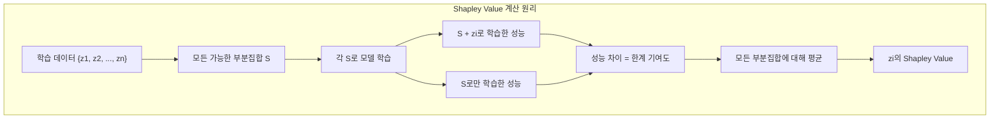
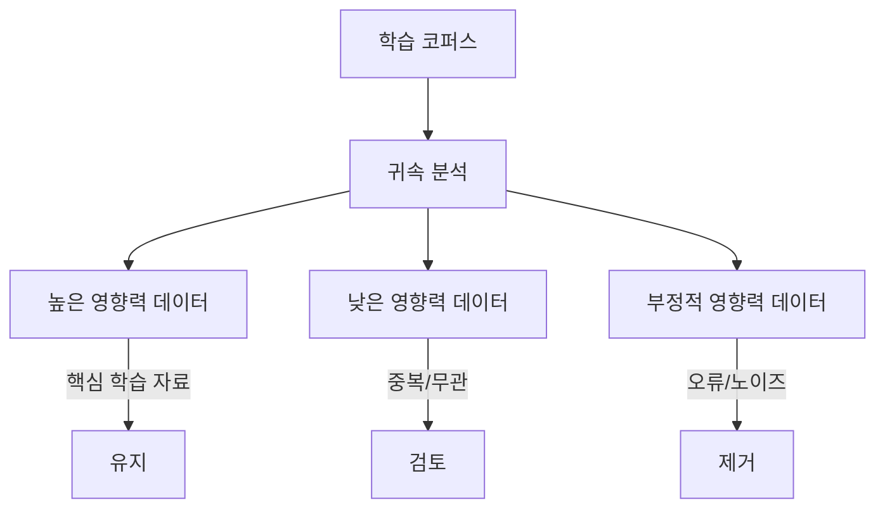

# 데이터 귀속과 영향 분석

## 개요

데이터 귀속(Data Attribution)은 학습된 모델의 특정 예측이 어떤 학습 데이터에 의해 영향을 받았는지를 정량적으로 추적하는 기법이다. "이 모델이 왜 이렇게 답했는가?"라는 질문에 대해, 파라미터나 아키텍처가 아닌 학습 데이터 수준에서 원인을 규명한다. 영향 함수(Influence Function)에서 시작하여 Data Shapley, TRAK, TrackStar로 발전하며, 수십억 파라미터 모델과 수천억 토큰 학습 코퍼스 규모에서도 작동하는 확장 가능한 방법론이 등장했다. 이는 [[pretraining-data-curation]], 저작권 분석, 데이터 품질 평가, 모델 디버깅에 직접적으로 활용된다.

## 핵심 방법론

### 영향 함수 (Influence Functions)

영향 함수는 로버스트 통계학에서 유래한 기법으로, 개별 학습 데이터 포인트를 미세하게 업웨이팅(upweighting)하거나 제거했을 때 모델의 학습된 파라미터와 예측이 어떻게 변하는지를 1차 근사(first-order approximation)로 추정한다.

핵심 아이디어: 학습 데이터 z_i를 극소량 epsilon만큼 업웨이팅했을 때 테스트 포인트 z_test에 대한 손실 변화를 추정한다. 이를 위해 헤시안(Hessian) 역행렬이 필요하지만, 대규모 모델에서는 직접 계산이 불가능하므로 다양한 근사 기법이 사용된다.

**장점과 한계**:
- 재학습(retraining) 없이 영향도를 추정할 수 있어 효율적
- 헤시안 역행렬 근사의 품질에 따라 정확도가 크게 좌우됨
- 비볼록(non-convex) 모델에서의 이론적 보장이 제한적

### Data Shapley

Data Shapley는 Ghorbani & Zou(2019)가 제안한 학습 데이터 가치 평가 방법론이다. 게임 이론의 샤플리 값(Shapley Value)을 학습 데이터에 적용하여, 각 데이터 포인트가 모델 성능에 기여하는 공정한 가치를 정량화한다.

**Shapley 값의 고유 속성**:

| 속성 | 설명 |
|------|------|
| 효율성(Efficiency) | 모든 데이터의 가치 합 = 전체 모델 성능 |
| 대칭성(Symmetry) | 동일한 기여를 하는 데이터는 동일한 가치 |
| 영 플레이어(Null Player) | 기여가 없는 데이터의 가치 = 0 |
| 선형성(Linearity) | 가치 함수의 선형 결합에 대해 가치도 선형 |

**계산 비용 문제**: 정확한 Shapley 값 계산은 2^n개 부분집합을 평가해야 하므로 지수적 복잡도를 가진다. 실용적 접근:

- **Monte Carlo 샘플링**: 무작위 순열에서 한계 기여도를 반복 추정
- **KNN-Shapley** (Jia et al., 2019): K-최근접 이웃 알고리즘에 특화된 닫힌 형태(closed-form) 해로 계산 효율을 극적으로 향상
- **그래디언트 기반 근사**: 재학습 대신 그래디언트 정보로 기여도 추정

## 확장 가능한 귀속 방법

### TRAK (Attributing Model Behavior at Scale)

TRAK(Park et al., 2023)은 대규모 모델에서 효율적인 데이터 귀속을 위해 설계된 방법이다.

핵심 접근: 학습 중 각 데이터 포인트에서의 그래디언트를 랜덤 프로젝션(random projection)으로 저차원 공간에 매핑한 뒤, 이 투영된 그래디언트 간의 유사도로 영향도를 근사한다.

### TrackStar

TrackStar는 가장 최신의 대규모 데이터 귀속 방법으로, 8B 파라미터 LLM에서 160B+ 토큰의 전체 사전학습 코퍼스를 대상으로 영향력 있는 학습 예제를 검색할 수 있다.

**핵심 혁신**:

1. **과제 특화 메트릭 보정(Task-Specific Metric Correction)**: 과제에 맞는 헤시안 근사와 옵티마이저 2차 모멘트 보정을 결합하여 귀속 정확도를 향상
2. **랜덤 프로젝션**: 고차원 그래디언트를 효율적으로 압축
3. **메모리/검색 비용 80,000배 감소**: 사전학습 코퍼스 전체를 대상으로 수천 개 쿼리에 대해 실용적인 시간 내에 귀속 수행

| 방법 | 모델 규모 | 코퍼스 규모 | 헤시안 근사 | 특징 |
|------|----------|------------|------------|------|
| 영향 함수 | ~수백M | 소규모 | 직접 | 이론적 기반 |
| TRAK | ~수B | 수백M | 랜덤 프로젝션 | 확장 가능 |
| TrackStar | 8B+ | 160B+ 토큰 | 과제 특화 | 사전학습 귀속 |

## 그래디언트 기반 방법 계보

영향 함수 이후 다양한 그래디언트 기반 귀속 방법이 등장했다:

- **TracIn**: 학습 궤적(trajectory)을 따라 체크포인트별 그래디언트 내적을 누적
- **EK-FAC**: 크로네커 인수분해(Kronecker factorization)로 피셔 정보 행렬을 효율적으로 근사
- **LoGRA**: 저랭크(low-rank) 그래디언트 근사로 메모리 효율적인 귀속

이들은 모두 "학습 데이터 z_i의 그래디언트가 테스트 입력의 그래디언트와 유사하면, z_i가 해당 예측에 영향을 미쳤다"라는 공통 직관에 기반한다.

## 응용 분야

### 데이터 품질 평가

Data Shapley 값이 지속적으로 낮거나 음수인 데이터는 이상치(outlier), 라벨 오류, 또는 노이즈일 가능성이 높다. 이를 [[pretraining-data-curation]]과 [[data-decontamination]]에 활용하면 학습 데이터의 품질을 체계적으로 개선할 수 있다.

### 저작권 및 출처 추적

모델의 특정 출력이 학습 코퍼스의 어떤 텍스트에 영향을 받았는지 추적하여, 저작권 침해 여부를 판단하거나 출처를 투명하게 공개하는 데 활용된다. EU AI Act 등 규제 요구사항이 강화됨에 따라 실무적 중요성이 커지고 있다.

### 모델 디버깅

모델이 잘못된 예측을 할 때, 해당 예측에 가장 큰 영향을 준 학습 데이터를 역추적하여 오류의 근본 원인을 파악한다. [[synthetic-data-training]]에서 합성 데이터의 품질 문제를 진단하는 데도 유용하다.

### 능동 학습(Active Learning)과의 결합

Data Shapley 값을 기반으로 모델 성능 향상에 가장 큰 기여가 예상되는 새로운 데이터를 선택적으로 수집하는 전략이다. 한정된 라벨링 예산을 최적으로 배분할 수 있다.

## 한계와 전망

### 현재 한계

- **계산 비용**: TrackStar도 사전학습 코퍼스 전체에 대한 귀속은 상당한 연산이 필요
- **근사 오차**: 모든 확장 가능한 방법은 근사치이며, 정확한 영향도와의 괴리가 존재
- **동적 학습에서의 적용**: 학습 중반에 데이터 혼합 비율이 바뀌는 경우 귀속의 해석이 복잡해짐

### 발전 방향

- 실시간(online) 귀속: 학습과 동시에 데이터 가치를 추적하여 동적으로 데이터 혼합 비율 조정
- [[neural-scaling-laws]]와의 결합: 데이터 가치 분포가 스케일링 법칙 예측에 미치는 영향 분석
- 연합 학습(federated learning)에서의 기여도 측정: 참여자별 데이터 가치 공정 배분

## 관련 문서

- [[pretraining-data-curation]] -- 학습 데이터 품질 관리와 귀속의 직접적 연결
- [[data-decontamination]] -- 오염 데이터 탐지에 귀속 활용
- [[synthetic-data-training]] -- 합성 데이터의 가치 평가
- [[neural-scaling-laws]] -- 데이터 가치와 스케일링 법칙의 관계
- [[evaluation-during-training]] -- 학습 중 데이터 영향력 모니터링
- [[knowledge-distillation]] -- 교사-학생 모델 간 데이터 영향 전이
