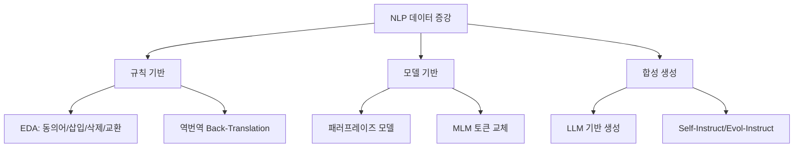

# NLP 데이터 증강

텍스트 데이터의 양과 다양성을 늘려 모델 성능을 개선하는 기법. 이미지의 회전/크롭과 달리 텍스트는 **의미를 보존하면서 변형**해야 해서 더 복잡하다.

## 기법 분류

## 주요 기법

| 기법 | 원리 | 품질 | 비용 |
|------|------|------|------|
| **EDA** (Wei & Zou 2019) | 동의어 치환/삽입/삭제/교환 | 낮음 | 매우 낮음 |
| **역번역** | 영->한->영 번역으로 패러프레이즈 | 중간 | 중간 |
| **MLM 교체** | BERT로 일부 토큰 마스킹 후 대체 | 중간 | 낮음 |
| **LLM 생성** | GPT 등으로 유사 텍스트 직접 생성 | **높음** | 높음 |

## LLM 시대의 증강

2024년 이후 데이터 증강의 주류는 [[synthetic-data-generation-pipeline|합성 데이터 생성]]으로 이동. Self-Instruct, Evol-Instruct, Magpie 등이 대규모 학습 데이터를 생성한다.

## 관련 문서

- [[synthetic-data-generation-pipeline]] -- 합성 데이터 파이프라인
- [[pretraining-data-curation]] -- 사전학습 데이터 선별
- [[instruction-tuning]] -- 인스트럭션 튜닝
