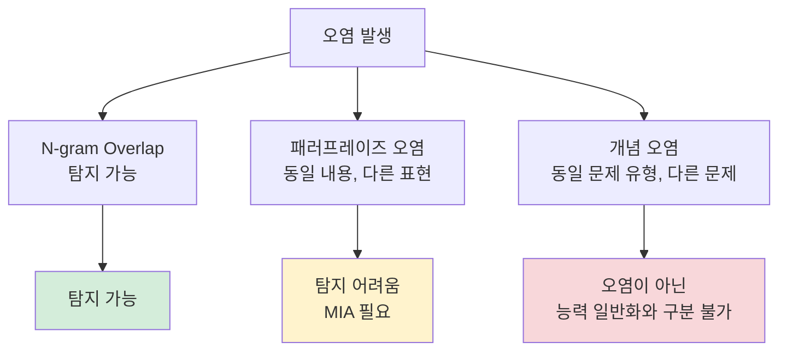

# 데이터 오염 탐지 (Data Contamination Detection)

## 개념 요약

데이터 오염(data contamination)은 모델의 **평가 데이터(벤치마크 테스트셋)** 가 학습 데이터에 포함되어, 모델이 답을 암기한 상태로 평가받는 현상이다. 오염된 모델은 실제 능력보다 높은 벤치마크 점수를 기록해 커뮤니티를 오도할 수 있다. 오염 **탐지(detection)** 는 이미 오염이 발생했거나 의심되는 경우 사후 확인하는 과정이다.

## Decontamination vs Detection 구분

| 개념 | 시점 | 목적 |
|------|------|------|
| **Decontamination** (오염 제거) | 학습 전 (데이터 큐레이션) | 평가 데이터를 학습 데이터에서 사전 제거 |
| **Contamination Detection** (오염 탐지) | 학습 후 (모델 평가 시) | 이미 학습된 모델이 오염되었는지 판별 |

## 탐지 기법 1: N-gram Overlap 분석

가장 기본적이고 광범위하게 사용되는 기법.

**방법**:
- 평가 문제와 학습 코퍼스 간 13-gram 이상 겹치는 비율을 계산
- 높은 overlap 비율 = 오염 의심

**한계**:
- 표면적 문자열 매칭이므로 의미가 같지만 표현이 다른 오염(패러프레이즈)을 탐지 못함
- false positive: 자연어에서 자연스럽게 발생하는 overlap

```python
# 의사 코드 예시
def compute_overlap(eval_text, corpus_texts, n=13):
    eval_ngrams = set(get_ngrams(eval_text, n))
    for text in corpus_texts:
        corpus_ngrams = set(get_ngrams(text, n))
        if eval_ngrams & corpus_ngrams:
            return True  # 오염 의심
    return False
```

## 탐지 기법 2: Membership Inference Attack (MIA)

모델이 특정 텍스트를 학습 중에 "보았는지" 통계적으로 추론하는 기법.

**원리**: 모델은 학습 데이터에 대해 더 낮은 perplexity(더 높은 확률)를 부여하는 경향이 있다.

주요 방법:
- **Min-K% Prob**: Shi et al. (2023). 텍스트에서 확률이 낮은 상위 K% 토큰의 평균 log-probability를 지표로 사용
- **Neighborhood Attack**: 원본 텍스트와 약간 변형된 텍스트의 PPL 차이 비교 - 학습 데이터는 원본이 변형본보다 낮은 PPL

$$
\text{MIA 점수} = \frac{1}{|S_{min}|}\sum_{t \in S_{min}} \log P_\theta(t)
$$

여기서 $S_{min}$은 확률이 가장 낮은 K% 토큰 집합.

## 탐지 기법 3: Canary Insertion (카나리 삽입)

**의도적으로** 특이한 문자열(canary)을 학습 데이터에 삽입한 후, 학습된 모델이 해당 문자열을 생성/완성할 수 있는지 확인한다.

**절차**:
1. 학습 전: 비밀스럽고 기억하기 쉬운 고유 문자열 삽입 (예: 랜덤 UUID + 고정 패턴)
2. 학습 완료 후: 삽입한 canary의 접두사를 모델에게 제시
3. 모델이 정확히 완성하면 해당 데이터가 기억(memorization)되었음을 확인

Carlini et al. (2021) "Extracting Training Data from Large Language Models"에서 이 방식으로 GPT-2의 학습 데이터 추출을 시연했다.

**활용**: 개인정보(주소, 전화번호) 유출 위험 평가에도 사용.

## GPT-4 / LLaMA 3 오염 사례

### GPT-4 (OpenAI, 2023)

- OpenAI는 GPT-4 기술 보고서에서 일부 평가셋에 오염이 있음을 인정
- HumanEval(코딩 벤치마크) 등에서 훈련 데이터 오염 의심 사례 보고
- GPT-4 보고서는 "contamination analysis" 섹션을 포함해 투명성 제고

### LLaMA 3 (Meta, 2024)

- Meta는 학습 전 decontamination 파이프라인을 적용했다고 명시
- 그럼에도 불구하고 독립 연구자들이 일부 벤치마크에서 오염 의심 패턴 보고
- n-gram overlap 분석 결과를 LLaMA 3 논문에 공개해 검증 가능하게 함

## 오염 탐지의 한계



- N-gram 탐지는 표면적 동일성만 확인 - 의미론적 오염 미탐지
- 오염 점수의 임계값 결정이 주관적
- 동적 벤치마크(LiveBench 등)가 근본적 해결책

## 관련 문서

- [[text-deduplication-strategies]] - decontamination과 연계
- [[benchmark-design-principles]] - 오염 방지 설계 원칙
- [[data-quality-scoring]] - 학습 데이터 필터링 전반
- [[pretraining-data-curation]] - 오염 제거가 포함된 큐레이션 파이프라인
