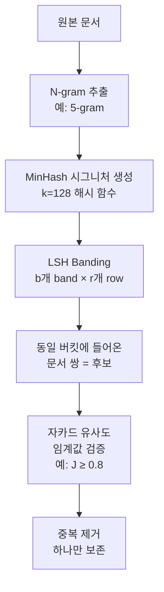

# 데이터 중복 제거 - MinHash LSH

## 개요

데이터 중복 제거(data deduplication)는 LLM 사전학습 데이터 품질 관리의 핵심 단계다. 웹 크롤링 데이터에는 동일하거나 매우 유사한 문서가 대량 포함되어 있으며, 이를 그대로 훈련하면 모델이 특정 패턴을 과적합하고 다양성이 감소한다. MinHash + LSH(Locality-Sensitive Hashing)는 대규모 텍스트 코퍼스에서 근접 중복(near-duplicate)을 효율적으로 제거하는 표준 기법이다.

## 중복의 종류

| 유형 | 설명 | 탐지 방법 |
|------|------|-----------|
| 완전 중복 (exact) | 두 문서가 완전히 동일 | MD5/SHA256 해시 |
| 근접 중복 (near-exact) | 95%+ 유사, 일부 편집만 다름 | MinHash + LSH |
| 의미적 중복 (semantic) | 다른 표현이지만 동일 내용 | 임베딩 유사도 |

대규모 파이프라인에서는 계산 비용 대비 효과가 가장 좋은 **근접 중복 제거**에 집중하며, MinHash LSH가 사실상 표준이다.

## MinHash 원리

MinHash는 집합 간 **자카드 유사도(Jaccard Similarity)**를 근사 추정하는 알고리즘이다.

**자카드 유사도**:
$$J(A, B) = \frac{|A \cap B|}{|A \cup B|}$$

문서를 n-gram 집합으로 변환한 뒤 자카드 유사도를 직접 계산하면 $O(|A| \cdot |B|)$ 비용이 발생한다. MinHash는 이를 해시 함수 $h$를 이용해 $O(k)$로 근사한다.

**MinHash 시그니처 생성**:
1. 문서를 n-gram 집합으로 변환 (보통 5-gram)
2. $k$개의 독립 해시 함수 $h_1, h_2, ..., h_k$ 정의
3. 각 해시 함수에 대해 집합 원소의 최솟값: $\text{sig}_i(D) = \min_{w \in D} h_i(w)$
4. 길이 $k$의 시그니처 벡터 $\text{sig}(D) = [\text{sig}_1, \text{sig}_2, ..., \text{sig}_k]$

핵심 성질: $P[\text{sig}_i(A) = \text{sig}_i(B)] = J(A, B)$

## LSH Banding 기법

MinHash 시그니처만으로는 모든 쌍을 비교해야 하므로 $O(N^2)$ 비용이 발생한다. LSH Banding은 이를 $O(N)$에 가깝게 줄인다.

**Banding 원리**:
- 길이 $k$의 시그니처를 $b$개 밴드(band)로 분할, 각 밴드는 $r$개 행(row): $k = b \times r$
- 각 밴드를 해시해 버킷에 할당
- 같은 밴드의 같은 버킷에 들어온 문서 쌍만 중복 후보

유사도 임계값 $t$와 밴드 수 $b$, 행 수 $r$ 관계:
$$t \approx \left(\frac{1}{b}\right)^{1/r}$$

**설정 예시** ($t=0.8$ 기준):
- $k=128$, $b=8$, $r=16$ → $t \approx 0.82$
- $k=200$, $b=20$, $r=10$ → $t \approx 0.80$

## 대규모 파이프라인 구현

[[pretraining-data-curation]] 파이프라인에서 MinHash LSH는 일반적으로 아래 순서로 실행된다.

**병렬화**: Apache Spark 또는 Dask를 이용해 수십 TB 데이터를 분산 처리한다. [[text-dedup]] 오픈소스 라이브러리(BigCode)가 이를 지원한다.

**Union-Find**: 중복 후보 쌍을 그래프의 엣지로 보고 연결 컴포넌트(connected component)를 탐색한다. 컴포넌트 내에서 가장 오래된 문서 또는 가장 짧은 URL의 문서 하나만 보존한다.

## 실제 적용 사례

| 데이터셋 | 중복 제거 방식 | 제거율 |
|----------|---------------|--------|
| The Pile | 문서 수준 MinHash | ~30% |
| RefinedWeb | URL + MinHash | ~70% |
| FineWeb | Exact + MinHash (5-gram, J=0.65) | ~40% |
| Dolma | 여러 단계 MinHash | ~50% |

## 한계와 보완

- **의미적 중복 미탐지**: 동일 내용이지만 다른 표현은 MinHash로 탐지 불가. 임베딩 기반 시맨틱 중복 제거로 보완 가능하나 비용이 매우 높다.
- **임계값 민감도**: $J$ 임계값을 낮추면 더 많은 중복이 제거되지만 고유 문서도 함께 제거될 수 있다.
- **도메인별 차별화**: 코드는 구문 수준의 정확한 중복이 더 중요하므로 별도 파이프라인이 필요하다.
- **n-gram 크기**: 5-gram이 표준이나 짧은 문서에서는 3-gram이, 긴 문서에서는 8-gram이 더 정확하다.

## 관련 문서

- [[pretraining-data-curation]] - 사전학습 데이터 전처리 전반
- [[text-dedup]] - 텍스트 중복 제거 상세 기법
- [[quality-classifier-filtering]] - 중복 제거 이후의 품질 필터링
- [[fineweb-dataset]] - MinHash를 적극 활용한 데이터셋 사례
- [[dolma-dataset]] - 다단계 중복 제거 파이프라인 사례
