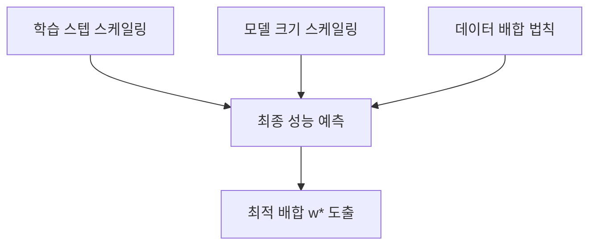
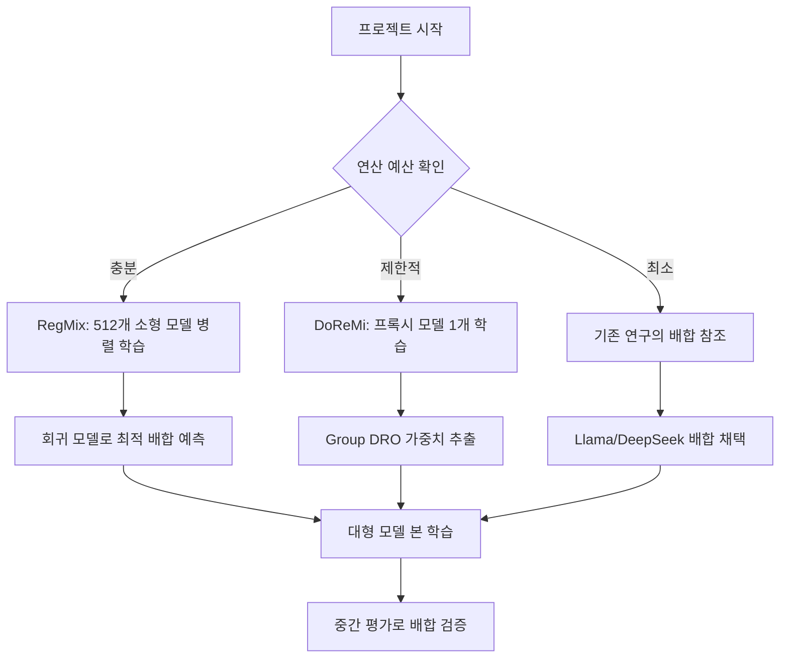

# 데이터 배합 법칙 (Data Mixing Laws)

## 개요

데이터 배합 법칙(Data Mixing Laws)은 LLM 사전학습 코퍼스의 도메인 혼합 비율이 모델 성능에 미치는 영향을 수학적으로 예측하는 프레임워크다. 기존에는 도메인별 가중치(웹 텍스트 60%, 코드 15%, 도서 10% 등)를 경험과 직관으로 설정했으나, DoReMi(2023), Data Mixing Laws(ICLR 2025), RegMix(ICLR 2025 Spotlight) 등의 연구가 이를 원칙적이고 예측 가능한 최적화 문제로 전환시켰다. 소규모 실험에서 대규모 학습의 최적 배합을 예측할 수 있어, 수천만 달러 규모의 학습 비용을 크게 절감할 수 있다.

## 문제 정의

사전학습 코퍼스가 k개 도메인 D_1, ..., D_k로 구성될 때, 가중치 벡터 w = (w_1, ..., w_k) (w_i >= 0, sum = 1)에 따라 학습 배치를 구성한다. 목표는 다운스트림 벤치마크 성능을 최대화하는 최적 가중치 w*를 찾는 것이다.

### 왜 어려운가

- **조합 폭발**: k개 도메인의 가중치 조합은 연속 공간이므로 격자 탐색이 불가
- **비선형 상호작용**: 도메인 간 전이 학습 효과가 있어, 특정 도메인의 가중치를 낮춰도 해당 도메인의 성능이 오히려 개선될 수 있음
- **스케일 의존성**: 소규모에서의 최적 배합이 대규모에서 최적이라는 보장이 없음
- **다중 목표**: 코드 성능, 추론 능력, 다국어 능력 등 상충할 수 있는 복수 목표

## DoReMi: 기초 프레임워크

DoReMi(Domain Reweighting with Minimax Optimization, NeurIPS 2023)는 자동 도메인 가중치 최적화의 기초를 놓았다. [[data-mixing-curriculum-learning]]에서 기본 메커니즘을 다루고 있으며, 여기서는 스케일링 관점을 보완한다.

### 핵심 아이디어

1. 소형 참조 모델을 기본 가중치로 학습
2. 소형 프록시 모델을 Group DRO(Distributionally Robust Optimization)로 학습하여, 모든 도메인에서 참조 모델 대비 초과 손실을 최소화하는 가중치 탐색
3. 프록시가 산출한 가중치로 대형 모델 학습

### 주요 결과

| 측정 항목 | 기본 가중치 | DoReMi 가중치 | 개선폭 |
|----------|-----------|-------------|--------|
| 평균 few-shot 정확도 | 기준 | +6.5%p | 유의미한 향상 |
| 목표 정확도 도달 스텝 | 기준 | 2.6배 감소 | 학습 효율 대폭 개선 |
| 전체 22개 도메인 퍼플렉시티 | 기준 | 전 도메인 개선 | 가중치를 낮춘 도메인도 개선 |

280M 프록시 모델로 8B 모델(30배 큰 모델)의 최적 가중치를 결정한 것이 DoReMi의 핵심 기여다. 그러나 프록시 모델 학습 자체에 수십만 스텝이 필요하다는 비용 문제가 남았다.

## Data Mixing Laws (ICLR 2025)

Ye et al.의 Data Mixing Laws는 스케일링 법칙을 데이터 배합에 확장한 연구다. [[neural-scaling-laws]]의 멱법칙 관계를 배합 비율 차원으로 일반화한다.

### 중첩 스케일링 법칙

세 가지 스케일링 법칙을 중첩(nested)하여 사용한다:

1. **학습 스텝 스케일링**: 스텝 수 증가에 따른 손실 감소 패턴
2. **모델 크기 스케일링**: 파라미터 수 증가에 따른 손실 감소 패턴
3. **데이터 배합 법칙**: 배합 비율 변화에 따른 손실 변화 함수

이 세 법칙을 중첩하면, 소규모 모델의 짧은 학습 결과만으로 대규모 모델의 장기 학습에서의 최적 배합을 예측할 수 있다. 실험에서는 1B 모델의 100B 토큰 학습에 대한 최적 배합을 RedPajama 코퍼스에서 성공적으로 도출했다.

### 용량 인식 배합 법칙 (Capacity-Aware Mixture Law)

모델 크기와 배합 비율 사이의 비선형 상호작용을 명시적으로 모델링한다. 작은 모델과 큰 모델의 최적 배합이 다를 수 있다는 점을 포착한다.

**손실-벤치마크 예측 법칙(Loss-to-Benchmark Prediction Law)**: 검증 손실에서 벤치마크 정확도를 추정하는 별도의 예측 함수를 도입하여, 최종적으로 벤치마크 성능 기준으로 배합을 최적화할 수 있다.

## RegMix (ICLR 2025 Spotlight)

RegMix는 데이터 배합 최적화를 회귀(regression) 문제로 정식화한 연구다.

### 방법론

| 단계 | 내용 | 규모 |
|------|------|------|
| 1. 다양한 배합으로 소형 모델 학습 | 512개 모델, 각 1M 파라미터 | 1B 토큰씩 |
| 2. 회귀 모델 학습 | 배합 -> 성능 매핑 함수 학습 | 가벼운 연산 |
| 3. 최적 배합 예측 | 회귀 모델로 미탐색 배합의 성능 예측 | 추론만 수행 |
| 4. 대형 모델 학습 | 예측된 최적 배합으로 본 학습 | 1B 모델, 25B 토큰 |

### 핵심 장점

- **DoReMi 대비 10%의 연산으로 동등 이상의 결과**: 프록시 모델의 장기 학습이 불필요
- **병렬화 용이**: 512개 소형 모델을 독립적으로 병렬 학습 가능
- **7B 모델, 100B 토큰까지 일관된 우위**: 인간 전문가의 수동 배합을 일관적으로 능가
- **확장성**: 새로운 도메인 추가 시 해당 배합만 추가 탐색하면 됨

## 최신 동향

### MergeMix (2025)

학습 중간(mid-training)에 데이터 배합을 동적으로 조정하는 기법이다. 서로 다른 배합으로 학습된 체크포인트를 병합(model merging)하여, 사후적으로도 배합 비율을 탐색할 수 있다.

### Rethinking Data Mixing (2026)

LLM 관점에서 데이터 배합을 재고하는 최신 연구로, 토큰 수준(token-level)의 가중치 부여가 도메인 수준(domain-level)보다 더 세밀한 최적화를 가능하게 한다는 방향을 탐색하고 있다.

## 실무 적용 프레임워크

### 도메인 배합 참고 사례

| 도메인 | Llama 3 (추정) | The Pile 기본 | DoReMi 최적화 |
|--------|--------------|-------------|-------------|
| 웹 텍스트 | ~50% | ~62% | 도메인별 최적화 |
| 코드 | ~17% | ~5% | 상향 조정 |
| 학술/논문 | ~4.5% | ~14% | 도메인별 조정 |
| 도서 | ~4.5% | ~12% | 하향 조정 |
| Wikipedia | ~2.5% | ~4% | 유지/미세 조정 |
| 수학 | ~5% | N/A | 추가 배합 |

## 관련 페이지

- [[data-mixing-curriculum-learning]] -- 데이터 믹싱과 커리큘럼 학습의 기본 프레임워크
- [[neural-scaling-laws]] -- 스케일링 법칙의 배합 차원 확장
- [[pretraining-data-curation]] -- 각 도메인의 데이터 품질 관리
- [[evaluation-during-training]] -- 배합 효과 검증을 위한 중간 평가
- [[optimizer-selection]] -- 배합 변경 시 옵티마이저 상태 관리
- [[pretraining-pipeline-e2e]] -- 사전학습 파이프라인에서 배합의 위치
