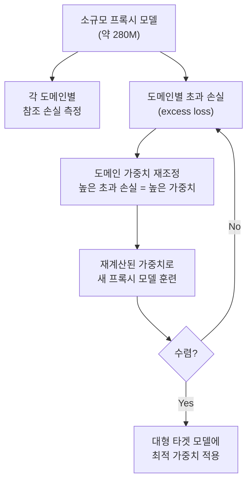

# 데이터 배합 전략 (Data Mixing Strategy)

## 개요

데이터 배합 전략(Data Mixing Strategy)은 사전학습 코퍼스를 구성할 때 여러 도메인(웹, 코드, 수학, 책, 논문 등)의 데이터를 **어떤 비율로 섞을 것인가**를 결정하는 방법론이다. 같은 총 토큰 수라도 배합 비율에 따라 최종 모델 성능이 크게 달라지며, 이는 단순히 "더 많은 데이터가 더 좋다"는 직관을 넘어 배합 설계 자체가 독립적인 연구 주제가 되었다.

## 왜 배합이 중요한가

[[pretraining-data-curation]]에서 개별 도메인의 품질 필터링을 다루는 것과 달리, 배합 전략은 필터링 후 남은 데이터의 *상대적 비중*을 다룬다. 직관적으로 이해가 안 되는 현상들이 관찰된다:

- 웹 데이터만 늘리면 코드·수학 성능이 저하될 수 있음
- 코드 데이터 비중이 적당히 높으면 일반 추론 능력이 향상됨
- 중복된 고품질 데이터를 반복 학습하면 "양보다 질"이 때로 더 유효

최적 배합은 모델 크기, 총 훈련 토큰, 다운스트림 태스크에 따라 달라지므로 일반화된 황금 비율이 없다. 이것이 체계적 탐색 방법론이 필요한 이유다.

## 주요 배합 최적화 알고리즘

### DoReMi (Domain Reweighting with Minimax Optimization)

Stanford/Google의 DoReMi(2023)는 게임 이론의 minimax 최적화 관점에서 배합 비율을 탐색한다.

**핵심 아이디어**: 모델이 "가장 어려워하는" 도메인(초과 손실이 큰 도메인)에 더 많은 가중치를 부여. 이렇게 하면 모든 도메인에서 worst-case 손실을 최소화하는 배합을 자동으로 찾게 된다.

**결과**: 도메인별 직관적 비율 설정 대비 평균 6.5% 퍼플렉시티 개선 보고.

### RegMix

RegMix(2024)는 DoReMi보다 단순한 회귀 기반 접근법이다. 다양한 배합 비율로 소규모 실험을 수행하고, 배합 비율과 성능 간의 회귀 모델을 적합한 뒤, 이를 이용해 최적 비율을 예측한다.

| 방법 | 핵심 메커니즘 | 장점 | 단점 |
|------|-------------|------|------|
| DoReMi | Minimax 반복 최적화 | 이론적 보장 | 반복 훈련 비용 |
| RegMix | 회귀 예측 | 간단, 해석 가능 | 탐색 범위 제한 |
| 균일 배합 | 도메인 비율 동일 | 최단 구현 | 최적 보장 없음 |
| 데이터 비율 배합 | 원시 데이터 크기 비례 | 직관적 | 도메인 불균형 증폭 |

### [[chinchilla-scaling-laws]] 관점에서의 배합

[[chinchilla-scaling-laws]]는 총 학습 토큰과 모델 크기의 최적 비율을 다루지만, 도메인 배합 비율이 스케일링 법칙 자체를 바꾼다는 연구들이 나오고 있다. 코드가 많은 배합은 코드 관련 스케일링 계수가 달라지는 것이 관찰된다.

## 배합 비율의 실용적 범위

주요 오픈소스 모델의 공개 배합 비율 참고:

| 모델 | 웹 | 코드 | 수학 | 책/논문 |
|------|-----|------|------|--------|
| LLaMA-3 | ~70% | ~17% | ~5% | ~8% |
| Mistral/Mixtral | ~82% | ~13% | ~2% | ~3% |
| Phi 시리즈 | ~40% | ~35% | ~15% | ~10% |
| DeepSeek | ~87% | ~8% | ~3% | ~2% |

Phi 시리즈는 고품질 합성 데이터 및 교과서 스타일 데이터의 높은 비중이 특징적이다.

## 훈련 중 동적 배합 (Dynamic Mixing)

고정 배합보다 훈련 단계에 따라 비율을 변화시키는 동적 배합도 연구되고 있다:

LLaMA-3 훈련 보고서에서 이와 유사한 단계별 배합 전환이 언급되었다.

## 평가 기준: 무엇을 최적화할 것인가

배합 최적화의 목표 함수 선택이 중요하다:

1. **검증 손실(validation perplexity)**: 빠른 프록시이나 태스크 성능과 완전히 일치하지 않음
2. **다운스트림 벤치마크 평균**: MMLU, HumanEval 등 다양한 태스크 평균
3. **특정 태스크 집중**: 코드 생성에 집중한다면 HumanEval/MBPP 특화
4. **Worst-case 도메인 손실**: DoReMi의 minimax 접근법

일반적으로는 훈련 중 체크포인트별로 여러 기준을 동시에 모니터링하는 것이 권장된다.

## 데이터 중복 노출(Epoch)과 배합의 상호작용

토큰 예산이 총 데이터량보다 클 때 일부 도메인은 여러 번 반복된다. 이때:
- 고품질 소규모 도메인(예: 수학 증명집)은 2-4 에폭도 허용될 수 있음
- 저품질 웹 데이터의 반복은 성능 저하 유발 (모델 붕괴 위험)
- 반복 횟수 자체도 배합 설계의 일부로 고려해야 함

## 관련 문서

- [[pretraining-data-curation]] - 개별 도메인 데이터 수집 및 품질 필터링
- [[chinchilla-scaling-laws]] - 컴퓨팅 최적 훈련 토큰·모델 크기 비율
- [[data-mixing-laws]] - 데이터 배합과 스케일링 법칙의 관계
- [[curriculum-learning]] - 학습 순서 설계와 배합 전략의 연관
- [[synthetic-data-training]] - 합성 데이터를 배합에 포함하는 전략
