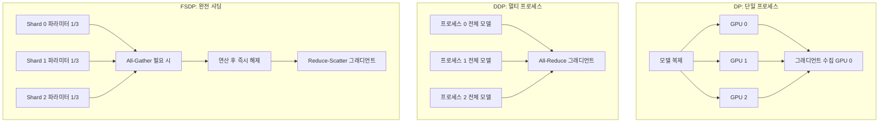

# 데이터 병렬화와 FSDP

## 개요

데이터 병렬화(Data Parallelism)는 대규모 모델 학습에서 가장 기본적이고 널리 사용되는 분산 학습 전략이다. 동일한 모델 복제본을 여러 GPU에 배치하고, 학습 데이터를 GPU 수만큼 분할하여 각 GPU가 서로 다른 데이터 배치를 동시에 처리한 뒤 그래디언트를 동기화하는 방식이다. PyTorch 생태계에서 DP(DataParallel), DDP(DistributedDataParallel), FSDP(Fully Sharded Data Parallel)로 진화해왔으며, 2026년 현재 FSDP2가 대규모 LLM 사전학습의 사실상 표준으로 자리잡았다.

## 핵심 개념

### DP (DataParallel) -- 단일 프로세스 멀티 GPU

가장 단순한 형태의 데이터 병렬화다. 하나의 프로세스에서 여러 GPU를 관리하며, 각 forward pass마다 모델을 모든 GPU에 복제(replicate)한다. GIL(Global Interpreter Lock)로 인한 병목과 매 반복마다의 모델 복제 오버헤드 때문에 실전에서는 거의 사용되지 않는다.

### DDP (DistributedDataParallel) -- 멀티 프로세스 표준

GPU당 하나의 프로세스를 할당하여 GIL 병목을 제거한다. 각 프로세스가 독립적으로 forward/backward를 수행하고, backward 중에 [[distributed-communication]] 백엔드(NCCL 등)를 통해 그래디언트를 all-reduce로 동기화한다. 버킷(bucket) 단위의 비동기 그래디언트 통신으로 연산과 통신을 오버랩하여 효율성을 높인다.

**문제점**: 모든 GPU에 전체 모델 파라미터, 그래디언트, 옵티마이저 상태의 완전한 복사본이 필요하다. 모델이 커질수록 GPU 메모리가 기하급수적으로 부족해진다.

### FSDP (Fully Sharded Data Parallel) -- 메모리 효율 극대화

FSDP는 모델 파라미터, 그래디언트, 옵티마이저 상태를 모든 GPU에 걸쳐 샤딩(sharding)한다. 각 GPU는 전체 모델의 일부분(shard)만 보유하고, 연산이 필요할 때만 all-gather로 파라미터를 수집하여 사용한 뒤 즉시 해제한다. [[deepspeed-zero]]의 ZeRO Stage 3과 동일한 원리이며, PyTorch 네이티브로 구현되었다.

### FSDP2 -- 2026년 현재 표준

FSDP2는 FSDP1의 flat-parameter 샤딩을 DTensor 기반 per-parameter 샤딩으로 전환했다. 주요 개선점:

| 항목 | FSDP1 | FSDP2 |
|------|-------|-------|
| 샤딩 단위 | flat parameter (연결된 덩어리) | per-parameter (개별 파라미터) |
| 메모리 관리 | record_stream 의존 | 결정적 메모리 사용 |
| 동결 파라미터 | 제약 있음 | 자유롭게 지원 |
| 상태 사전(state dict) | all-gather 필요 | 통신 없이 샤딩된 채로 저장 |
| GPU 메모리 | 기준 | 약 7% 절감 |
| 처리량 | 기준 | 평균 1.5% 향상 |

### HSDP (Hybrid Sharded Data Parallel)

FSDP2를 확장하여 2단계 계층 구조를 형성한다. 노드 내(intra-node)에서는 완전 샤딩하고, 노드 간(inter-node)에서는 복제(replicate)하여 노드 간 통신량을 줄인다. 수천 GPU 규모의 클러스터에서 통신 효율과 메모리 효율의 균형을 맞추는 전략이다.

## 작동 원리

1. **FSDP 초기화**: 모델 파라미터를 GPU 수로 균등 분할하여 각 GPU에 할당
2. **Forward pass**: 각 레이어 연산 전 all-gather로 전체 파라미터 수집, 연산 후 비-로컬 파라미터 해제
3. **Backward pass**: 동일하게 all-gather -> 그래디언트 계산 -> reduce-scatter로 그래디언트 샤딩
4. **Optimizer step**: 각 GPU가 자신의 파라미터 샤드에 대해서만 옵티마이저 업데이트 수행

## 성능과 메모리 비교

### GPU당 메모리 사용량 (7B 모델, BF16 기준)

| 전략 | 파라미터 | 그래디언트 | 옵티마이저 | 총 메모리 |
|------|---------|-----------|-----------|----------|
| DDP (8 GPU) | 14GB | 14GB | 56GB | ~84GB |
| FSDP (8 GPU) | 1.75GB | 1.75GB | 7GB | ~10.5GB |
| 절감률 | 87.5% | 87.5% | 87.5% | ~87.5% |

FSDP는 N개 GPU 사용 시 메모리를 이론적으로 1/N로 줄인다. 대신 all-gather/reduce-scatter 통신 오버헤드가 추가되지만, 연산과 통신을 오버랩하여 처리량 저하를 최소화한다.

### TorchTitan 통합

PyTorch의 TorchTitan 프로젝트는 FSDP2를 [[tensor-pipeline-parallelism]]과 결합한 다차원 병렬화를 PyTorch 네이티브로 제공한다. 분산 [[model-checkpointing-sharding]]에서도 50배 이상의 체크포인팅 오버헤드 절감을 달성했다.

## 실전 도입 가이드

### 전략 선택 기준

| 상황 | 권장 전략 | 이유 |
|------|----------|------|
| 소규모 모델 (< 1B) | DDP | 통신 오버헤드 최소 |
| 중형 모델 (1-10B) | FSDP | 메모리 효율 확보 |
| 대형 모델 (10B+) | FSDP + TP/PP | 단독 FSDP로는 부족 |
| 수천 GPU 클러스터 | HSDP + TP + PP | 노드 간 통신 최적화 |

### 흔한 실수

- **배치 크기 미조정**: GPU 수 증가 시 글로벌 배치 크기가 비례 증가. [[gradient-accumulation-checkpointing]]으로 유효 배치 크기 유지 필요
- **통신 병목 무시**: 노드 간 대역폭이 낮으면 FSDP보다 HSDP가 효과적
- **[[mixed-precision-training]] 미적용**: FSDP와 BF16/FP16 혼합 정밀도를 함께 사용해야 메모리 효율 극대화

## 관련 문서
- [[communication-efficient-training]] -- 통신 효율 분산 학습 (Communication-Efficient Training)

- [[tensor-pipeline-parallelism]] -- 모델 병렬화 기법 (FSDP와 결합)
- [[deepspeed-zero]] -- FSDP와 동일 원리의 DeepSpeed 구현
- [[distributed-communication]] -- all-reduce, all-gather 등 통신 패턴
- [[mixed-precision-training]] -- FSDP와 결합하는 메모리 최적화
- [[mit-training-efficiency]] -- 학습 효율화 연구
- [[lora-qlora-finetuning]] -- FSDP 위에서의 파인튜닝 전략
