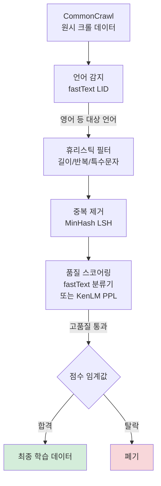

# 데이터 품질 스코어링과 필터링 (Data Quality Scoring)

## 개념 요약

사전학습 데이터 품질은 모델 성능에 직결된다. Raw 웹 크롤 데이터(CommonCrawl 등)는 대량이지만 품질이 낮아, 여러 단계의 **품질 스코어링(quality scoring)과 필터링(filtering)** 을 거쳐야 한다. "Data is the new hyperparameter"라는 표현처럼, 데이터 큐레이션(curation) 전략이 모델 아키텍처 선택만큼 중요하다.

## 주요 품질 필터링 기법

### 1. fastText 분류기 (Wikipedia 유사도)

고품질 텍스트(Wikipedia, 책 등)와 저품질 텍스트를 학습한 **이진 분류기**로, 새 문서의 품질 점수를 예측한다.

- GPT-3, LLaMA 학습에서 사용
- 학습 데이터: Wikipedia, WebText(Reddit upvote 필터링) -> 양성 예시
- CommonCrawl 무작위 샘플 -> 음성 예시
- fastText의 속도 덕분에 수십억 문서에 효율적으로 적용

**한계**: Wikipedia 스타일의 글을 선호하므로 코드, 대화, 창작문 등을 불공정하게 필터링할 수 있다.

### 2. Perplexity 기반 필터링 (KenLM)

소형 n-gram 언어 모델(KenLM)로 문서의 **퍼플렉시티(perplexity)** 를 계산해 이상치를 제거한다.

- PPL이 너무 높은 문서: 의미 없는 텍스트, 오염된 HTML
- PPL이 너무 낮은 문서: 반복적 텍스트, 복사 붙여넣기
- CCNet(Meta, 2019)이 이 방식을 대규모 적용해 효과를 검증

### 3. 휴리스틱 규칙 기반 필터링

| 규칙 | 대상 |
|------|------|
| 최소 문장 길이 (예: 3 단어 이상) | 너무 짧은 토막 제거 |
| 최대 문장 반복 비율 | 스팸/반복 콘텐츠 제거 |
| 특수문자 비율 임계값 | HTML 찌꺼기, 인코딩 오류 제거 |
| 영어 단어 비율 | 비영어권 문서 언어 분류 |
| 불용어 필터 | 성인/혐오 콘텐츠 제거 |
| 줄바꿈 비율 | 코드/테이블 구분 |

## 필터링 파이프라인

## FineWeb: C4 필터 vs 자체 필터

HuggingFace의 FineWeb 데이터셋 구축 과정은 필터 설계의 중요성을 잘 보여준다.

- **C4 필터** (Google의 C4 데이터셋 기준): 문장 끝 구두점 필수, "JavaScript 필요" 문구 포함 페이지 제거 등
- **FineWeb 자체 필터**: C4보다 관대하지만 반복 라인 비율, 특수문자 비율 등을 정밀 조정
- 실험 결과: C4 필터가 교육 콘텐츠를 과도하게 제거해 과학 벤치마크 성능 저하 유발

> 필터 설계는 **어떤 다운스트림 태스크를 중시하는가**에 따라 달라진다.

## 품질 스코어 캘리브레이션

스코어 임계값을 너무 높게 설정하면:
- 데이터 볼륨이 급감 -> 다양성 손실
- 특정 도메인(코드, 수학, 비영어)이 불균형하게 탈락

권장 방법:
- 다양한 임계값에서 소형 프록시 모델(proxy model) 학습 후 벤치마크 비교
- 도메인별 필터 적용 강도를 차별화 (코드 필터 vs 자연어 필터 분리)

## 관련 문서

- [[text-deduplication-strategies]] - 중복 제거 전략
- [[pretraining-data-curation]] - 데이터 큐레이션 전반
- [[fineweb-dataset]] - FineWeb 구체 사례
- [[commoncrawl]] - 원시 크롤 데이터 소스
- [[dolma-dataset]] - 오픈소스 사전학습 데이터셋
