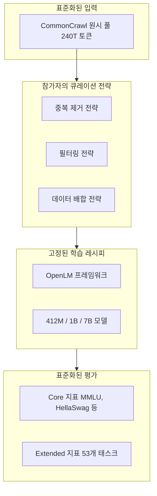
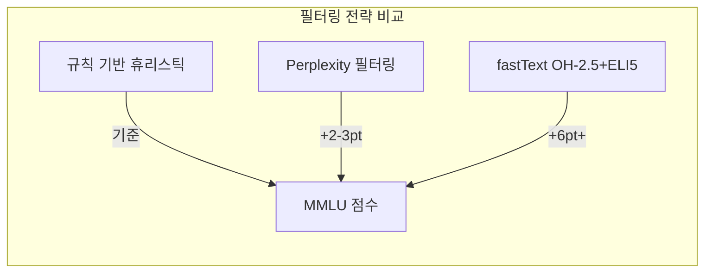

# DCLM - DataComp for Language Models

## 개요

DCLM(DataComp-LM)은 LLM 사전학습 데이터셋의 큐레이션 전략을 체계적으로 비교하고 평가하기 위한 벤치마크 프레임워크다. Stanford, Apple 등 25개 이상의 기관이 참여하여 개발했으며, NeurIPS 2024 Datasets and Benchmarks Track에 발표되었다. [[pretraining-data-curation]]의 각 기법(중복 제거, 필터링, 데이터 배합 등)이 실제로 모델 성능에 미치는 영향을 통제된 환경에서 측정할 수 있도록 설계되었다. 표준화된 240T 토큰 CommonCrawl 풀, OpenLM 기반 학습 레시피, 53개 다운스트림 평가를 함께 제공한다.

## 핵심 정보

| 항목 | 내용 |
|------|------|
| 개발 주체 | Stanford, Apple 등 25+ 기관 |
| 논문 | Li et al. (2024), NeurIPS 2024 |
| 원시 풀 | ~240T 토큰 (CommonCrawl) |
| 모델 규모 | 412M ~ 7B 파라미터 |
| 평가 스위트 | 53개 다운스트림 태스크 |
| 학습 프레임워크 | OpenLM |
| 라이선스 | 오픈소스 |

## 프레임워크 구조

DCLM의 핵심 설계 원리는 **데이터만 변수로 두고 나머지는 고정**하는 것이다. 학습 레시피(학습률, 배치 크기, 옵티마이저 등), 모델 아키텍처, 평가 프로토콜을 표준화하여 데이터 큐레이션 전략의 효과를 순수하게 비교할 수 있다.

### 경쟁 트랙

DCLM은 두 가지 참여 트랙을 제공한다.

| 트랙 | 설명 | 데이터 범위 |
|------|------|-----------|
| Filtering Track | 제공된 풀에서 부분집합 선택 | 240T 풀 내 |
| Mixing Track | 외부 데이터와 배합 전략 | 풀 + 외부 데이터 허용 |

## 핵심 발견: 모델 기반 필터링의 힘

DCLM 실험에서 가장 중요한 발견은 **모델 기반 필터링(model-based filtering)**이 고품질 학습 데이터 구축의 핵심이라는 것이다.

### fastText 분류기 필터링

DCLM-Baseline의 필터링에는 fastText 기반 이진 분류기가 사용되었다.

| 항목 | 상세 |
|------|------|
| 모델 | fastText 이진 분류기 |
| 양성 샘플 | OpenHermes 2.5 (OH-2.5) + Reddit r/ExplainLikeImFive |
| 음성 샘플 | CommonCrawl 무작위 샘플 |
| 필터 임계값 | 상위 ~10% (분류기 점수 기준) |
| 레이블 | `__label__hq` (고품질) vs `__label__cc` (저품질) |

이 단순한 분류기가 다른 복잡한 필터링 전략보다 우수한 성능을 보인 이유는 양성 샘플의 품질에 있다. OH-2.5의 instruction 형식 데이터와 ELI5의 설명적 텍스트가 "모델이 학습하기에 좋은 텍스트"의 특성을 잘 대변한다.

### 필터링 전략 비교

| 필터링 방식 | MMLU 향상 (vs 무필터) | 특성 |
|-----------|---------------------|------|
| 규칙 기반 휴리스틱 | 기준선 | Gopher/MassiveText 스타일 |
| Perplexity 기반 | +2-3 pts | CCNet/KenLM |
| **fastText OH-2.5+ELI5** | **+6 pts+** | **DCLM 최선 전략** |

fastText 기반 필터링은 참조 데이터 풀만 사용한 경우 대비 Core 지표에서 약 3.5점, MMLU에서 6점 이상의 향상을 보였다.

## DCLM-Baseline 데이터셋

DCLM 프레임워크에서 도출된 최적 큐레이션 전략을 적용하여 구축한 데이터셋이다.

| 항목 | 내용 |
|------|------|
| 규모 | ~4T 토큰, ~3B 문서 |
| 소스 | DCLM 240T 풀 필터링 결과 |
| 필터링 | fastText OH-2.5+ELI5, 상위 10% |
| 7B 모델 학습 결과 | MMLU 5-shot 64% (2.6T 토큰 학습) |

### 성능 비교

| 모델 | 학습 데이터 | 연산량 | MMLU 5-shot |
|------|-----------|--------|------------|
| MAP-Neo (기존 SOTA) | 자체 큐레이션 | 4.5T 토큰 | ~57.4% |
| **DCLM-Baseline 7B** | **DCLM-Baseline** | **2.6T 토큰** | **~64%** |

DCLM-Baseline은 기존 오픈 데이터 SOTA인 MAP-Neo 대비 MMLU에서 6.6점 향상을 달성하면서도, 학습 연산량은 40% 적었다. 이는 데이터 품질이 [[neural-scaling-laws]]의 효율성 곡선을 실질적으로 이동시킬 수 있음을 보여준다.

## 53개 평가 태스크

DCLM의 평가 스위트는 다양한 능력 차원을 포괄한다.

| 카테고리 | 대표 벤치마크 | 측정 능력 |
|---------|-------------|----------|
| 지식 | MMLU, ARC-Challenge | 사실적 지식, 과학 추론 |
| 추론 | HellaSwag, WinoGrande | 상식 추론, 문맥 이해 |
| 독해 | RACE, BoolQ | 읽기 이해력 |
| 수학 | GSM8K | 수학적 추론 |
| 코드 | HumanEval | 코딩 능력 |

Core 지표는 이 중 핵심 벤치마크의 가중 평균으로, 데이터 큐레이션 전략의 전반적 효과를 단일 수치로 요약한다.

## ImageNet DataComp에서 LM DataComp로

DCLM은 이미지 분류 데이터셋 벤치마크인 DataComp(Gadre et al., 2023)의 설계를 언어 모델로 확장한 것이다. DataComp에서 검증된 "데이터만 변수, 나머지 고정" 원칙이 LLM 도메인에서도 유효함을 보여주었다. [[data-mixing-curriculum-learning]]의 연구자들이 자신의 배합 전략을 DCLM 프레임워크에서 공정하게 평가할 수 있다.

## 대표 자료

- [DataComp-LM: In search of the next generation of training sets for language models (Li et al., 2024)](https://arxiv.org/abs/2406.11794)
- [DCLM 공식 사이트](https://www.datacomp.ai/dclm/)
- [DCLM GitHub Repository](https://github.com/mlfoundations/dclm)

## 관련 문서

- [[pretraining-data-curation]] -- DCLM이 평가하는 큐레이션 전략의 전체 범주
- [[data-decontamination]] -- 53개 평가 태스크에 대한 오염 방지 필요성
- [[neural-scaling-laws]] -- 데이터 품질이 스케일링 효율에 미치는 영향
- [[data-mixing-curriculum-learning]] -- DCLM Mixing Track에서 검증되는 배합 전략
- [[synthetic-data-training]] -- 분류기 양성 샘플(OH-2.5)의 합성 데이터 특성
- [[mixed-precision-training]] -- OpenLM 학습 레시피의 정밀도 설정
