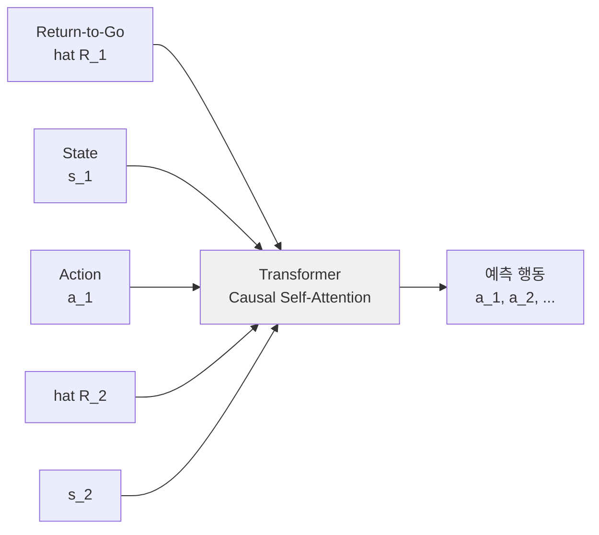
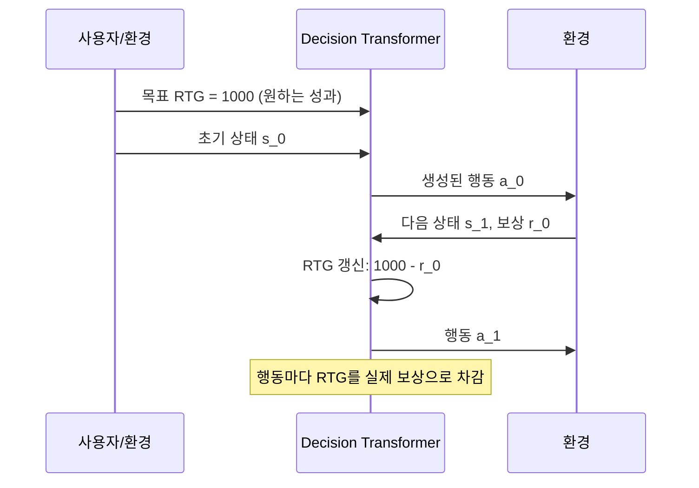

# Decision Transformer

Decision Transformer(DT)는 Chen et al. 2021이 제안한 기법으로, **강화학습(RL) 문제를 시퀀스 모델링(sequence modeling)으로 재정식화**한다. GPT 스타일의 인과적 [[transformer-architecture]]로 (리턴, 상태, 행동) 삼중쌍 시퀀스를 모델링하고, 원하는 미래 리턴을 조건으로 주면 그에 맞는 행동을 자동회귀적으로 생성한다.

## 핵심 아이디어

전통적 RL은 Bellman 방정식과 가치 함수(V, Q)를 기반으로 한다. Decision Transformer는 이를 완전히 우회해 **"어떤 리턴을 원하는가?"를 입력으로 주면 그 리턴을 달성하는 행동을 직접 생성**하는 시퀀스 모델을 학습한다.

입력 시퀀스 구조:

$$(\hat{R}_1, s_1, a_1, \hat{R}_2, s_2, a_2, \ldots, \hat{R}_T, s_T, a_T)$$

- $\hat{R}_t$: 타임스텝 $t$ 이후 얻을 리턴(return-to-go) - 미래 보상의 합
- $s_t$: 상태(state)
- $a_t$: 행동(action)

## Return-to-Go 조건부 생성

**Return-to-go(RTG)**: $\hat{R}_t = \sum_{t'=t}^{T} r_{t'}$ - 현재 시점 이후 받을 보상의 합.

학습 시: 오프라인 데이터셋의 각 전이(transition)에서 RTG를 사후적으로 계산해 레이블로 사용.

추론 시: 원하는 목표 RTG(예: 환경의 최대 가능 점수)를 첫 번째 입력으로 제공 → 모델이 그 리턴을 달성할 행동을 순차적으로 생성.

## [[offline-reinforcement-learning]] 과의 관계

Decision Transformer는 본질적으로 [[offline-reinforcement-learning]] 기법이다:

1. 오프라인 데이터셋(전문가 또는 혼합 데모)에서 학습
2. 환경과 추가 상호작용 없이 정책 추출
3. 분포 이탈(distributional shift) 문제를 시퀀스 모델링으로 우회

전통적 오프라인 RL(CQL, IQL 등)이 보수적 Q 학습으로 분포 이탈을 억제하는 것과 달리, DT는 **행동 복제(behavior cloning)처럼 모방하되 RTG를 조건으로 주어 목표 성능을 선택 가능**하게 한다.

## [[transformer-architecture]] 활용

GPT-2 아키텍처를 그대로 차용하며, 각 모달리티(RTG, 상태, 행동)를 별도 임베딩 레이어로 처리한다:

- 각 토큰: 선형 임베딩 + 레이어 정규화
- 위치 임베딩: 타임스텝 인덱스 기반 (절대적 위치)
- 인과적 어텐션 마스크(causal mask): 미래 토큰을 보지 못하도록 제한
- 행동 예측: 마지막 레이어의 행동 토큰 위치에서 선형 헤드로 예측

## 기존 RL 대비 장단점

**장점**:
- 장기 의존성 처리: 어텐션으로 먼 과거 상태/행동 참고 가능
- 보상 설계 불필요: RTG 레이블만 있으면 됨
- 대형 언어 모델 생태계(학습 인프라, 프리트레인 등) 활용 가능
- 오프라인 데이터가 충분하면 온라인 RL 없이도 강력한 정책 학습

**한계**:
- 잘 설계된 Bellman 백업 기반 RL보다 서브옵티말(sub-optimal) 데이터에서 성능이 낮을 수 있음
- RTG 조건이 정확해야 함 - 너무 높은 RTG를 요구하면 hallucination 유사 현상 발생
- 마르코프 속성 미활용 - 불필요한 이전 상태 참조로 비효율 가능

## 성능 벤치마크 (Atari, D4RL)

| 환경 | DT | CQL | BC |
|------|----|-----|----|
| Hopper-medium | 67.6 | 58.5 | 52.5 |
| HalfCheetah-medium | 42.6 | 44.0 | 42.6 |
| Walker2d-medium | 74.0 | 72.5 | 75.3 |
| Atari Pong | 106.1 | - | 85.2 |

전문가 수준 데이터에서는 특히 강력한 성능을 보인다.

## 발전 방향

- **Gato (DeepMind 2022)**: DT 아이디어를 멀티태스크·멀티모달로 확장한 범용 에이전트
- **Q-Transformer**: RTG 대신 Q값으로 조건을 주어 Bellman 백업과 결합
- **온라인 DT**: 오프라인 학습 후 온라인 파인튜닝으로 성능 향상

## 실무 관점

- 로봇 조작, 자율주행, 게임 플레이에서 오프라인 데이터가 풍부할 때 유용
- 언어 모델 인프라를 RL에 재사용할 수 있어 엔지니어링 비용 절감
- 시뮬레이터가 없거나 온라인 탐색이 위험한 실세계 RL 시나리오에 적합
- 컨텍스트 창 길이(context window)가 에피소드 길이를 제한 - 장기 과제에 주의

## 관련 문서

- [[offline-reinforcement-learning]] - DT의 학습 패러다임 기반
- [[transformer-architecture]] - DT가 차용한 GPT 스타일 아키텍처
- [[imitation-learning]] - DT와 유사하게 데모 데이터에서 정책을 추출하는 기법
- [[sac-soft-actor-critic]] - 온라인 RL 대표 알고리즘과의 비교
