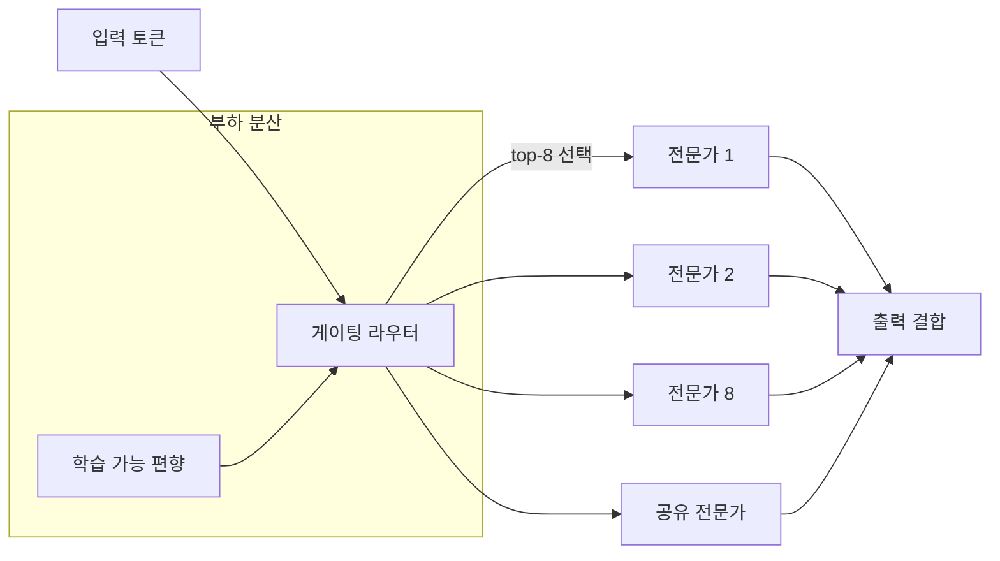
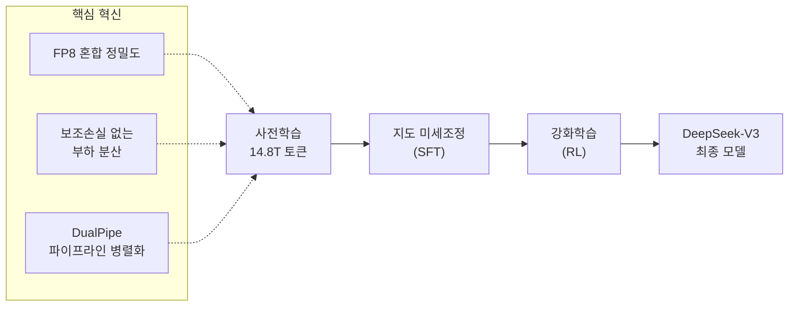

# DeepSeek-V3 학습

## 개요

DeepSeek-V3는 DeepSeek-AI가 2024년 12월 공개한 671B 파라미터 Mixture-of-Experts(MoE) 언어 모델이다. 토큰당 37B 파라미터만 활성화하는 효율적 구조를 채택했으며, 14.8조 토큰으로 사전학습되었다. 전체 학습 비용이 약 $5.6M(2.788M H800 GPU 시간)에 불과하여, 동급 규모 모델 대비 극도로 낮은 비용으로 최상위 성능을 달성한 점이 핵심 화제였다. FP8 혼합 정밀도 학습의 대규모 검증, 보조 손실 없는 부하 분산 전략, DualPipe 파이프라인 병렬화 등 다수의 학습 기술 혁신을 포함한다.

## 모델 아키텍처

### Multi-head Latent Attention (MLA)

DeepSeek-V2에서 검증된 MLA 아키텍처를 계승한다. 핵심 아이디어는 Key-Value 텐서를 저차원 잠재 공간(latent space)으로 압축하여 KV 캐시에 저장하고, 추론 시 원래 차원으로 복원하는 것이다. LoRA가 어댑터에 적용하는 저랭크 분해(low-rank factorization)를 기본 어텐션 메커니즘 자체에 적용한 형태로, 추론 시 메모리 사용량을 대폭 절감한다.

### DeepSeekMoE 구조

| 항목 | 수치 |
|------|------|
| 총 파라미터 | 671B |
| 토큰당 활성 파라미터 | 37B |
| 전문가(Expert) 수 | 256 + 1 공유 전문가 |
| 토큰당 활성 전문가 | 8 |
| 레이어 수 | 61 |
| 어텐션 | MLA (Multi-head Latent Attention) |

## 핵심 학습 기법

### 보조 손실 없는 부하 분산 (Auxiliary-Loss-Free Load Balancing)

기존 MoE 모델은 전문가 간 부하를 균등하게 분산하기 위해 보조 손실(auxiliary loss)을 추가한다. 그러나 이 보조 손실은 모델의 주 학습 목표와 상충하여 성능 저하를 유발한다. DeepSeek-V3는 보조 손실 없이 각 전문가에 학습 가능한 편향(bias) 항을 도입하여 라우팅 점수를 조절하는 방식으로 자연스러운 부하 분산을 달성한다. 이 전략이 성능 저하 최소화의 핵심이다.

### FP8 혼합 정밀도 학습

DeepSeek-V3는 초대규모 모델에서 FP8 학습의 실현 가능성과 효과를 최초로 검증했다. BF16 기준선 대비 상대 손실 오차(relative loss error)가 0.25% 이내로 유지되어, 학습 난수(training randomness)의 허용 범위 안에 들었다. FP8 학습은 메모리 사용량과 연산량을 동시에 절감하여, $5.6M이라는 낮은 학습 비용의 핵심 요인이 되었다.

| 정밀도 | 비트 수 | 메모리 절감 | 성능 영향 |
|--------|--------|-----------|----------|
| BF16 (기준선) | 16 | - | - |
| FP8 (DeepSeek-V3) | 8 | ~50% | 손실 오차 0.25% 이내 |

### DualPipe 파이프라인 병렬화

MoE 모델의 교차 노드 전문가 병렬화(Expert Parallelism)는 all-to-all 통신 오버헤드가 커서 연산 대 통신 비율이 약 1:1에 달한다. DualPipe는 순방향(forward)과 역방향(backward) 연산-통신 단계를 양방향으로 겹쳐 실행하여 이 문제를 해결한다.

각 학습 청크(chunk)는 네 가지 구성요소로 분할된다:
1. **어텐션 연산** (노드 내)
2. **All-to-all 디스패치** (교차 노드 통신)
3. **MLP 연산** (전문가 실행)
4. **All-to-all 결합** (결과 수집)

역방향 청크에서는 어텐션과 MLP를 ZeroBubble 방식처럼 입력 역전파와 가중치 역전파로 추가 분할하여, 파이프라인 버블을 최소화한다.

## 학습 인프라 및 구성

| 항목 | 구성 |
|------|------|
| GPU | H800 클러스터 |
| 노드 내 연결 | NVLink |
| 노드 간 연결 | InfiniBand (IB) |
| 파이프라인 병렬화 (PP) | 16-way |
| 전문가 병렬화 (EP) | 64-way (8노드) |
| 데이터 병렬화 (DP) | ZeRO-1 |
| 총 GPU 시간 | 2.788M H800 시간 |
| 추정 비용 | ~$5.6M |

## 학습 데이터 및 절차

### 사전학습 (Pre-training)

14.8조 개의 다양하고 고품질인 토큰으로 사전학습되었다. 데이터 구성에는 웹 텍스트, 코드, 수학, 다국어 데이터가 포함된다.

### 후속 학습 (Post-training)

사전학습 이후 [[supervised-fine-tuning|지도 미세조정(SFT)]]과 [[rlhf-pipeline|강화학습(RL)]] 단계를 거쳐 모델을 정렬(alignment)했다. DeepSeek-V3는 후속 학습에서도 자체 생성 데이터를 활용한 자기 진화(self-evolution) 접근법을 적용했다.

## 비용 효율성 비교

DeepSeek-V3의 학습 비용은 동급 모델 대비 현저히 낮다. $5.6M은 Llama 3 405B 등 유사 규모 모델의 학습 비용 추정치와 비교하면 한 자릿수 이상 저렴하다. 이 효율성은 FP8 학습, DualPipe 통신 최적화, 보조 손실 제거 등 기술 혁신의 복합적 결과다.

| 모델 | 파라미터 | 학습 토큰 | 추정 비용 |
|------|---------|----------|----------|
| DeepSeek-V3 | 671B (37B 활성) | 14.8T | ~$5.6M |
| Llama 3 405B | 405B (밀집) | 15.6T | 훨씬 고비용 |

## 의의와 영향

DeepSeek-V3는 MoE 아키텍처와 학습 효율화 기법의 조합이 밀집(dense) 모델 대비 얼마나 큰 비용 절감을 달성할 수 있는지 보여준 대표 사례다. 특히 FP8 학습의 대규모 검증은 [[mixed-precision-training|혼합 정밀도 학습]]의 새로운 기준점을 제시했으며, 보조 손실 없는 부하 분산은 MoE 학습의 근본적 트레이드오프를 해소한 기법으로 평가받는다.

## 관련 문서

- [[mixed-precision-training]] -- FP8 혼합 정밀도 학습의 이론적 배경
- [[tensor-pipeline-parallelism]] -- DualPipe가 확장한 파이프라인 병렬화 기법
- [[deepspeed-zero]] -- ZeRO-1 데이터 병렬화
- [[neural-scaling-laws]] -- MoE의 효율적 스케일링 근거
- [[supervised-fine-tuning]] -- 후속 학습 SFT 단계
- [[rlhf-pipeline]] -- 후속 학습 RL 단계
