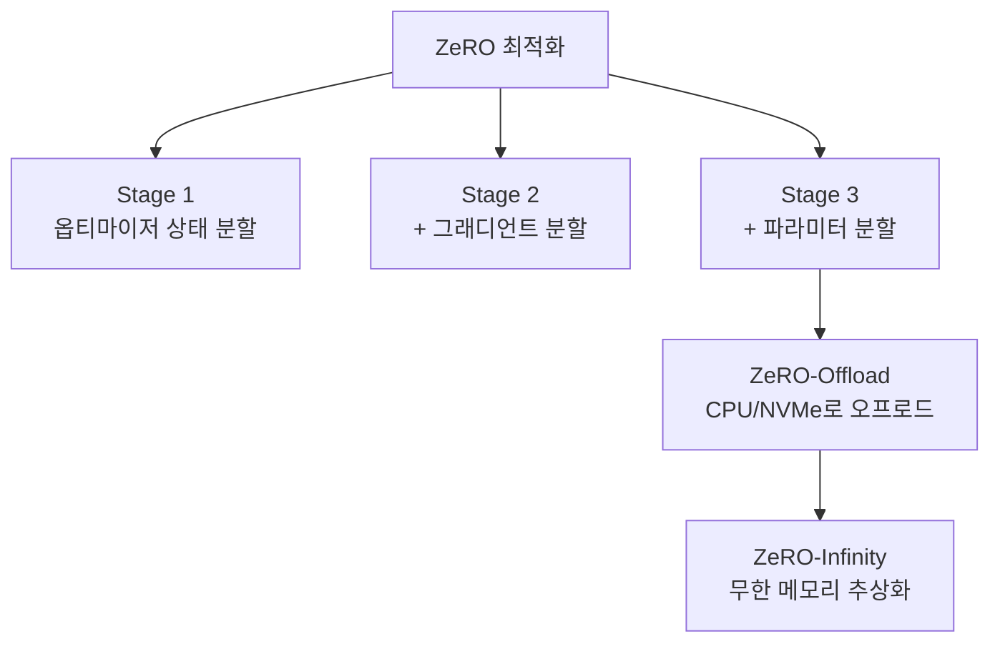

# DeepSpeed 내부 구조

Microsoft의 대규모 모델 학습/추론 최적화 라이브러리. [[data-parallelism-fsdp|ZeRO]] 시리즈를 핵심으로, 혼합 정밀도, 파이프라인 병렬화, 커널 최적화를 통합 제공한다.

## ZeRO 3단계

| 단계 | 분할 대상 | GPU당 메모리 절감 | 통신 오버헤드 |
|------|----------|-----------------|-------------|
| Stage 1 | 옵티마이저 상태 | 4x | 없음 |
| Stage 2 | + 그래디언트 | 8x | 소폭 증가 |
| Stage 3 | + 파라미터 | **64x+** | 증가 (AllGather) |

## 주요 기능

- **[[mixed-precision-training|혼합 정밀도]]**: FP16/BF16 자동 관리
- **Activation Checkpointing**: [[selective-activation-recomputation|선택적 재계산]]
- **커널 융합**: Transformer 레이어 커널 최적화
- **Elastic Training**: 노드 장애 시 자동 복구

## PyTorch FSDP와의 비교

| 측면 | DeepSpeed ZeRO | PyTorch FSDP |
|------|---------------|-------------|
| 개발 | Microsoft | Meta (PyTorch) |
| CPU 오프로드 | 네이티브 | 제한적 |
| NVMe 오프로드 | ZeRO-Infinity | 미지원 |
| 생태계 통합 | HF Trainer, Composer | PyTorch 네이티브 |

## 관련 문서

- [[data-parallelism-fsdp]] -- FSDP / ZeRO
- [[distributed-training-overview]] -- 분산 학습 개요
- [[zero-offload]] -- ZeRO-Offload
- [[pipeline-parallelism-1f1b]] -- 파이프라인 병렬
