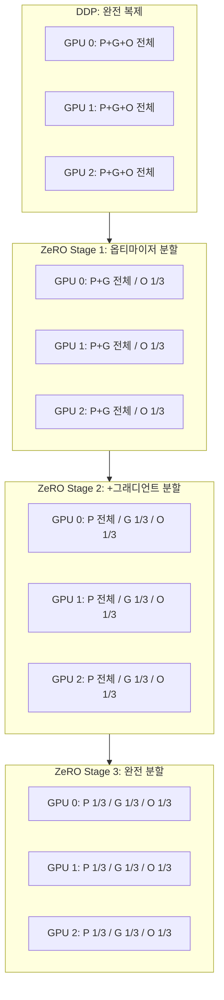

# DeepSpeed ZeRO

## 개요

ZeRO(Zero Redundancy Optimizer)는 Microsoft DeepSpeed 라이브러리의 핵심 기술로, 분산 학습 시 각 GPU에 중복 저장되는 모델 상태(옵티마이저 상태, 그래디언트, 파라미터)를 단계적으로 분할(partitioning)하여 메모리 중복을 제거하는 기법이다. 3개의 단계(Stage 1/2/3)로 구성되며, 단계가 높아질수록 메모리 절감이 커지지만 통신 오버헤드도 증가한다. ZeRO-Infinity는 CPU와 NVMe 스토리지까지 오프로딩을 확장하여 GPU 메모리 한계를 초월한다. PyTorch [[data-parallelism-fsdp]]의 FSDP가 ZeRO Stage 3과 동일한 원리를 PyTorch 네이티브로 구현한 것이다.

## 핵심 개념

### 모델 학습의 메모리 구성

7.5B 파라미터 모델을 AdamW(FP32) + [[mixed-precision-training]](FP16)으로 학습할 때 GPU당 메모리:

| 구성요소 | 크기 | 설명 |
|---------|------|------|
| FP16 파라미터 | 15GB | 7.5B x 2 bytes |
| FP16 그래디언트 | 15GB | 7.5B x 2 bytes |
| FP32 옵티마이저 상태 | 60GB | FP32 파라미터(30GB) + 1차 모멘트(15GB) + 2차 모멘트(15GB) |
| **총합** | **90GB** | 단일 GPU에 적재 불가능 |

DDP에서는 이 90GB가 모든 GPU에 동일하게 복제된다. ZeRO는 이 중복을 제거한다.

### ZeRO Stage 1: 옵티마이저 상태 분할

옵티마이저 상태(FP32 마스터 가중치, 1차/2차 모멘트)만 GPU 간에 분할한다. 8개 GPU 사용 시 옵티마이저 메모리가 60GB에서 7.5GB로 감소한다. 파라미터와 그래디언트는 여전히 모든 GPU에 복제되므로 통신 패턴은 DDP와 동일하다.

**메모리 절감**: 최대 4배 (8 GPU 기준)

### ZeRO Stage 2: 그래디언트 분할 추가

Stage 1에 더해 그래디언트도 분할한다. 각 GPU는 자신이 담당하는 옵티마이저 파라미터에 해당하는 그래디언트만 보유한다. backward 중에 reduce-scatter로 그래디언트를 분배하여 각 GPU가 자신의 파티션에 대한 그래디언트만 유지한다.

**메모리 절감**: 최대 8배 (8 GPU 기준)

### ZeRO Stage 3: 파라미터 분할 추가

모든 모델 상태(파라미터 + 그래디언트 + 옵티마이저)를 완전히 분할한다. 각 GPU는 전체 모델의 1/N만 보유하며, forward/backward 수행 시 필요한 파라미터를 all-gather로 수집하고 사용 후 즉시 해제한다. [[data-parallelism-fsdp]]의 FSDP와 동일한 원리이다.

**메모리 절감**: GPU 수에 선형 비례 (N개 GPU에서 1/N)

### ZeRO-Infinity: CPU/NVMe 오프로딩

Stage 3에 CPU 메모리와 NVMe SSD로의 오프로딩을 추가한다. GPU에서 즉시 필요하지 않은 파라미터와 옵티마이저 상태를 CPU RAM이나 NVMe에 저장하고, 필요할 때 프리페치(prefetch)한다. 이론적으로 GPU 메모리와 무관하게 모델 크기를 확장할 수 있다.

## 작동 원리



P = Parameters, G = Gradients, O = Optimizer States

### Stage별 통신량 비교

| Stage | 메모리 절감 | 통신량 (DDP 대비) | 주요 통신 패턴 |
|-------|-----------|-----------------|--------------|
| DDP | 없음 | 1x | all-reduce (그래디언트) |
| Stage 1 | ~4x | 1x | all-reduce (그래디언트) |
| Stage 2 | ~8x | 1x | reduce-scatter (그래디언트) |
| Stage 3 | ~Nx | 1.5x | all-gather (파라미터) + reduce-scatter |
| ZeRO-Infinity | 무제한 | 1.5x+ | all-gather + CPU/NVMe I/O |

Stage 1과 2는 DDP와 통신량이 동일하므로 처리량 저하가 거의 없다. Stage 3은 forward에서 파라미터 all-gather가 추가되어 통신량이 약 50% 증가하지만, 연산과 통신의 오버랩으로 실제 속도 저하를 최소화한다.

## DeepSpeed 구성 예시

```json
{
  "zero_optimization": {
    "stage": 3,
    "offload_optimizer": {
      "device": "cpu",
      "pin_memory": true
    },
    "offload_param": {
      "device": "cpu",
      "pin_memory": true
    },
    "overlap_comm": true,
    "contiguous_gradients": true,
    "reduce_bucket_size": 5e8,
    "stage3_prefetch_bucket_size": 5e8,
    "stage3_param_persistence_threshold": 1e6
  }
}
```

`stage3_param_persistence_threshold`는 지정 크기 이하의 파라미터를 분할하지 않고 모든 GPU에 유지한다. 작은 파라미터의 빈번한 all-gather 오버헤드를 방지한다.

## FSDP vs ZeRO Stage 3 비교

| 항목 | PyTorch FSDP2 | DeepSpeed ZeRO-3 |
|------|-------------|-----------------|
| 구현 | PyTorch 네이티브 | 독립 라이브러리 |
| 샤딩 원리 | per-parameter (DTensor) | flat buffer |
| CPU/NVMe 오프로딩 | 제한적 지원 | ZeRO-Infinity 완전 지원 |
| TP/PP 결합 | TorchTitan으로 네이티브 | Megatron-DeepSpeed |
| 생태계 통합 | HuggingFace Accelerate, TorchTitan | HuggingFace, Composer |
| 설정 방식 | Python API | JSON 설정 파일 |

## 실전 도입 가이드

### Stage 선택 기준

| 상황 | 권장 Stage | 이유 |
|------|-----------|------|
| 메모리 약간 부족 | Stage 1 | 통신 증가 없이 옵티마이저 메모리 절감 |
| 메모리 상당히 부족 | Stage 2 | 통신 증가 없이 최대 8배 절감 |
| 모델이 단일 GPU에 미적재 | Stage 3 | 완전 분할로 GPU 수 비례 절감 |
| GPU 메모리 극히 제한 | ZeRO-Infinity | CPU/NVMe 오프로딩으로 제한 초월 |

### [[mixed-precision-training]]과의 결합

ZeRO의 모든 Stage에서 FP16/BF16 혼합 정밀도를 함께 사용하여 메모리를 추가 절감할 수 있다. Stage 2 + BF16 조합이 통신 오버헤드와 메모리 효율의 최적 균형점으로 널리 사용된다.

## 관련 문서

- [[data-parallelism-fsdp]] -- PyTorch 네이티브 FSDP (ZeRO-3 동등)
- [[tensor-pipeline-parallelism]] -- DeepSpeed와 결합하는 모델 병렬화
- [[mixed-precision-training]] -- ZeRO와 결합하는 정밀도 최적화
- [[gradient-accumulation-checkpointing]] -- 추가 메모리 절감
- [[optimizer-selection]] -- AdamW 등 옵티마이저의 메모리 특성
- [[mit-training-efficiency]] -- 학습 효율화 연구
