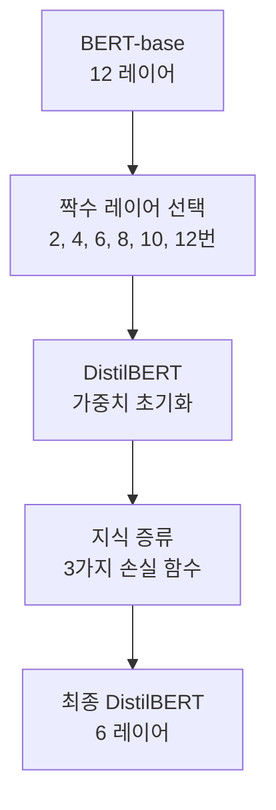
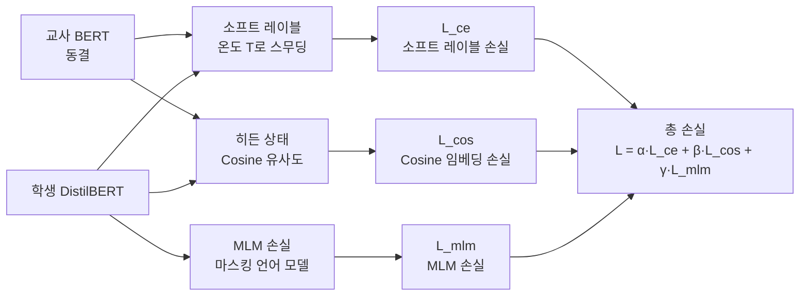

# DistilBERT - 트랜스포머 지식 증류

DistilBERT는 Hugging Face가 2019년 발표한 [[bert-paper|BERT]] 경량화 모델이다. [[knowledge-distillation]] 기법으로 BERT-base의 40% 파라미터를 제거하면서도 97% 이상의 언어 이해 성능을 유지하고 추론 속도를 60% 향상시켰다. 트랜스포머 모델의 지식 증류를 실용화한 선구적 사례다.

## 핵심 수치

| 지표 | BERT-base | DistilBERT | 비율 |
|------|-----------|------------|------|
| 파라미터 수 | 110M | 66M | 40% 감소 |
| 추론 속도 | 기준 | 1.6배 빠름 | 60% 향상 |
| GLUE 점수 | 79.6 | 77.0 | 97% 유지 |
| 모델 크기 | 438MB | 263MB | 40% 감소 |

## 아키텍처: 레이어 반감 전략

DistilBERT는 BERT-base (12레이어)에서 절반인 6레이어만 사용한다. 단순히 레이어를 제거하는 것이 아니라, **레이어 초기화 방식**이 핵심이다.



### 제거한 것들
- 레이어 수: 12 -> 6
- 토큰 타입 임베딩 (NSP 태스크 제거로 불필요)
- Pooler 레이어

### 유지한 것들
- 히든 차원: 768 (변경 없음)
- 어텐션 헤드 수: 12 (변경 없음)
- 어휘집 크기: 30,522 (변경 없음)

## 3가지 손실 함수 결합

DistilBERT의 핵심은 세 가지 손실 함수를 결합하여 교사 모델의 지식을 다양한 수준에서 전달하는 것이다.



### 손실 1: 소프트 레이블 손실 (Distillation Loss)

$$L_{ce} = -\sum_i p_T^i \log q^i$$

여기서 $p_T$는 교사 모델의 **온도 조정 소프트맥스** 출력이다.

```python
import torch.nn.functional as F

temperature = 4.0  # 온도 파라미터

# 교사 소프트 레이블
teacher_probs = F.softmax(teacher_logits / temperature, dim=-1)
# 학생 로그 확률
student_log_probs = F.log_softmax(student_logits / temperature, dim=-1)

# KL Divergence로 구현
distillation_loss = F.kl_div(student_log_probs, teacher_probs, reduction="batchmean")
distillation_loss *= temperature ** 2  # 온도 보정
```

**온도(Temperature) 파라미터의 역할**: 온도가 높으면 소프트맥스 분포가 완만해져 교사 모델이 각 클래스에 부여하는 미묘한 상대적 확률 정보가 살아난다.

### 손실 2: 코사인 임베딩 손실 (Cosine Embedding Loss)

히든 상태의 방향성을 보존한다.

$$L_{cos} = 1 - \cos(\hat{h}_s, \hat{h}_t)$$

학생과 교사의 히든 상태 벡터 간 코사인 유사도를 최대화한다.

### 손실 3: MLM 손실 (Masked Language Modeling Loss)

표준 BERT 사전학습 목표를 함께 유지한다. 이를 통해 학생 모델이 언어 표현 능력을 독자적으로도 유지하도록 한다.

## 가중치 초기화 전략

DistilBERT의 또 다른 핵심은 **교사 모델의 가중치로 학생을 초기화**하는 것이다.

BERT-base 12레이어 중 짝수 번째(2, 4, 6, 8, 10, 12)를 선택해 학생의 6레이어를 초기화한다. 무작위 초기화 대비 훨씬 빠른 수렴과 높은 최종 성능을 얻을 수 있다.

## BERT와의 상세 비교

### 제거된 NSP 태스크
BERT는 두 문장이 연속적인지 예측하는 Next Sentence Prediction(NSP)을 사전학습 목표로 사용한다. DistilBERT는 MLM만 사용한다. 이는 [[bert-paper|RoBERTa]] 등이 NSP가 성능에 기여하지 않음을 보인 연구와 일치한다.

### 파인튜닝 성능

| 태스크 | BERT-base | DistilBERT |
|--------|-----------|------------|
| SST-2 (감성) | 93.5% | 91.3% |
| SQuAD 2.0 | 76.5 F1 | 70.7 F1 |
| MNLI-m (추론) | 84.9% | 82.2% |
| QQP (유사도) | 89.3% | 88.5% |

대부분의 태스크에서 2-6%p 정도의 성능 차이를 보이면서도 속도는 60% 향상되었다.

## 실무 활용

### 언제 DistilBERT를 선택하는가

- **엣지/모바일 배포**: 모델 크기와 추론 속도가 제약 요소일 때
- **실시간 처리**: 지연 시간(latency)이 중요한 서비스
- **비용 절감**: 대규모 추론 비용을 줄여야 할 때
- **BERT 수준 정확도로 충분한 태스크**: 감성 분석, 분류, 간단한 NER 등

### 코드 예시

```python
from transformers import DistilBertTokenizer, DistilBertForSequenceClassification

tokenizer = DistilBertTokenizer.from_pretrained("distilbert-base-uncased")
model = DistilBertForSequenceClassification.from_pretrained(
    "distilbert-base-uncased",
    num_labels=2
)

inputs = tokenizer("이 영화는 정말 훌륭합니다!", return_tensors="pt")
outputs = model(**inputs)
logits = outputs.logits
```

## DistilBERT 계열 모델들

DistilBERT의 성공 이후 같은 방법론으로 다른 BERT 변형 모델들도 증류되었다.

| 모델 | 원본 | 레이어 수 | 파라미터 |
|------|------|---------|---------|
| DistilBERT | BERT-base | 6 | 66M |
| DistilRoBERTa | RoBERTa | 6 | 82M |
| DistilBERT-multilingual | mBERT | 6 | 134M |
| TinyBERT | BERT | 4 | 14M |
| MobileBERT | BERT-large | 24 | 25M |

## 지식 증류의 일반 원칙으로서의 의미

DistilBERT는 단순히 BERT를 경량화한 것을 넘어, **트랜스포머 모델의 지식 증류 방법론을 체계화**했다는 점에서 중요하다.

1. **소프트 레이블 + 하드 레이블 혼합**: 이후 모든 증류 작업의 표준
2. **중간 표현 증류**: 최종 출력뿐 아니라 히든 상태도 증류 가능
3. **교사 가중치 초기화**: 랜덤 초기화 대비 훨씬 효율적

이 원칙들은 이후 [[seq-knowledge-distillation]], [[minillm-text-distillation]] 등 더 발전된 LLM 증류 방법론의 기초가 되었다.

## 관련 문서

- [[bert-paper]] - DistilBERT의 원본 교사 모델
- [[knowledge-distillation]] - 지식 증류 기본 개념
- [[seq-knowledge-distillation]] - 시퀀스 레벨로 확장된 지식 증류
- [[minillm-text-distillation]] - LLM에 적용된 발전된 증류 방법론
- [[supervised-fine-tuning]] - 증류 후 파인튜닝 기법
