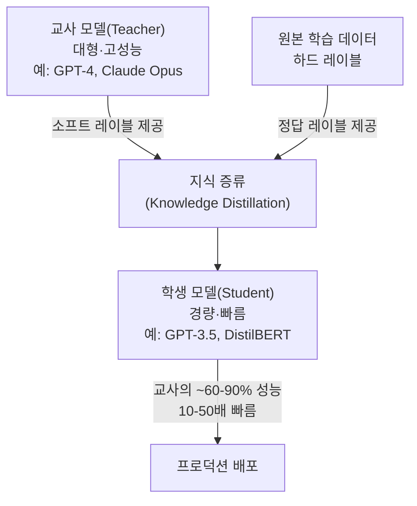
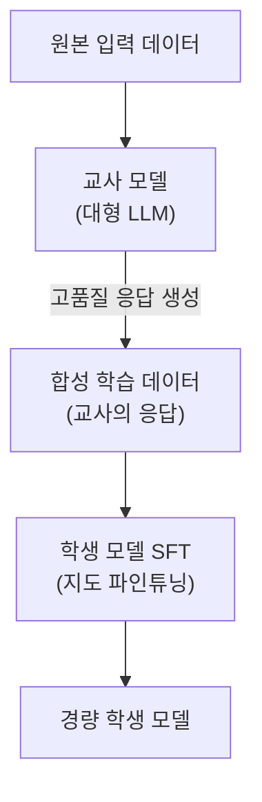
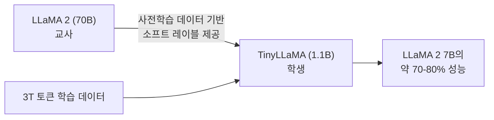
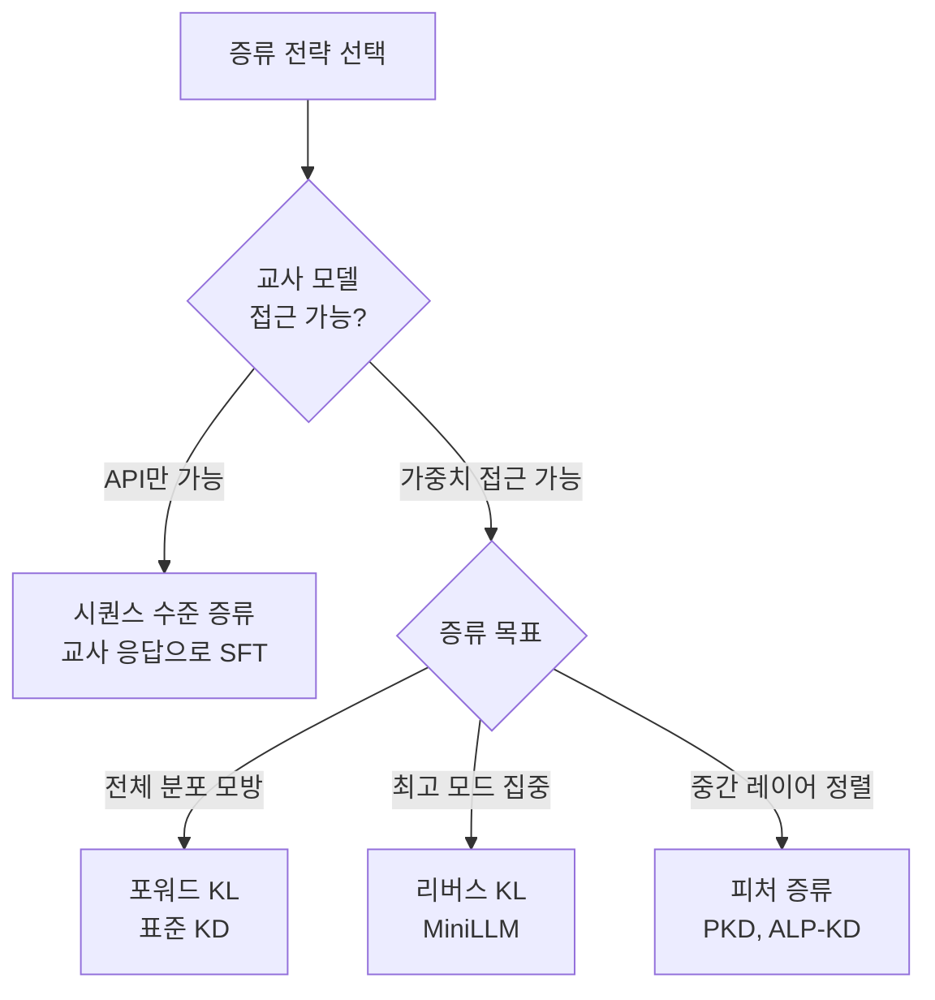

# LLM 지식 증류 (Knowledge Distillation for LLMs)

## 개요

지식 증류(Knowledge Distillation, KD)는 **대형 교사 모델(teacher model)** 의 지식을 **소형 학생 모델(student model)** 에 전달하여 경량 모델의 성능을 끌어올리는 기법이다. Hinton et al. (2015)의 "Distilling the Knowledge in a Neural Network"에서 처음 제안된 이 개념은, LLM 시대에 이르러 훨씬 복잡한 형태로 진화했다.

LLM 맥락에서 지식 증류가 특히 중요한 이유는 **추론 비용의 불균형** 때문이다. GPT-4, Claude Opus 같은 수백억~수조 파라미터 모델은 강력하지만 실시간 서비스에 적용하기엔 너무 느리고 비싸다. 증류는 이 격차를 좁히는 핵심 도구다.



---

## 핵심 원리: 소프트 타겟

### 하드 레이블 vs 소프트 레이블

지식 증류의 핵심 아이디어는 **온도가 있는 소프트맥스(softmax with temperature)** 를 통한 소프트 레이블이다.

일반 분류 학습에서는 정답 클래스만 1, 나머지는 0인 하드 레이블(one-hot)을 사용한다:

$$y_{hard} = [0, 0, 1, 0, 0]$$

교사 모델의 소프트 레이블은 각 클래스에 대한 확률 분포를 제공한다:

$$p_T(x) = \text{softmax}\left(\frac{z_T}{T}\right), \quad z_T : \text{교사 로짓}$$

여기서 $T$는 **증류 온도(distillation temperature)** 다. $T > 1$이면 확률 분포가 평탄해져 클래스 간 관계 정보가 풍부해진다.

### 왜 소프트 레이블이 더 좋은가

예를 들어, 이미지 분류에서 "고양이" 이미지에 대한 교사 모델의 소프트 레이블이 다음과 같다면:

| 클래스 | 하드 레이블 | 소프트 레이블 |
|--------|-----------|------------|
| 고양이 | 1.0 | 0.85 |
| 표범 | 0.0 | 0.10 |
| 개 | 0.0 | 0.04 |
| 자동차 | 0.0 | 0.01 |

소프트 레이블은 "고양이는 표범과 비슷하다"는 **관계적 지식**을 전달한다. 이는 하드 레이블로는 표현할 수 없는 정보다.

---

## 표준 증류 손실 함수

학생 모델의 학습 손실은 두 부분으로 구성된다:

$$\mathcal{L}_{KD} = (1 - \alpha) \cdot \mathcal{L}_{CE}(y, \hat{y}_S) + \alpha \cdot T^2 \cdot \mathcal{L}_{KL}(p_T, p_S)$$

- $\mathcal{L}_{CE}$: 정답 레이블에 대한 교차 엔트로피 손실
- $\mathcal{L}_{KL}$: 교사-학생 출력 분포 간 KL 발산
- $\alpha$: 두 손실의 균형 가중치 (보통 0.5~0.9)
- $T^2$: 온도 스케일링 보정 항

```python
import torch
import torch.nn.functional as F

def distillation_loss(
    student_logits: torch.Tensor,
    teacher_logits: torch.Tensor,
    labels: torch.Tensor,
    temperature: float = 4.0,
    alpha: float = 0.7,
) -> torch.Tensor:
    """
    표준 지식 증류 손실 계산.
    
    Args:
        student_logits: 학생 모델의 로짓 (B, V)
        teacher_logits: 교사 모델의 로짓 (B, V)
        labels: 정답 토큰 ID (B,)
        temperature: 증류 온도
        alpha: KD 손실 가중치 (1-alpha = CE 가중치)
    """
    # 소프트 타겟 손실 (KL 발산)
    soft_teacher = F.softmax(teacher_logits / temperature, dim=-1)
    soft_student = F.log_softmax(student_logits / temperature, dim=-1)
    kd_loss = F.kl_div(soft_student, soft_teacher, reduction="batchmean")
    kd_loss = kd_loss * (temperature ** 2)  # 온도 스케일 보정

    # 하드 타겟 손실 (정답 레이블)
    ce_loss = F.cross_entropy(student_logits, labels)

    return alpha * kd_loss + (1 - alpha) * ce_loss
```

---

## LLM 특화 증류 기법

LLM은 일반 분류 모델과 다른 특성을 가진다. 어휘 크기가 수만 개, 시퀀스가 수천 토큰이며, 지식이 단순 레이블이 아닌 **문장 생성 능력** 에 있다. 이를 위한 전용 기법들이 개발되었다.

### 1. 시퀀스 수준 증류 (Sequence-Level KD)

Kim & Rush (2016)에서 제안. 단순히 토큰 수준 로짓을 맞추는 대신, **교사 모델이 생성한 텍스트 시퀀스** 를 학생의 학습 데이터로 사용한다.



**장점**: 구현이 단순하고 효과적  
**단점**: 교사의 오류도 학습 (exposure bias)

[[seq-knowledge-distillation]] 상세 참조.

### 2. MiniLLM (2023)

Microsoft 연구팀이 제안한 기법. 표준 KD가 **포워드 KL 발산** $D_{KL}(p_T \| p_S)$를 최소화하는 반면, MiniLLM은 **리버스 KL 발산** $D_{KL}(p_S \| p_T)$를 최소화한다.

**핵심 차이:**
- 포워드 KL: 교사의 모든 모드를 커버하려 함 → 낮은 확률 영역도 학습
- 리버스 KL: 학생이 잘 하는 영역에 집중 → **모드 추구(mode-seeking)** 동작

리버스 KL은 교사 모델의 분포 전체를 모방하지 않고 **가장 중요한 모드** 에 집중하게 만들어, 작은 모델 용량으로 더 효율적인 학습이 가능하다.

$$\mathcal{L}_{MiniLLM} = D_{KL}(p_S \| p_T) = \mathbb{E}_{x \sim p_S}\left[\log \frac{p_S(x)}{p_T(x)}\right]$$

이 손실은 정책 경사도(policy gradient)로 최적화:

$$\nabla_\theta \mathcal{L} = -\mathbb{E}_{x \sim p_S}\left[\nabla_\theta \log p_S(x) \cdot \log p_T(x)\right]$$

[[minillm-text-distillation]] 상세 참조.

### 3. DistilBERT (2019)

Sanh et al.의 선구적 작업. BERT(110M)를 DistilBERT(66M)로 증류. 3가지 손실을 조합:

1. **언어 모델링 손실**: MLM 태스크의 표준 손실
2. **증류 손실**: 교사-학생 소프트 레이블 KL 발산
3. **코사인 임베딩 손실**: 히든 스테이트 정렬

결과: 파라미터 40% 감소, 속도 60% 향상, GLUE 성능 97% 보존.

[[distilbert-distillation]] 상세 참조.

### 4. TinyLLaMA / Phi 계열

사전학습 단계부터 증류를 통합:



Microsoft의 **Phi 시리즈**는 다른 접근을 취한다. 교사 모델의 로짓이 아니라 **교사가 생성한 고품질 텍스트**로 학습 (Data-First Distillation):

- Phi-1: 7B 모델의 코딩 능력을 1.3B로
- Phi-2: 2.7B로 7B 수준 달성
- Phi-3: 3.8B로 GPT-3.5 수준 달성

---

## 증류 전략별 비교



| 전략 | 필요 조건 | 장점 | 단점 |
|------|---------|------|------|
| 시퀀스 수준 KD | API 접근만 | 구현 단순 | 교사 오류 전파 |
| 토큰 수준 KD | 로짓 접근 | 풍부한 분포 정보 | 계산 비용 |
| MiniLLM | 로짓 접근 | 작은 모델에 효율적 | 학습 불안정 가능 |
| 피처 증류 | 히든 스테이트 접근 | 중간 표현 정렬 | 크기 차이 시 어려움 |
| 데이터 기반 (Phi) | 강력한 교사만 | 교사 로짓 불필요 | 데이터 품질 의존 |

---

## 추론 모델 증류

[[reasoning-llm]]의 등장으로 **추론 능력 증류** 가 새로운 영역으로 부상했다.

### 사고 사슬 증류 (Chain-of-Thought Distillation)

```python
def generate_cot_training_data(
    teacher_client,
    problems: list[str],
    model: str = "claude-3-7-sonnet-20250219",
) -> list[dict]:
    """
    교사 추론 모델의 사고 과정을 학생 학습 데이터로 변환.
    """
    import anthropic

    training_data = []
    for problem in problems:
        response = teacher_client.messages.create(
            model=model,
            max_tokens=16000,
            thinking={"type": "enabled", "budget_tokens": 8000},
            messages=[{"role": "user", "content": problem}],
        )

        thinking = next(
            (b.thinking for b in response.content if b.type == "thinking"), ""
        )
        answer = next(
            (b.text for b in response.content if b.type == "text"), ""
        )

        # 사고 과정을 학생의 학습 시퀀스에 포함
        training_data.append({
            "input": problem,
            "chain_of_thought": thinking,
            "output": answer,
            "combined": f"<think>\n{thinking}\n</think>\n{answer}",
        })

    return training_data
```

DeepSeek R1의 증류 버전(R1-Distill-Qwen-7B 등)은 이 방식으로 32B 교사 모델의 추론 능력을 7B 모델에 전달했다.

---

## 증류 평가 지표

| 지표 | 측정 대상 | 공식 |
|------|---------|------|
| 파라미터 압축률 | 모델 크기 감소 | $N_T / N_S$ |
| 지식 보존률 | 성능 대비 크기 | $\text{perf}_S / \text{perf}_T$ |
| 추론 가속비 | 속도 향상 | $\text{latency}_T / \text{latency}_S$ |
| FLOP 효율 | 추론 비용 | $\text{FLOPs}_T / \text{FLOPs}_S$ |

### 대표 모델들의 압축 결과

| 학생 모델 | 교사 모델 | 파라미터 감소 | 성능 보존 |
|----------|---------|------------|---------|
| DistilBERT (66M) | BERT (110M) | 40% | 97% |
| DistilGPT-2 (82M) | GPT-2 (124M) | 34% | ~95% |
| TinyLLaMA (1.1B) | LLaMA 2 (7B) | 84% | ~70% |
| DeepSeek R1-Distill-7B | DeepSeek R1 (671B) | 98.9% | ~65% |

---

## 실무 고려사항

### 언제 증류를 사용하는가

1. **지연 시간(latency) 제약**: 교사는 너무 느리지만 성능이 필요할 때
2. **비용 절감**: API 비용이 과도할 때 오프라인 학생으로 대체
3. **에지 배포**: 디바이스 온디바이스 추론
4. **특화 태스크**: 범용 교사에서 특정 도메인 학생으로 지식 추출

### 증류 vs 직접 파인튜닝

| 상황 | 권장 방법 |
|------|---------|
| 레이블 데이터 충분 | 직접 파인튜닝이 더 효율적 |
| 레이블 비용이 높음 | 증류로 합성 데이터 생성 |
| 극단적 압축 필요 | 프루닝 + 양자화 + 증류 조합 |
| 추론 능력 전달 | 사고 사슬 증류 |

---

## 관련 문서

- [[knowledge-distillation]] - 지식 증류 일반 개념 (non-LLM 포함)
- [[seq-knowledge-distillation]] - 시퀀스 수준 증류 상세
- [[minillm-text-distillation]] - MiniLLM 리버스 KL 기법
- [[distilbert-distillation]] - DistilBERT 논문 요약
- [[reasoning-llm]] - 추론 능력 증류의 새로운 기회
- [[scaling-laws-overview]] - 작은 모델의 성능 한계 이해
