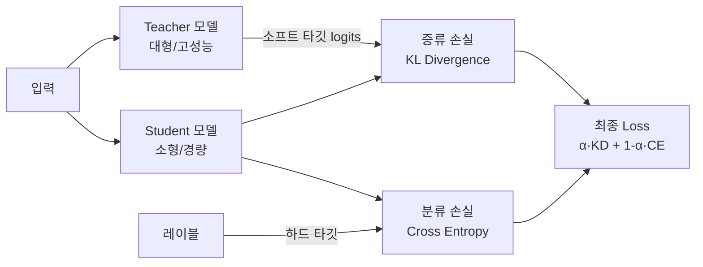

# 지식 증류 (Knowledge Distillation)

지식 증류(Knowledge Distillation, KD)는 **큰 모델(teacher)의 지식을 작은 모델(student)로 이전**하는 학습 기법이다. Hinton et al. (2015)이 제안한 방법으로, 단순히 하드 레이블(정답 클래스)만 학습하는 것보다 teacher의 출력 분포(소프트 타깃)를 함께 학습하면 student가 더 나은 일반화 성능을 보인다는 통찰에서 출발한다.

## Teacher-Student 구조

위 다이어그램은 표준 KD 학습 구조를 보여준다. Student는 실제 정답(hard label)과 Teacher의 출력 분포(soft target) 두 가지 신호를 동시에 학습한다.

## 소프트 타깃과 온도 스케일링 (Temperature Scaling)

Teacher의 로짓(logit) $z_i$에 온도 $T$를 적용해 확률 분포를 **부드럽게** 만든다:

$$p_i = \frac{\exp(z_i / T)}{\sum_j \exp(z_j / T)}$$

- $T = 1$: 기본 softmax (날카로운 분포)
- $T > 1$: 분포가 평탄해져 클래스 간 상대 유사도 정보가 드러남

예를 들어 고양이 이미지를 분류할 때 Teacher가 "고양이 0.8, 개 0.15, 호랑이 0.05"를 출력한다면, 이 분포는 "고양이와 개는 비슷하다"는 유용한 구조 정보를 담고 있다. Student는 이를 학습해 더 나은 표현을 획득한다.

**최종 손실 함수**:

$$\mathcal{L} = \alpha \cdot T^2 \cdot \text{KL}(p_T \| p_S) + (1 - \alpha) \cdot \text{CE}(y, p_S)$$

- $\alpha$: 증류 손실 가중치 (보통 0.5~0.9)
- $T^2$ 곱셈: 그래디언트 크기를 보정하기 위한 항

## 지식 증류 유형

### 1. 응답 기반 증류 (Response-based Distillation)

Teacher의 **최종 출력(logits)**만 활용한다. 가장 단순하며, Teacher의 내부 구조에 접근할 수 없는 블랙박스 환경에서도 사용 가능하다.

### 2. 특징 기반 증류 (Feature-based Distillation)

Teacher의 **중간 레이어 표현(hidden states, feature maps)**을 Student가 모방하도록 학습한다. FitNets, AT(Attention Transfer) 등이 이 방식이다. 더 풍부한 감독 신호를 제공하지만 아키텍처가 동일하거나 매핑 레이어가 필요하다.

### 3. 관계 기반 증류 (Relation-based Distillation)

데이터 인스턴스 **간의 관계 구조**를 이전한다. 샘플 쌍의 유사도 행렬(RKD), 트리플릿 관계 등을 사용해 Teacher의 표현 공간의 기하 구조를 보존한다.

## 주요 활용 사례

### 모델 압축 (Model Compression)

대형 모델의 성능을 유지하면서 추론 비용을 절감한다. BERT → DistilBERT (40% 크기, 97% 성능 유지), GPT-4 → 소형 모델 등 실무 배포 시 핵심 기법이다.

### 도메인 적응 (Domain Adaptation)

범용 Teacher로 도메인 특화 Student를 학습할 때, 대규모 레이블 데이터 없이도 Teacher의 판단을 신호로 활용할 수 있다.

### 앙상블 압축

여러 Teacher 모델의 예측 평균을 소프트 타깃으로 사용해 단일 Student에 앙상블 성능을 담는다.

## LLM 증류 (LLM Distillation)

LLM 규모로 넘어오면 전통적 KD와 다른 도전 과제가 생긴다.

### 블랙박스 증류 (Black-box Distillation)

Teacher의 로짓에 접근할 수 없고 **텍스트 출력만 사용 가능한 경우**다. GPT-4 → 소형 모델 학습 시 GPT-4의 응답을 SFT 데이터로 수집해 학습한다. 엄밀한 의미의 KD는 아니며 **응답 모방(imitation learning)** 에 가깝다.

### 시퀀스 레벨 증류 (Sequence-level Distillation)

토큰별 cross-entropy가 아닌 **시퀀스 전체 확률 분포**를 매칭한다. Teacher가 생성한 시퀀스를 hard target으로 사용하거나(Kim & Rush 2016), 각 스텝의 분포를 직접 매칭한다.

### 온-폴리시 증류 (On-policy Distillation)

Student가 생성한 시퀀스에 대해 Teacher의 로짓을 실시간으로 계산해 학습한다. Student의 분포에서 샘플링하므로 분포 불일치(exposure bias) 문제를 완화한다. 관련 페이지: [[on-policy-distillation]]

### Cross-tokenizer 증류

Teacher와 Student의 토크나이저가 다를 때 토큰 공간이 달라 직접 KL 매칭이 불가능하다. 이를 해결하는 다양한 정렬 기법이 연구되고 있다. 관련 페이지: [[cross-tokenizer-distillation]]

## 왜 중요한가

- **추론 효율**: 프로덕션 환경에서 대형 모델을 직접 서빙하기 어렵다. 증류로 소형 모델을 만들면 지연 시간, 비용, 메모리를 대폭 절감할 수 있다.
- **GPT-4급 데이터 접근**: 상업용 LLM의 출력을 학습 신호로 재활용할 수 있어 오픈소스 모델의 성능을 높이는 데 광범위하게 쓰인다.
- **추론 능력 이전**: 대형 추론 모델(예: DeepSeek-R1)의 chain-of-thought를 소형 모델에 증류하는 시도가 활발하다.

## 관련 문서

- [[knowledge-distillation]] - LLM KD 기법 상세 (P-KD-Q, GKD)
- [[on-policy-distillation]] - 온-폴리시 증류
- [[cross-tokenizer-distillation]] - 토크나이저 불일치 해결
- [[self-distillation]] - 자기 증류
- [[dataset-distillation]] - 데이터셋 증류
- [[vit-distillation-techniques]] - 비전 모델 증류
- [[knowledge-distillation-theory]] - 증류 이론적 기반
- [[knowledge-distillation-llm]] - LLM 증류 개념
- [[fine-tuning-overview]] - 파인튜닝 전반
- [[reinforcement-learning]] - RL과의 비교 (policy 학습 관점)
