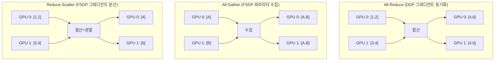

# 분산 통신 백엔드

## 개요

분산 학습에서 GPU 간 데이터 교환은 통신 백엔드(communication backend)와 집합 통신 연산(collective operations)을 통해 이루어진다. NCCL(NVIDIA Collective Communication Library), Gloo(Meta), MPI(Message Passing Interface)가 주요 백엔드이며, all-reduce, all-gather, reduce-scatter 등의 집합 연산이 [[data-parallelism-fsdp]], [[tensor-pipeline-parallelism]], [[deepspeed-zero]]의 기반을 형성한다. 2026년 현재 NCCL이 GPU 분산 학습의 사실상 표준이며, PyTorch의 `torch.distributed` 패키지를 통해 추상화된다.

## 핵심 개념

### 통신 백엔드

#### NCCL (NVIDIA Collective Communication Library)

NVIDIA GPU 간 집합 통신에 최적화된 라이브러리다. CUDA 텐서 전용으로 설계되어 NVLink, NVSwitch, InfiniBand, RoCE 등 다양한 인터커넥트에서 최적의 통신 경로를 자동 선택한다.

**핵심 특성**:
- GPU-GPU 직접 통신 (CPU 바운스 없음)
- Ring, Tree, Recursive Halving-Doubling 등 다중 알고리즘 자동 선택
- 토폴로지 인식: NVLink 범위, 노드 내/간 자동 판별
- FP16 통신 지원으로 대역폭 효율 2배
- 대용량 텐서에서 MPI, Gloo 대비 최대 345% 빠른 지연시간

**제한**: GPU(CUDA) 텐서만 지원. CPU 텐서 통신 불가.

#### Gloo

Meta가 개발한 오픈소스 집합 통신 라이브러리다. CPU와 GPU 텐서 모두 지원하며, NCCL이 사용 불가능한 환경에서의 대안이다.

**핵심 특성**:
- CPU 텐서 통신 지원 (분산 CPU 학습의 유일한 선택)
- GPU 텐서도 지원하나 NCCL 대비 느림
- FP16 CPU 통신 지원 (MPI는 제한적)
- InfiniBand, TCP/IP 지원

#### MPI (Message Passing Interface)

HPC 전통의 표준 통신 인터페이스다. OpenMPI, Intel MPI, MVAPICH 등 구현체가 존재한다. 소용량 텐서의 FP32 통신에서 Gloo보다 우수하지만, 대용량 FP16 통신에서는 NCCL에 크게 뒤진다.

### 백엔드 선택 가이드

| 환경 | 권장 백엔드 | 이유 |
|------|-----------|------|
| NVIDIA GPU 분산 학습 | NCCL | GPU 최적화, 최고 성능 |
| CPU 분산 학습 | Gloo | CPU 텐서 네이티브 지원 |
| NVIDIA 외 GPU (AMD 등) | Gloo 또는 RCCL | NCCL은 NVIDIA 전용 |
| 소용량 FP32 텐서 | MPI | 소량 통신에서 효율적 |
| 혼합 환경 (GPU + CPU) | NCCL(GPU) + Gloo(CPU) | 동시 사용 가능 |

PyTorch는 프로세스 그룹별로 다른 백엔드를 지정할 수 있다. 일반적으로 GPU 통신에 NCCL, CPU 통신에 Gloo를 사용하는 이중 백엔드 구성이 표준이다.

### 집합 통신 연산 (Collective Operations)

#### All-Reduce

모든 GPU의 텐서를 집계(합산/평균)하여 결과를 모든 GPU에 분배한다. [[data-parallelism-fsdp]]의 DDP에서 그래디언트 동기화의 핵심 연산이다.

#### All-Gather

모든 GPU가 보유한 서로 다른 텐서 조각을 수집하여 전체 텐서를 모든 GPU에 구성한다. FSDP에서 forward pass 전에 샤딩된 파라미터를 수집하는 데 사용한다.

#### Reduce-Scatter

All-Reduce와 유사하지만, 집계 결과를 분할하여 각 GPU가 결과의 한 조각만 받는다. FSDP의 backward에서 그래디언트를 집계하면서 동시에 샤딩하는 데 사용한다.

#### Broadcast

한 GPU의 텐서를 모든 GPU에 복제한다. 모델 초기화 시 가중치를 동기화하는 데 사용한다.

#### Point-to-Point (Send/Recv)

특정 GPU 쌍 간의 직접 통신이다. [[tensor-pipeline-parallelism]]의 파이프라인 스테이지 간 활성값/그래디언트 전달에 사용한다.

## 작동 원리

### 분산 학습 기법별 사용 연산

| 기법 | 주요 연산 | 빈도 | 데이터 |
|------|----------|------|--------|
| DDP | All-Reduce | 매 backward | 그래디언트 |
| FSDP Forward | All-Gather | 매 레이어 | 파라미터 |
| FSDP Backward | Reduce-Scatter | 매 레이어 | 그래디언트 |
| TP (텐서 병렬) | All-Reduce | 매 레이어 | 부분 결과 |
| PP (파이프라인) | Send/Recv | 매 마이크로배치 | 활성값 |

### 통신-연산 오버랩

분산 학습의 핵심 최적화는 통신과 연산을 시간적으로 겹치는 것이다. DDP의 버킷 기반 all-reduce가 대표적이다:

1. Backward 중 레이어별로 그래디언트 계산
2. 일정 크기(버킷)의 그래디언트가 모이면 즉시 all-reduce 시작
3. 다음 레이어의 backward 연산과 이전 버킷의 통신이 동시 진행
4. 모든 backward 완료 시점에 대부분의 all-reduce도 완료

## 성능 특성

### NCCL 대역폭 활용

| 인터커넥트 | 이론 대역폭 | NCCL 효율 | 주요 적용 |
|-----------|-----------|----------|----------|
| NVLink (Hopper) | 900 GB/s | >95% | TP (노드 내) |
| InfiniBand HDR | 200 Gb/s | >90% | DP, PP (노드 간) |
| InfiniBand NDR | 400 Gb/s | >90% | DP, PP (노드 간) |
| RoCE v2 | 100-200 Gb/s | 80-90% | 클라우드 환경 |

[[nvidia-vera-rubin]] 아키텍처에서는 NVLink 6세대의 대역폭이 더욱 향상되어 TP 그룹 크기를 확대할 수 있다.

### [[gpu-cluster-scheduling]]과의 관계

토폴로지 인식 스케줄링이 통신 성능에 직접적 영향을 미친다. 같은 랙(rack) 내 노드 간 통신이 랙 간 통신보다 대역폭이 높으므로, PP 그룹을 같은 랙 내에 배치하면 파이프라인 지연을 줄일 수 있다.

## 실전 도입 가이드

### 통신 디버깅

- `NCCL_DEBUG=INFO` 환경 변수로 NCCL 토폴로지 탐색과 알고리즘 선택 로그 확인
- `NCCL_IB_DISABLE=1`로 InfiniBand 비활성화하여 네트워크 문제 격리
- `torch.distributed.barrier()` 타임아웃으로 hang 디버깅

### 흔한 실수

- **NCCL 버전 불일치**: 클러스터 내 모든 노드에서 동일한 NCCL 버전 필수
- **방화벽 포트 미개방**: NCCL은 동적 포트를 사용하므로 노드 간 포트 범위 개방 필요
- **CPU 텐서에 NCCL 사용 시도**: NCCL은 CUDA 텐서만 지원. CPU 통신에는 Gloo 사용
- **대역폭 과소 평가**: TP를 InfiniBand 범위에 배치하면 심각한 병목 발생

## 관련 문서

- [[data-parallelism-fsdp]] -- All-Reduce, All-Gather 활용
- [[tensor-pipeline-parallelism]] -- All-Reduce(TP), Send/Recv(PP)
- [[deepspeed-zero]] -- Reduce-Scatter 기반 메모리 최적화
- [[gpu-cluster-scheduling]] -- 토폴로지 인식 배치
- [[nvidia-vera-rubin]] -- NVLink 6세대 대역폭
- [[dgx-spark]] -- 소규모 환경의 통신 구성
