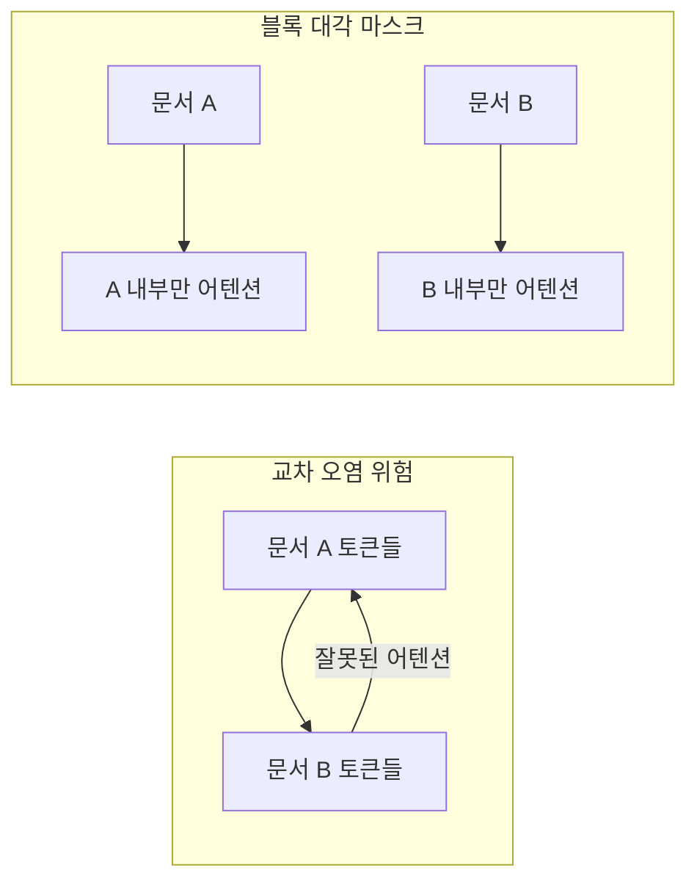

# Document Attention Masking

[[sequence-packing|시퀀스 패킹]]으로 여러 문서를 하나의 시퀀스에 연결할 때, 문서 경계를 넘는 어텐션을 차단하여 **교차 오염(cross-contamination)**을 방지하는 마스킹 기법.

## 문제: 교차 오염

패킹 없이 학습하면 각 시퀀스는 하나의 문서만 포함하므로 어텐션이 문서 내부에만 적용된다. 하지만 패딩 낭비를 제거하기 위해 여러 문서를 연결하면, 앞 문서의 토큰이 뒤 문서의 토큰에 어텐션할 수 있다.



## 구현 방법

### 블록 대각 Causal 마스크

각 문서의 시작/끝 위치를 `cu_seqlens` (cumulative sequence lengths)로 추적하고, 어텐션 계산 시 문서 경계를 넘는 위치에 $-\infty$ 마스크를 적용한다.

FlashAttention의 `varlen` API가 이를 네이티브로 지원:
```python
flash_attn_varlen_func(q, k, v, cu_seqlens_q, cu_seqlens_k, max_seqlen)
```

### 손실 계산 주의사항

분산 학습에서 gradient accumulation 시 **토큰 단위 평균**이 아닌 **문서 단위 평균**을 사용해야 문서 길이 불균형으로 인한 편향을 방지한다.

## 성능 영향

문서 마스크를 적용하지 않으면 학습 초기에는 차이가 미미하지만, 장문 생성과 다중 문서 추론에서 **환각율이 증가**한다는 연구 결과가 있다.

## 관련 문서

- [[sequence-packing]] -- 시퀀스 패킹
- [[causal-language-modeling]] -- 인과적 언어 모델링
- [[flash-attention]] -- FlashAttention (varlen 지원)
- [[distributed-training-overview]] -- 분산 학습
