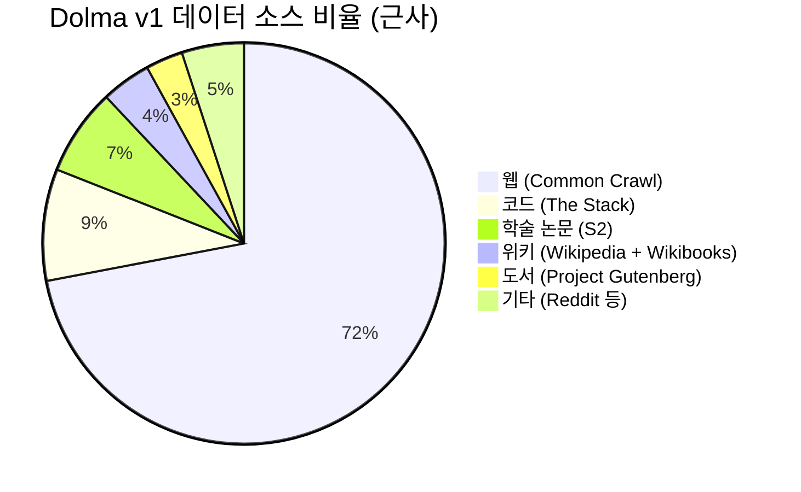
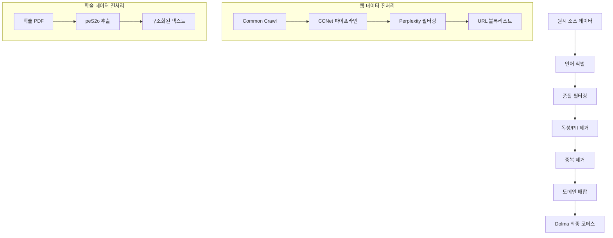

# Dolma 데이터셋 (Dolma Dataset)

## 개요

Dolma(Data for Open Language Models' Appetite)는 Allen Institute for AI(AI2)가 구축한 약 3조(3T) 토큰 규모의 오픈 사전학습 코퍼스다. OLMo(Open Language Model) 프로젝트의 학습 데이터로 개발되었으며, 웹 콘텐츠, 학술 논문, 코드, 도서, 백과사전 등 다양한 소스를 혼합한다. Dolma의 가장 큰 차별점은 **완전한 투명성**이다 -- 데이터 구축의 설계 원칙, 처리 상세, 중간 상태의 분석과 실험 결과까지 공개하여 [[pretraining-data-curation]] 연구의 재현성을 높였다. 데이터셋과 함께 큐레이션 도구킷(dolma CLI)도 오픈소스로 제공된다.

## 핵심 정보

| 항목 | 내용 |
|------|------|
| 개발 주체 | Allen Institute for AI (AI2) |
| 논문 | Soldaini et al. (2024), ACL 2024 |
| 규모 | ~3T 토큰 (v1.7 기준 ~2.3T) |
| 소스 수 | 6개 주요 카테고리 |
| 라이선스 | AI2 ImpACT License (Low Risk) |
| 관련 모델 | OLMo, OLMo-2 |
| 큐레이션 도구 | dolma (Python CLI) |

## 데이터 소스 구성

### 소스별 상세

| 소스 | 설명 | 처리 방식 |
|------|------|-----------|
| Common Crawl | 웹 크롤 데이터 | CCNet + 언어 필터 + 품질 분류 + 중복 제거 |
| The Stack | 오픈소스 코드 | 라이선스 필터링, 중복 제거 |
| Semantic Scholar (S2) | 학술 논문 | peS2o 파이프라인으로 PDF에서 텍스트 추출 |
| Wikipedia + Wikibooks | 백과사전 | Wikiextractor로 마크업 제거 |
| Project Gutenberg | 공개 도메인 도서 | 텍스트 정제, 메타데이터 제거 |
| Reddit | 소셜 미디어 대화 | Pushshift 아카이브, 3+ upvote 필터 |

## 데이터 처리 파이프라인

### 품질 필터링

웹 데이터의 품질 필터링은 여러 층위로 이루어진다.

1. **언어 필터**: fastText 기반 영어 식별
2. **Perplexity 필터**: CCNet의 KenLM 기반 perplexity로 Head/Middle/Tail 분류
3. **규칙 기반 필터**: Gopher/MassiveText에서 영감을 받은 휴리스틱 -- 문서 길이, 반복 비율, 특수문자 비율 등
4. **URL 블록리스트**: UT1 블록리스트 기반 저품질 도메인 차단

### 독성 및 PII 필터링

- **독성 제거**: Jigsaw Toxic Comments 데이터로 학습한 fastText 독성 분류기 적용
- **PII 제거**: 이메일, IP 주소, 전화번호 등의 정규식 기반 탐지 및 치환
- **NSFW 필터**: 성인 콘텐츠 URL 필터와 텍스트 분류기 병행

### 중복 제거

| 방식 | 적용 범위 | 상세 |
|------|-----------|------|
| URL 중복 제거 | 웹 데이터 | 동일 URL의 문서 제거 |
| 문서 수준 정확 중복 | 전체 소스 | Bloom 필터 기반 |
| 문단 수준 중복 | 웹 데이터 | 반복 문단(boilerplate) 제거 |

## Dolma v1.5에서 v1.7로의 발전

| 특성 | Dolma v1.5 | Dolma v1.7 |
|------|-----------|-----------|
| 총 토큰 | ~3T | ~2.3T |
| 소스 다양성 | 웹 데이터 위주 | 다양한 소스 확대 |
| 특수 지식 비율 | 낮음 | ~10.4% (전문 지식 소스 추가) |
| 필터링 정밀도 | 기본 | 웹 소스 필터링 강화 |

v1.7에서는 토큰 수가 줄어든 대신, 더 정밀한 필터링과 소스 다양화로 학습 품질을 높였다. OLMo-2 학습에서 v1.7은 v1.5 대비 MMLU에서 24점 이상 향상을 이끌었다.

## 오픈 사이언스 철학

Dolma 프로젝트의 핵심 가치는 사전학습 데이터의 투명성이다.

### 기존 데이터셋과의 차별점

| 항목 | GPT-3/4 학습 데이터 | Dolma |
|------|-------------------|-------|
| 데이터 공개 | 비공개 | 전체 공개 |
| 처리 코드 | 비공개 | 오픈소스 (dolma CLI) |
| 중간 결과 | 비공개 | 중간 상태 분석 공개 |
| 설계 결정 근거 | 비공개 | 논문에 상세 기술 |

이러한 투명성은 [[data-decontamination]]의 검증, [[data-mixing-curriculum-learning]]의 재현, 그리고 데이터 편향 연구를 가능하게 한다.

### dolma 도구킷

`dolma` CLI는 Dolma 구축에 사용된 데이터 큐레이션 도구를 패키지로 제공한다. 사용자는 이를 활용하여 자체 코퍼스에 동일한 처리 파이프라인을 적용하거나, Dolma를 자신의 기준으로 재필터링할 수 있다. PyPI에서 `pip install dolma`로 설치 가능하다.

## 다른 데이터셋과의 비교

| 데이터셋 | 토큰 | 소스 다양성 | 투명성 | 사용 방식 |
|---------|------|-----------|--------|----------|
| FineWeb | 15T | 웹 단일 | 파이프라인 공개 | 즉시 사용 가능 |
| RedPajama v2 | 30T+ | 웹 단일 (5개 언어) | 시그널 공개 | 사용자 필터링 필요 |
| **Dolma** | **3T** | **6개 소스 혼합** | **최고 수준** | **즉시 사용 가능** |
| The Pile | 825B | 22개 소스 | 소스별 기술 | 즉시 사용 가능 |

Dolma는 규모 면에서 FineWeb이나 RedPajama v2에 미치지 못하지만, 다양한 소스 혼합과 완전한 투명성에서 차별화된다. [[neural-scaling-laws]]의 관점에서 양과 질의 트레이드오프를 고려한 설계다.

## 대표 자료

- [Dolma: an Open Corpus of Three Trillion Tokens for Language Model Pretraining Research (Soldaini et al., 2024)](https://arxiv.org/abs/2402.00159)
- [AI2 Dolma Blog Post](https://allenai.org/blog/dolma-3-trillion-tokens-open-llm-corpus-9a0ff4b8da64)
- [dolma GitHub Repository](https://github.com/allenai/dolma)

## 관련 문서

- [[pretraining-data-curation]] -- Dolma의 큐레이션 파이프라인이 따르는 일반 원칙
- [[data-decontamination]] -- Dolma의 투명성이 오염 검증을 가능하게 하는 방식
- [[data-mixing-curriculum-learning]] -- 6개 소스의 배합 비율 결정 방법론
- [[neural-scaling-laws]] -- 3T 토큰 규모에서의 데이터-모델 크기 균형
- [[synthetic-data-training]] -- OLMo-2에서 Dolma와 함께 사용된 합성 데이터
- [[tokenizer-training]] -- Dolma 코퍼스 기반 OLMo 토크나이저 학습
