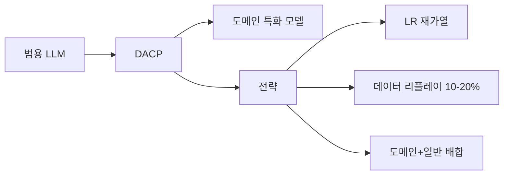

# 도메인 적응형 지속 사전학습 (DACP)

일반 LLM을 **도메인 특화 코퍼스**(의료, 법률, 금융, 코드 등)로 지속 사전학습하여 도메인 전문성을 강화하는 기법. [[continual-learning-theory|치명적 망각]]을 방지하면서 새 도메인 지식을 흡수해야 한다.

## 핵심 전략

### 1. LR 재가열 (Learning Rate Re-warming)

[[warmup-stable-decay-wsd|WSD]] 스케줄의 안정 구간에서 체크포인트를 가져온 후, 학습률을 일시적으로 높였다가 다시 감쇠. 새 데이터 분포에 적응할 공간을 확보.

### 2. 데이터 리플레이

일반 코퍼스를 **10-20% 혼합**하여 범용 능력(언어 이해, 상식) 유지. 리플레이 비율이 너무 낮으면 일반 능력 저하, 너무 높으면 도메인 적응 부족.

### 3. 단계적 전환

[[mid-training-phase|Mid-Training]]과 결합: 1단계 일반 -> 2단계 도메인 특화 -> 3단계 SFT/RLHF.

## 대표 사례

| 모델 | 도메인 | 코퍼스 |
|------|--------|--------|
| PMC-LLaMA | 의료 | PubMed 4.8M 논문 |
| SaulLM | 법률 | 법률 코퍼스 30B 토큰 |
| CodeLlama | 코드 | 코드 500B 토큰 추가 |

## 관련 문서

- [[continual-learning-llm]] -- LLM 지속 학습
- [[continual-learning-theory]] -- 지속 학습 이론
- [[warmup-stable-decay-wsd]] -- WSD 스케줄러
- [[mid-training-phase]] -- Mid-Training Phase
- [[domain-adaptation]] -- 도메인 적응
