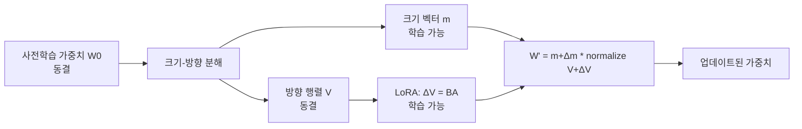

# DoRA - 가중치 분해 LoRA (Weight-Decomposed Low-Rank Adaptation)

## 배경

LoRA(Low-Rank Adaptation)는 사전학습 가중치를 동결하고 저랭크 행렬 $\Delta W = BA$만 학습하는 PEFT(Parameter-Efficient Fine-Tuning) 방법이다. 적은 파라미터로 경쟁력 있는 성능을 내지만, 전체 파인튜닝(full fine-tuning)과의 성능 격차가 여전히 존재한다.

**DoRA(Weight-Decomposed Low-Rank Adaptation, Liu et al., 2024)**는 이 격차가 어디서 비롯되는지 분석하고, 가중치를 **크기(magnitude)와 방향(direction)** 두 성분으로 분해함으로써 LoRA와 동일한 추가 파라미터 수로 표현력을 높인다.

## 핵심 아이디어: 크기-방향 분해

### 가중치 분해 원리

사전학습 가중치 행렬 $W_0 \in \mathbb{R}^{d_{out} \times d_{in}}$를 다음과 같이 분해한다:

$$W_0 = m \cdot \frac{V}{\|V\|_c}$$

- $m \in \mathbb{R}^{1 \times d_{in}}$: 각 열(column)의 크기 벡터
- $V \in \mathbb{R}^{d_{out} \times d_{in}}$: 방향 행렬
- $\|V\|_c$: 열 단위 L2 노름 (각 열을 단위 벡터로 정규화)

이는 가중치 정규화(weight normalization)와 동일한 분해 방식이다.

### DoRA 업데이트 공식

파인튜닝 시 방향 행렬만 LoRA 방식으로 업데이트하고, 크기 벡터는 별도로 학습한다:

$$W' = (m + \Delta m) \cdot \frac{V + \Delta V}{\|V + \Delta V\|_c}$$

여기서:
- $\Delta m$: 학습 가능한 크기 벡터 조정값 ($\approx$ 0으로 초기화)
- $\Delta V = B \cdot A$: LoRA 방식의 저랭크 방향 업데이트



### 추가 파라미터

LoRA(랭크 r)에 비해 DoRA가 추가하는 파라미터:
- 크기 벡터 $m$: $d_{in}$개 추가 스칼라
- 일반적으로 $d_{in} \ll$ LoRA 파라미터 수

실질적으로 **LoRA와 거의 동일한 파라미터 예산**으로 동작한다. 크기 벡터는 채널당 1개의 스칼라이므로 오버헤드가 매우 작다.

## LoRA와 성능 차이가 나는 이유

저자들은 전체 파인튜닝 vs LoRA의 업데이트 패턴을 분석했다:

| 특성 | 전체 파인튜닝 | LoRA |
|-----|------------|------|
| 크기 변화 | 다양함 (레이어별 상이) | 제한적 |
| 방향 변화 | 큰 방향 조정 가능 | 저랭크로 제한 |
| 크기-방향 결합 | 독립적으로 조정 가능 | 함께 변화 (얽힘) |

LoRA의 핵심 문제: $\Delta W = BA$는 크기와 방향이 **얽혀(coupled)** 있어서 하나를 조정하면 다른 하나도 영향을 받는다.

DoRA는 크기를 별도 스칼라로 분리함으로써 이 얽힘을 해소한다. 전체 파인튜닝에 더 가까운 업데이트 패턴을 보인다.

## 초기화 방법

DoRA를 사전학습 모델에서 시작할 때:

1. $V \leftarrow W_0$ (방향 행렬을 원본 가중치로 초기화)
2. $m \leftarrow \|W_0\|_c$ (크기 벡터를 원본 열 노름으로 초기화)
3. $A \sim \mathcal{N}(0, \sigma^2)$, $B \leftarrow 0$ (LoRA 표준 초기화)

초기화 직후에는 $W' = W_0$이 보장된다. 즉, 사전학습 모델과 동일하게 시작해 점진적으로 조정된다.

## 실험 결과

### 상식 추론 벤치마크 (LLaMA-7B 기준)

| 방법 | 추가 파라미터 | 평균 정확도 |
|------|------------|------------|
| Full FT | 7B | 79.8% |
| LoRA (r=32) | 33.6M | 76.2% |
| **DoRA (r=32)** | **33.7M** | **79.4%** |

동일한 파라미터 예산으로 전체 파인튜닝에 근접한 성능을 달성했다.

### 멀티모달 태스크 (LLaVA-1.5 기반)

VQA, 이미지 캡셔닝 등에서도 LoRA 대비 일관된 성능 향상을 보인다. 멀티모달 어댑터에도 동일한 분해 방식이 적용된다.

## QDoRA - 양자화와 결합

QLoRA와 유사하게 DoRA를 4비트 양자화와 결합한 **QDoRA**도 가능하다:

```python
# transformers + peft 라이브러리 사용
from peft import LoraConfig, get_peft_model

# DoRA 활성화: use_dora=True
config = LoraConfig(
    r=16,
    lora_alpha=32,
    target_modules=["q_proj", "v_proj"],
    use_dora=True,   # DoRA 분해 활성화
    lora_dropout=0.05,
)
model = get_peft_model(model, config)
```

`peft` 라이브러리 v0.9.0 이상에서 `use_dora=True` 옵션으로 바로 사용 가능하다.

## 한계 및 주의사항

1. **추론 오버헤드**: 추론 시 크기-방향 정규화 연산이 추가됨. 가중치 병합(merge)으로 해소 가능
2. **병합 복잡성**: LoRA 가중치 병합보다 약간 복잡한 병합 로직 필요
3. **소형 모델 효과 미미**: 수억 파라미터 이하 모델에서 LoRA 대비 이점이 줄어드는 경향
4. **하이퍼파라미터**: 랭크 r 선택 기준은 LoRA와 동일 (태스크 복잡도에 따라 4-64)

## 언제 사용하는가

- 제한된 파라미터 예산 내에서 전체 파인튜닝에 최대한 근접해야 할 때
- 수학, 코딩, 복잡한 추론처럼 LoRA로 성능이 아쉬운 태스크
- QLoRA 기반 효율적 파인튜닝에서 성능을 조금 더 쥐어짜야 할 때

## 관련 문서

- [[lora-qlora-finetuning]] - LoRA / QLoRA 기본 개념
- [[adalora-adaptive-rank]] - 적응적 랭크 할당으로 LoRA 개선
- [[ia3-injection-adapters]] - 더 적은 파라미터로 학습하는 방법
- [[peft-library]] - Hugging Face PEFT 라이브러리
- [[peft-adapter-survey]] - PEFT 방법론 전체 비교
- [[fine-tuning-overview]] - 파인튜닝 전략 개요
