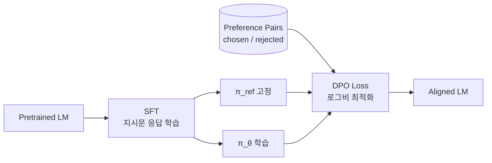

# DPO (Direct Preference Optimization)

Rafailov et al. (2023, NeurIPS)이 제안한 **선호도 직접 최적화** 기법. RLHF의 reward model + PPO 강화학습 두 단계를 단일 분류 손실(classification loss)로 단순화한 방법으로, 별도의 보상 모델 없이 선호도 쌍 데이터로 정책을 직접 fine-tune한다. 안정성·계산 효율·구현 단순성 면에서 PPO 기반 RLHF의 사실상 표준 대체재가 되었다.

## 1. 핵심 아이디어 — "Your Language Model is Secretly a Reward Model"

DPO는 RLHF의 보상 모델 파라미터화를 새롭게 정의해 **최적 정책을 폐쇄형(closed form)으로 추출**할 수 있음을 보였다. 결과적으로 표준 RLHF 문제가 단순한 분류 문제로 환원된다.

> "We introduce a new parameterization of the reward model in RLHF that enables extraction of the corresponding optimal policy in closed form, allowing us to solve the standard RLHF problem with only a simple classification loss."
> — Rafailov et al. 2023 abstract

핵심 통찰: 정책 $\pi_\theta$와 reference 정책 $\pi_\text{ref}$의 **로그 확률 비(log-ratio)** 자체가 implicit reward 역할을 한다.

## 2. 손실 함수

선호도 쌍 $(x, y^+, y^-)$ — prompt $x$, chosen 응답 $y^+$, rejected 응답 $y^-$ — 에 대한 DPO 손실:

$$
\mathcal{L}_{\mathrm{DPO}}(\theta) = -\mathbb{E}_{(x,y^{+},y^{-})}\left[\log \sigma\left(\beta\Big(\log\frac{\pi_{\theta}(y^{+}\mid x)}{\pi_{\mathrm{ref}}(y^{+}\mid x)} - \log \frac{\pi_{\theta}(y^{-}\mid x)}{\pi_{\mathrm{ref}}(y^{-}\mid x)}\Big)\right)\right]
$$

- $\pi_\theta$: 학습 중인 정책
- $\pi_\text{ref}$: 보통 [[sft|SFT]] 모델 (학습 시작점)
- $\beta$: 선호 신호 강도 (보통 0.1~0.5)
- $\sigma$: sigmoid

직관: chosen 응답의 log-ratio는 키우고 rejected 응답의 log-ratio는 낮춘다. 단, reference 대비 너무 멀어지지 않도록 KL 제약이 자연스럽게 내재화된다.

## 3. SFT → DPO 파이프라인

1. **SFT**: instruction-following 데이터로 지도학습
2. **Preference data 수집**: 사람 또는 강한 모델이 chosen/rejected 쌍 라벨링
3. **DPO 학습**: SFT 모델을 $\pi_\text{ref}$로 고정, 동일 가중치로 $\pi_\theta$ 초기화 후 손실 최적화

## 4. PPO RLHF와의 비교

| 항목 | PPO 기반 RLHF | DPO |
|------|---------------|-----|
| Reward model | 별도 학습 필요 | 불필요 (implicit) |
| Sampling | 학습 중 LM 샘플링 필요 | 불필요 (offline) |
| 안정성 | KL penalty 튜닝 까다로움 | 단일 $\beta$ 하이퍼파라미터 |
| 메모리 | policy + reward + value | policy + reference (얼릴 수 있음) |
| 성능 | 강력하지만 불안정 | 동등하거나 우수 (감정 제어, 요약, 단일 턴 대화) |

> "Fine-tuning with DPO exceeds PPO-based RLHF in ability to control sentiment of generations, and matches or improves response quality in summarization and single-turn dialogue."
> — Rafailov et al. 2023 abstract

## 5. 변형 알고리즘

DPO는 손실 함수가 단순해서 다양한 변형이 빠르게 등장했다. [[trl-library|TRL]]의 `DPOTrainer`는 `loss_type` 인자로 다음을 지원한다:

| 변형 | 핵심 차이 |
|------|-----------|
| **IPO** (Identity Preference Optimization) | logit transform이 과적합한다는 비판으로 identity transform 사용 |
| **KTO** (Kahneman-Tversky Optimization) | 페어가 아닌 개별 응답에 binary signal로 학습 |
| **ORPO** | SFT loss와 odds-ratio 선호 손실을 결합, reference model 불필요 |
| **SimPO** | reference-free 단순 마진 손실 |
| **GRPO** | DeepSeek-R1에서 사용한 group relative variant |
| **NCA / RSO / SPPO / APO** | TRL이 공식 지원하는 후속 변형들 |
| **DiscoPOP** | LLM이 발견한 log-ratio modulated loss |

reference-free 변형(ORPO, SimPO)은 reference model 메모리 부담을 제거한다. 자세한 비교는 [[iterative-dpo]], [[online-dpo-iterative]] 참조.

## 6. 실무 관점

- **언제 PPO 대신 DPO를 쓰는가**: offline 선호도 데이터가 충분하고, 학습 파이프라인을 단순화하고 싶을 때 기본 선택. 대부분의 open-weights 모델(Zephyr, Mistral Instruct 등)이 DPO 채택
- **데이터 수집**: chosen/rejected 쌍 자체가 자원 — UltraFeedback, HH-RLHF 같은 공개 데이터셋 활용
- **하이퍼파라미터**: $\beta$ 0.1~0.5, learning rate 1e-6~5e-6, full fine-tune 시 작은 lr 권장 ([[trl-library|TRL]] 기본값 1e-6)
- **함정**: reference model에서 너무 멀어지면 hallucination·degeneration이 늘어남 — eval set으로 KL drift 모니터링 필수
- **VLM 확장**: 이미지 컬럼 포함 데이터셋으로 multimodal 정렬도 가능 (TRL 지원)

## 7. 한계와 후속 연구

- **분포 이동**: offline 학습 특성상 SFT 데이터 분포에 갇혀 새 행동을 탐색하지 못함 → online DPO, [[iterative-dpo|iterative DPO]] 등장
- **Reference 의존**: $\pi_\text{ref}$ 품질이 상한선을 결정 → ORPO·SimPO는 이를 제거
- **다중 보상**: 여러 선호 차원(유용성·안전성)을 한 손실로 표현 어려움 → multi-objective DPO 연구 진행

## 관련 문서

- [[rlhf]] — 인간 선호 학습 일반론
- [[ppo-for-llms]] — DPO와 비교되는 PPO RLHF
- [[trl-library]] — DPOTrainer 공식 구현
- [[constitutional-ai]] — AI 피드백 기반 정렬 (RLAIF)
- [[reward-model]] — DPO가 우회하는 명시적 보상 모델
- [[sft]] — DPO의 사전 단계
- [[iterative-dpo]] — online 변형
- [[dpo-paper]] — 원 논문 요약
