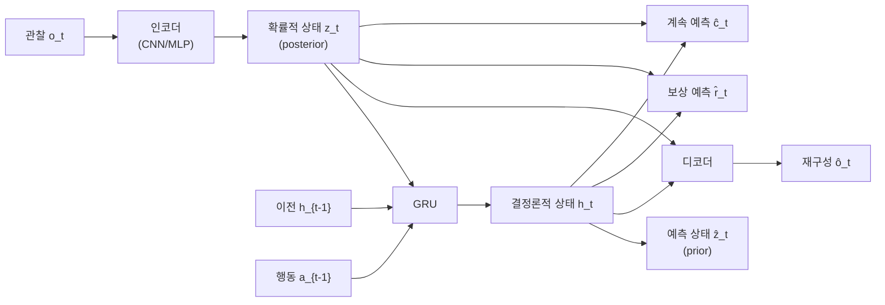
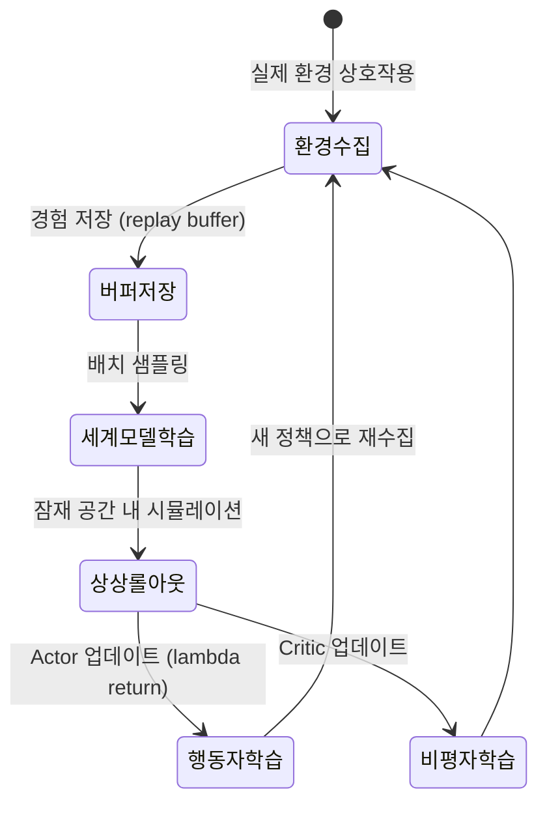

# Dreamer 세계 모델 RL

Dreamer는 Danijar Hafner 등이 Google Brain에서 개발한 **모델 기반 강화학습(model-based RL)** 알고리즘 시리즈로, 환경의 잠재 표현(latent representation)만으로 에이전트 행동 학습을 가능하게 한다. 핵심 아이디어는 실제 환경과 직접 상호작용하지 않고 **학습된 세계 모델 내부에서 상상(imagine)하며 정책을 최적화**하는 것이다.

## 핵심 구성요소: RSSM

Dreamer의 세계 모델은 **RSSM(Recurrent State Space Model)**으로 구현된다. RSSM은 두 가지 상태를 조합한다:

- **결정론적 은닉 상태 $h_t$**: GRU 셀이 관리하는 순환 상태. 과거 정보를 압축
- **확률적 잠재 상태 $z_t$**: 현재 관찰에서 샘플링된 불확실성 있는 상태

$$z_t \sim p(z_t | h_t, o_t), \quad \hat{z}_t \sim p(\hat{z}_t | h_t)$$

이 두 상태의 결합 $(h_t, z_t)$이 에이전트가 알고 있는 세계의 전부다.

RSSM 구조에서 에이전트는 실제 관찰 없이 $h_t$와 $\hat{z}_t$만으로 미래를 롤아웃(rollout)할 수 있다.

## Dreamer 버전 진화

### DreamerV1 (2019)

- Atari, DeepMind Control Suite 벤치마크에서 모델 기반 RL의 가능성 입증
- 이미지 기반 관찰에서 직접 잠재 표현 학습
- Actor-Critic을 잠재 공간에서 학습하는 "dream" 단계 도입

### DreamerV2 (2020)

- **이산 잠재 변수(discrete latent variables)** 도입으로 성능 대폭 향상
- Atari에서 모델 프리(model-free) 방법과 동등한 성능 달성
- 이산 표현이 연속 표현보다 세계 모델 학습에 유리함을 실증

### DreamerV3 (2023)

- **단일 하이퍼파라미터 세트**로 Atari, DeepMind Control Suite, Minecraft 등 다양한 태스크 동시 해결
- **Free Bits 기법**: KL 손실에 최솟값 하한을 두어 잠재 공간 붕괴 방지
- **비율 스케일링(ratio scaling)**: 세계 모델 크기와 실제 환경 상호작용 비율 조정
- Minecraft의 다이아몬드 수집 태스크를 사전 시연 없이 최초로 해결 (10M+ 환경 스텝)

위 상태 다이어그램은 Dreamer의 주요 학습 루프를 나타낸다. 세계 모델 학습과 행동자(actor)/비평자(critic) 학습이 교대로 진행된다.

## 학습 목표

Dreamer의 손실 함수는 세 부분으로 구성된다:

$$\mathcal{L} = \mathcal{L}_{\text{recon}} + \mathcal{L}_{\text{KL}} + \mathcal{L}_{\text{pred}}$$

- $\mathcal{L}_{\text{recon}}$: 관찰 재구성 손실 (이미지/상태 복원)
- $\mathcal{L}_{\text{KL}}$: posterior와 prior 사이의 KL 다이버전스 (잠재 공간 정규화)
- $\mathcal{L}_{\text{pred}}$: 보상 및 계속 여부(continuation) 예측 손실

## [[model-based-rl]]과의 관계

Dreamer는 [[model-based-rl]] 패러다임의 대표적 구현이다. 모델 프리(model-free) 방법과의 근본적 차이는 **환경 모델을 명시적으로 학습하고 이를 계획에 활용**한다는 점이다. Dreamer의 특징은 환경 모델을 **잠재 공간에서만 동작**시켜 고차원 이미지를 직접 롤아웃하는 비용을 피한다는 것이다.

## [[world-model-architectures]]와의 연계

RSSM은 더 광범위한 [[world-model-architectures]] 개념의 구체적 구현이다. 최근에는 Dreamer의 RSSM 구조를 대형 트랜스포머 기반 아키텍처와 결합하는 연구가 진행 중이며, GAIA-1(Wayve의 자율주행 세계 모델) 등이 이 방향의 확장이다.

## 실무 적용 고려사항

- **샘플 효율성**: 동일한 환경 상호작용 수 대비 모델 프리 대비 우수한 성능
- **계획 가능성**: 학습된 세계 모델로 시뮬레이션 기반 계획 가능
- **일반화**: 다양한 환경에 같은 알고리즘 적용 가능 (DreamerV3)
- **한계**: 세계 모델의 부정확성이 정책 품질에 직접 영향 (model bias)

## 관련 문서

- [[model-based-rl]] - 모델 기반 강화학습 일반 개념
- [[world-model-architectures]] - RSSM 외 세계 모델 아키텍처 비교
- [[hierarchical-rl]] - 시간 추상화를 통한 장기 계획 (Dreamer와 결합 연구 존재)
- [[conservative-q-learning-cql]] - 오프라인 RL 관점에서의 비교
