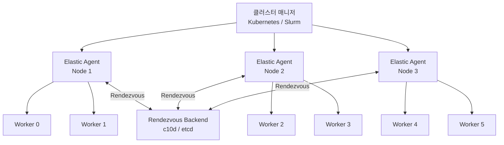
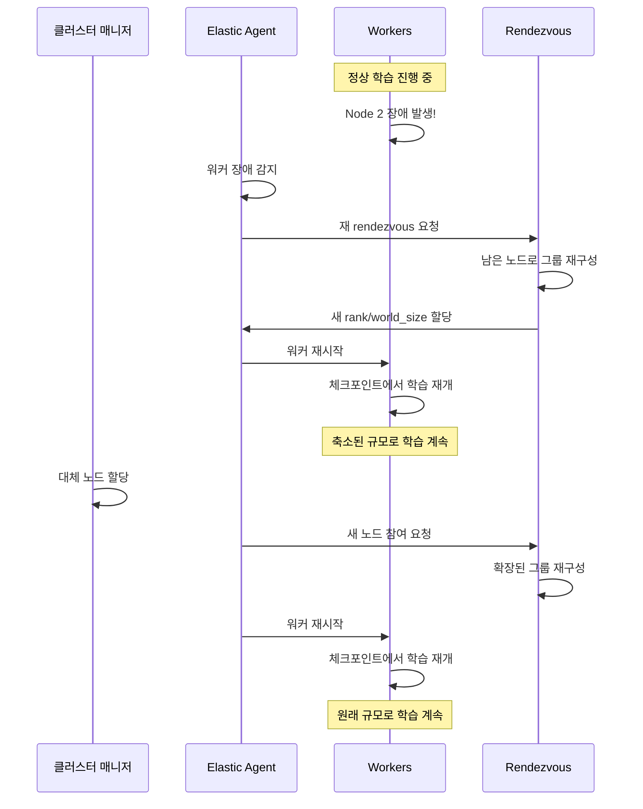

# 탄력적 학습 (Elastic Training)

## 개요

탄력적 학습(Elastic Training)은 학습 도중 노드의 추가, 제거, 장애가 발생해도 전체 작업을 중단하지 않고 자동으로 적응하여 학습을 계속하는 분산 학습 방식이다. 전통적인 분산 학습은 하나의 워커라도 실패하면 전체 작업이 중단되지만, 탄력적 학습은 남은 워커들로 자동 재구성하여 학습을 이어간다. 클라우드의 선점형(preemptible/spot) 인스턴스를 활용한 비용 절감, 대규모 클러스터에서 불가피한 하드웨어 장애 대응, 그리고 자원 가용성에 따른 동적 스케일링이 핵심 가치다. PyTorch의 `torch.distributed.elastic`(TorchElastic)과 Kubernetes의 Training Operator가 이 영역의 주요 기술이다.

## 핵심 아키텍처

### TorchElastic 계층 구조



TorchElastic은 클러스터 매니저와 학습 스크립트 사이에 중간 계층을 도입한다:

- **Elastic Agent**: 각 노드에서 실행되며 로컬 워커 프로세스를 관리한다. 워커 장애 감지, 재시작, 그룹 멤버십 관리를 담당한다
- **Rendezvous Backend**: 모든 에이전트가 서로를 발견하고 그룹을 형성하는 조율(coordination) 메커니즘이다
- **Worker**: 실제 학습 코드를 실행하는 프로세스. 각 워커는 하나의 GPU에 매핑된다

### Rendezvous 메커니즘

Rendezvous(랑데부)는 참여하는 모든 노드가 서로를 인식하고 역할(rank, world_size)을 할당받는 분산 동기화 과정이다.

**지원 백엔드**:

| 백엔드 | 특성 | 외부 의존성 | 권장 환경 |
|--------|------|-----------|----------|
| c10d (TCPStore) | PyTorch 내장, 추가 설치 불필요 | 없음 | 고성능 클러스터, 기본 권장 |
| etcd-v2 | 분산 키-값 저장소 기반 | etcd 서버 | 대규모 멀티 클러스터 |
| etcd (legacy) | 이전 구현, 유지보수 모드 | etcd 서버 | 마이그레이션 대상 |

c10d 백엔드는 지정된 마스터 노드에서 TCPStore를 호스팅하며, 추가 인프라 없이 동작하므로 대부분의 환경에서 기본 선택이다.

## torchrun과 실행 모드

`torchrun`은 TorchElastic의 CLI 런처로, 이전의 `torch.distributed.launch`를 대체한다.

```bash
# 단일 노드, 4 GPU
torchrun --nproc_per_node=4 train.py

# 멀티 노드, 탄력적 (최소 2, 최대 4노드)
torchrun \
    --nnodes=2:4 \
    --nproc_per_node=4 \
    --rdzv_id=job123 \
    --rdzv_backend=c10d \
    --rdzv_endpoint=master:29400 \
    train.py
```

핵심 파라미터:
- `--nnodes=MIN:MAX`: 최소/최대 노드 수 범위 지정. 이 범위 내에서 탄력적으로 동작한다
- `--rdzv_backend`: rendezvous 백엔드 선택 (c10d 권장)
- `--rdzv_endpoint`: rendezvous 조율 서버의 주소와 포트 (기본 29400)
- `--max_restarts`: 워커 그룹 최대 재시작 횟수

## 장애 대응 흐름



1. **장애 감지**: Elastic Agent가 로컬 워커의 비정상 종료를 감지한다
2. **재 rendezvous**: 살아있는 에이전트들이 새로운 rendezvous를 수행하여 그룹을 재구성한다
3. **rank 재할당**: 새로운 world_size에 맞게 rank가 재배정된다
4. **학습 재개**: [[training-resumption]]에 따라 최신 체크포인트에서 학습을 재개한다

## Kubernetes 통합

### Training Operator (Kubeflow)

Kubeflow Training Operator는 Kubernetes 위에서 PyTorchJob CRD(Custom Resource Definition)를 통해 분산 학습을 관리한다.

```yaml
apiVersion: kubeflow.org/v1
kind: PyTorchJob
metadata:
  name: elastic-training
spec:
  elasticPolicy:
    minReplicas: 2
    maxReplicas: 8
    rdzvBackend: c10d
  pytorchReplicaSpecs:
    Worker:
      replicas: 4
      template:
        spec:
          containers:
          - name: trainer
            image: training:latest
            resources:
              limits:
                nvidia.com/gpu: 1
```

`elasticPolicy` 필드에서 최소/최대 레플리카 수를 지정하면, Training Operator가 TorchElastic의 rendezvous를 자동으로 구성한다.

### Spot 인스턴스 활용 패턴

클라우드 선점형 인스턴스(AWS Spot, GCP Preemptible, Azure Spot)는 온디맨드 대비 60-90% 저렴하지만, 언제든 회수될 수 있다. 탄력적 학습과 결합하면:

- **비용 절감**: [[gpu-cluster-scheduling]]에서 Spot 인스턴스를 기본 풀로 활용하고, 온디맨드를 최소 보장 풀로 유지
- **중단 내성**: 인스턴스 회수 시 TorchElastic이 자동으로 축소하여 학습 계속
- **자동 복구**: Kubernetes의 Cluster Autoscaler가 새 Spot 인스턴스를 할당하면 자동으로 확장

## 탄력적 학습의 학습 코드 요구사항

탄력적 학습을 지원하려면 학습 코드에 다음이 반영되어야 한다:

1. **world_size 동적 처리**: 하드코딩된 GPU 수 대신 `torch.distributed.get_world_size()`를 사용
2. **배치 크기 조정**: world_size 변경 시 글로벌 배치 크기를 동적으로 조정하거나, 로컬 배치 크기를 고정하고 [[gradient-accumulation-checkpointing]] 스텝을 조정
3. **주기적 체크포인팅**: [[model-checkpointing-sharding]]을 통해 재개 지점을 자주 저장
4. **데이터 샘플러 재설정**: DistributedSampler를 새 rank/world_size에 맞게 재생성
5. **멱등성(Idempotency)**: 같은 스텝이 여러 번 실행되어도 부작용이 없도록 설계

```python
def train():
    # rank와 world_size를 동적으로 조회
    rank = torch.distributed.get_rank()
    world_size = torch.distributed.get_world_size()
    
    # 데이터 샘플러를 현재 world_size에 맞게 생성
    sampler = DistributedSampler(
        dataset, num_replicas=world_size, rank=rank
    )
    
    # 체크포인트가 있으면 복원
    if checkpoint_exists:
        load_checkpoint(model, optimizer, scheduler)
```

## 한계와 고려사항

| 항목 | 설명 |
|------|------|
| 배치 크기 변동 | world_size 변경 시 글로벌 배치 크기가 달라져 학습 동역학에 영향 |
| 통신 오버헤드 | 재 rendezvous와 상태 재분배에 시간 소요 |
| 체크포인트 빈도 | 잦은 체크포인팅은 I/O 오버헤드, 드문 체크포인팅은 작업 손실 증가 |
| 모델 병렬화 | [[tensor-pipeline-parallelism]]과 결합 시 탄력성이 제한됨 (파이프라인 스테이지 재배치 복잡) |
| 디버깅 난이도 | 동적 토폴로지에서의 재현과 디버깅이 어려움 |

## 관련 페이지

- [[training-resumption]] -- 체크포인트에서의 안전한 학습 재개 메커니즘
- [[model-checkpointing-sharding]] -- 체크포인트 저장/복원과 분산 체크포인팅
- [[gpu-cluster-scheduling]] -- Slurm/Kubernetes 클러스터 스케줄링과 장애 복구
- [[data-parallelism-fsdp]] -- FSDP 분산 학습과 상태 샤딩
- [[distributed-communication]] -- NCCL/Gloo 통신 백엔드와 집합 연산
- [[gradient-accumulation-checkpointing]] -- 배치 크기 조정을 위한 그래디언트 누적
