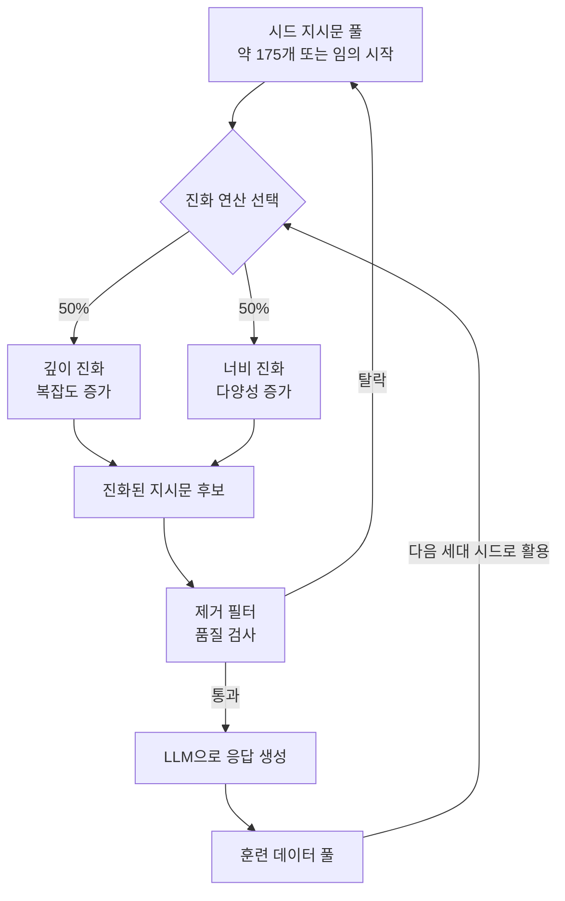

# Evol-Instruct - 진화적 지시문 합성

## 배경과 문제 의식

[[self-instruct-original|Self-Instruct]]는 소수의 시드 지시문에서 대규모 합성 데이터를 만드는 방법을 제안했다. 그러나 생성된 지시문의 품질, 특히 **복잡도(complexity)** 가 제한적이라는 문제가 있다. 단순한 지시문은 LLM의 복잡한 추론 능력을 끌어내는 데 효과적이지 않다.

Evol-Instruct는 "진화(Evolution)" 아이디어를 지시문 합성에 적용한다. 기존 지시문을 더 복잡하고 다양하게 **변형(mutate)** 하는 방식으로 데이터의 난이도를 점진적으로 높인다. WizardLM과 WizardCoder 모델의 학습 데이터 생성 방법으로 채택되어 주목받았다.

## 진화 방향: 깊이와 너비

Evol-Instruct는 두 가지 방향으로 지시문을 진화시킨다:

### 깊이 진화 (In-Depth Evolving)

기존 지시문을 **더 복잡하고 어렵게** 만드는 5가지 변형 연산:

| 연산 | 설명 | 예시 |
|------|------|------|
| 조건 추가 | 새 제약/요구사항 삽입 | "정렬하라" → "시간 복잡도 O(nlogn) 이내로 정렬하라" |
| 심화 | 더 깊은 추론 요구 | "설명하라" → "핵심 원리를 수식과 함께 증명하라" |
| 구체화 | 추상적 개념을 구체적으로 | "최적화하라" → "메모리 사용량을 50% 줄이며 최적화하라" |
| 추론 증가 | 더 많은 추론 단계 | "A를 구하라" → "A를 구하고 그 결과로 B를 유도하라" |
| 복잡화 | 입력/도메인을 복합적으로 | 단일 도메인 → 복수 도메인 결합 |

### 너비 진화 (In-Breadth Evolving)

기존 지시문에서 **새롭고 다른 주제**의 지시문을 창출:

- 유사하지만 다른 도메인의 새 지시문 생성
- 데이터셋의 **다양성** 확보
- 희귀하거나 미커버된 태스크 영역 탐색

## 진화 프롬프트 구조

각 진화는 LLM(원래는 ChatGPT/GPT-4)에 특별한 프롬프트를 전달해 수행된다. 깊이 진화의 프롬프트 구조:

```
다음 지시문을 더 어렵게 만들어주세요.
방법: [조건 추가/심화/구체화 중 하나]

원본 지시문:
{instruction}

더 어려운 버전:
```

너비 진화의 프롬프트:

```
다음 지시문에서 영감을 받아 완전히 새로운 지시문을 만들어주세요.
새 지시문은 다른 도메인/주제를 다루어야 합니다.

원본 지시문:
{instruction}

새 지시문:
```

## 전체 파이프라인



각 라운드에서 살아남은 지시문이 다음 라운드의 시드가 되어 점진적으로 복잡한 데이터가 쌓인다.

## 제거 필터 (Elimination Filter)

무작위 진화가 모두 유효한 지시문을 만들지는 않는다. 다음 기준으로 저품질 진화 결과를 제거한다:

1. **동일성 체크**: 진화 후 원본과 거의 같으면 제거 (편집 거리 기준).
2. **거절 응답 체크**: LLM이 응답 생성 시 "적절하지 않습니다"처럼 거절하면 해당 지시문 제거.
3. **규칙 기반 필터**: 특정 금지 패턴(그림 요청, URL 포함 등) 포함 시 제거.
4. **품질 평가**: 너무 짧거나 비일관적인 지시문 제거.

## WizardLM과 WizardCoder 적용

Evol-Instruct는 WizardLM 시리즈의 핵심 데이터 생성 방법이다:

### WizardLM (일반 지시문 따르기)

- 52K Alpaca 데이터를 Evol-Instruct로 확장 → 250K 고품질 데이터
- LLaMA-7B/13B 기반 파인튜닝
- 당시 Vicuna/Alpaca 대비 복잡한 지시문 처리 능력 대폭 향상

### WizardCoder (코드 지시 튜닝)

- 코드 특화 Evol-Instruct 연산 추가:
  - "더 복잡한 알고리즘을 사용하도록"
  - "엣지 케이스를 처리하도록"
  - "성능을 최적화하도록"
- Code Alpaca 20K에서 시작해 78K 코드 지시문 생성
- HumanEval에서 당시 코드 생성 SOTA

### WizardMath (수학 지시 튜닝)

- 수학 문제에 특화된 진화 연산 추가
- 복잡한 단계별 풀이 생성 강조
- GSM8K, MATH 벤치마크 성능 향상

## 합성 데이터 품질 분석

Evol-Instruct의 효과는 지시문 복잡도 분포의 변화로 확인된다:

- **Alpaca 52K**: 대부분 단순 1-2단계 지시문
- **WizardLM 250K**: 복잡한 다단계, 조건부, 도메인 교차 지시문 포함
- 복잡한 지시문에서 학습한 모델이 MT-Bench 높은 점수 달성

## Self-Instruct vs Evol-Instruct 비교

| 특성 | Self-Instruct | Evol-Instruct |
|------|--------------|---------------|
| 방향 | 시드에서 새 지시문 생성 | 기존 지시문을 복잡화/다양화 |
| 품질 제어 | 유사도 필터링 | 진화 연산 + 제거 필터 |
| 복잡도 | 시드 수준 유지 경향 | 라운드마다 복잡도 증가 |
| 다양성 | 시드 분포 의존 | 너비 진화로 적극적 확장 |
| 외부 모델 | 필요 | 필요 (동일) |

## 실무 적용 관점

### 도메인 특화 적용

특정 도메인(의료, 법률, 금융)의 소수 전문 지시문에서 시작해 Evol-Instruct로 대량의 도메인 특화 데이터를 생성할 수 있다:

1. 도메인 전문가가 20-50개 고품질 시드 지시문 작성.
2. Evol-Instruct로 수천 개로 확장.
3. 도메인 특화 모델 파인튜닝.

### 오픈소스 구현

- **WizardLM** GitHub: 원본 구현 참조 가능.
- **trl 라이브러리**: 일부 Evol 패턴 지원.
- **커스텀 구현**: 프롬프트 템플릿만 교체하면 어떤 LLM API로도 구현 가능.

## 한계

- **편향 증폭**: 시드의 편향이 진화 과정에서 강화될 수 있음.
- **강력한 LLM 의존**: 진화 연산 자체에 GPT-4 수준의 모델이 필요 (오픈소스로 대체 시 품질 저하).
- **비결정성**: 동일 진화 연산도 매번 다른 결과를 생성.
- **비용**: 대규모 진화를 위해서는 많은 LLM API 호출 필요.

## 관련 문서

- [[self-instruct-original]] - Evol-Instruct의 전신 방법론
- [[magpie-synthetic-instruction]] - 시드 없는 자동 지시문 생성
- [[synthetic-data-training]] - 합성 데이터 훈련 전반
- [[synthetic-data-generation-pipeline]] - 합성 데이터 생성 파이프라인
- [[instruction-tuning]] - 지시 튜닝 개요
- [[synthetic-data-tools]] - 합성 데이터 도구 비교
- [[rlhf-and-alignment]] - 정렬 학습 전반 맥락
