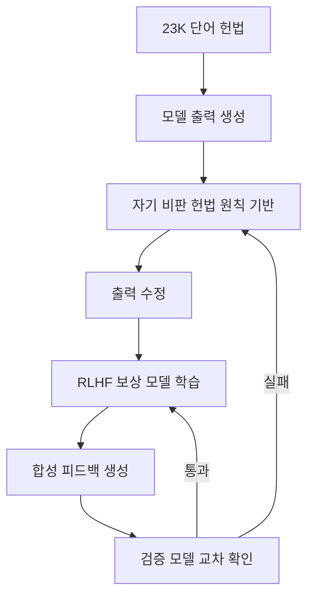

# 확장 헌법적 AI (Extended Constitutional AI, 2026)

## 개요

확장 헌법적 AI는 Anthropic이 2026년에 도입한 고도화된 Constitutional AI 프레임워크다. 2023년 초기 헌법이 약 2,700단어였던 반면, 2026년 버전은 23,000단어로 확장되어 훨씬 세밀한 행동 규범과 가치 충돌 해소 지침을 포함한다. [[rlhf-pipeline|RLHF]](인간 피드백 기반 강화학습)와 합성 피드백 검증 루프를 결합하여 안전성과 유용성 간 균형을 정밀하게 조율한다.

## 핵심 개념

### 헌법(Constitution)의 역할

헌법은 모델이 자신의 출력을 비판하고 수정하는 데 사용하는 텍스트 기반 원칙 집합이다. "유용하고, 해롭지 않으며, 정직하라(helpful, harmless, honest)"와 같은 규범적 진술(normative statements)을 학습 과정에서 기술적(descriptive) 신호로 변환하는 것이 핵심 메커니즘이다. 원칙의 형태는 "이 답변이 폭력을 조장하는가?", "이 답변이 사실에 기반하는가?"와 같은 이진 점검(binary check)으로 구체화된다.

### 가치 충돌과 is-ought 간극

"유용하라"와 "해롭지 않게 하라"는 진정한 가치 충돌을 내포한다. 초기 버전은 이 충돌의 가중치를 학습 과정에서 암묵적으로 결정했으나, 2026년 확장 버전은 상황별 우선순위 규칙을 명시적으로 기술하여 원칙적 해소를 시도한다. 예를 들어, 의료 정보 요청에서 "정확성"이 "과도한 주의사항 제공"보다 우선하는 규칙을 명시함으로써, 거짓 거부(false refusal)를 구조적으로 줄인다.

### 합성 피드백 검증 루프

RLHF의 인간 라벨러 의존도를 줄이기 위해, 모델이 생성한 합성 피드백을 별도 검증 모델이 교차 검증하는 루프를 도입했다. 이는 스케일링 병목(인간 라벨링 비용)을 완화하면서 피드백 품질을 유지하는 전략이다. 합성 피드백은 "low-noise, high-bias" 특성을 지니며, 비용은 인간 라벨링(건당 $1 이상) 대비 GPT-4o 기준 $0.01 미만으로 대폭 절감된다. 다만 의도하지 않은 체계적 편향이 발생할 수 있어 검증 모델의 교차 확인이 필수적이다.

## 작동 원리

### SL-CAI (지도학습 단계)

원칙 기반 반복 개선(iterative revision) 방식으로 학습 데이터를 생성한다:

1. 헌법 C에서 원칙 c_i를 샘플링
2. 모델이 프롬프트 x에 대한 이전 출력 y^i를 원칙에 맞춰 개정
3. {y^0, y^1, ... y^n} 시리즈를 생성한 뒤 최종 y^n을 지도학습 데이터로 사용
4. 이 과정을 통해 모델이 "자기 비판 -> 자기 수정"을 반복하며 헌법 정합성을 높임

### RL-CAI (강화학습 단계)

선호도 쌍(preference pair) 생성 메커니즘으로 보상 모델을 학습한다:

1. 헌법에서 원칙 부분집합 선택
2. 피드백 모델에 프롬프트 x, 원칙 집합, 두 완성본 (A, B) 제공
3. 모델이 헌법 원칙에 더 부합하는 답변 선택
4. 이 선호도 데이터로 보상 모델 학습 (RLAIF -- AI 피드백 기반 강화학습)
5. 초기에는 로짓 확률 기반 평가, 현재는 generative reward model로 추론 설명을 포함

### 전체 파이프라인

1. 확장된 헌법 원칙에 따라 모델이 자신의 출력을 비판하고 수정 (SL-CAI)
2. 수정된 출력 쌍으로 RLHF 보상 모델 학습 (RL-CAI)
3. 합성 피드백을 생성하여 인간 라벨링 보충
4. 별도 검증 모델이 합성 피드백의 품질 교차 검증
5. 전체 루프를 반복하여 안전성-유용성 균형 개선

## 성능/효과

- 헌법 규모: 2,700단어(2023) -> 23,000단어(2026), 약 8.5배 확장
- 세밀한 상황별 행동 규범으로 거짓 거부(false refusal) 감소
- 합성 피드백 루프로 인간 라벨링 비용 대폭 절감 (건당 $1+ -> $0.01 미만)
- RLHF 단독 대비 더 일관된 가치 정렬 달성
- SL-CAI와 RL-CAI의 분리로 "어떤 원칙을 우선할 것인가"를 명시적으로 제어 가능

## 한계와 미해결 과제

- **is-ought 간극**: 규범적 원칙("해롭지 않아야 한다")의 기술적 변환("이 출력의 해로움 점수가 임계값 이하인가")은 본질적으로 불완전하다. 원칙의 의미가 맥락에 따라 달라지는 문제가 남아 있다.
- **복수주의(Pluralism)**: 23,000단어 헌법이라 해도 전 세계 모든 문화/가치 체계를 포괄하지 못한다. 특정 문화적 맥락에서 "해로움"의 정의가 충돌할 수 있다.
- **합성 피드백 편향**: low-noise이지만 high-bias 특성으로 인해, 피드백 모델의 체계적 편향이 보상 모델에 전파될 위험이 있다. 검증 루프가 이를 완화하지만 완전히 제거하지는 못한다.
- **헌법 유지보수 비용**: 23,000단어 규모의 헌법을 일관되게 유지하고 업데이트하는 것 자체가 상당한 인적 비용을 수반한다.

## RLHF vs CAI vs 확장 CAI 비교

| 항목 | RLHF | Constitutional AI (2023) | 확장 CAI (2026) |
|------|------|------------------------|----------------|
| 피드백 소스 | 인간 라벨러 | 인간 + AI 자기비판 | AI 합성 피드백 + 검증 모델 |
| 헌법 규모 | 없음 | ~2,700단어 | ~23,000단어 |
| 가치 충돌 해소 | 암묵적 (학습 데이터 의존) | 원칙 명시 (우선순위 미지정) | 상황별 우선순위 규칙 명시 |
| 스케일링 병목 | 인간 라벨링 비용 | 인간 라벨링 + AI 비용 | AI 비용만 (검증 루프) |
| 피드백 비용 | 건당 $1+ | 절감 | 건당 $0.01 미만 |
| 거짓 거부 | 높음 | 중간 | 낮음 |

## 관련 문서
- [[preference-data-collection]]

- [[constitutional-classifiers]] -- 헌법적 분류기 기반 안전 필터
- [[deliberative-alignment]] -- 숙의적 정렬 기법
- [[alignment-faking]] -- 정렬 위장 문제
- [[synthetic-data-training]] -- 합성 데이터 파이프라인
