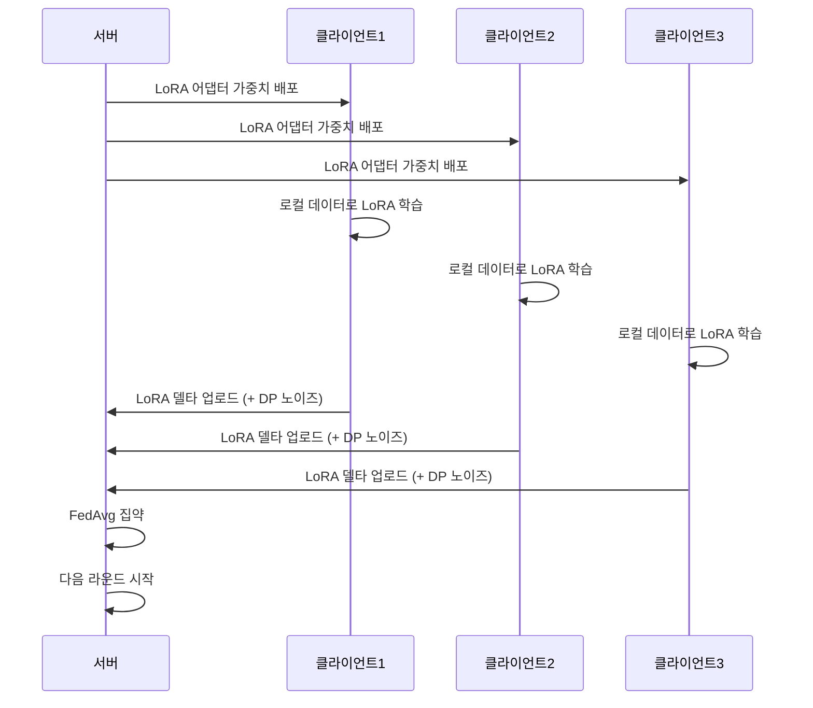

# 연합 학습 (Federated Learning)

## 개요

연합 학습(Federated Learning, FL)은 다수의 분산된 클라이언트(기기 또는 조직)가 원본 데이터를 중앙 서버에 전송하지 않고, 로컬에서 학습한 모델 업데이트만 공유하여 글로벌 모델을 협력적으로 학습하는 분산 기계학습 패러다임이다. Google이 2017년에 "Communication-Efficient Learning of Deep Networks from Decentralized Data" 논문으로 공식화한 이후, 개인정보 보호와 데이터 규제가 강화되는 환경에서 핵심적인 학습 기법으로 자리잡았다.

## 핵심 구조

### 학습 사이클

연합 학습의 기본 사이클은 다음과 같다:

1. **모델 배포**: 중앙 서버가 글로벌 모델의 현재 파라미터를 참여 클라이언트에 배포
2. **로컬 학습**: 각 클라이언트가 자신의 로컬 데이터로 모델을 학습 (수 에폭)
3. **업데이트 전송**: 클라이언트가 학습된 모델 업데이트(그래디언트 또는 가중치 차이)를 서버에 전송
4. **글로벌 집약**: 서버가 모든 클라이언트의 업데이트를 집약하여 글로벌 모델 갱신
5. **반복**: 수렴 조건이 충족될 때까지 1-4단계 반복

### FedAvg 알고리즘

가장 기본적인 집약 전략인 FedAvg(Federated Averaging)는 각 클라이언트의 로컬 모델 가중치를 데이터 크기에 비례하여 가중 평균한다:

```
w_global = SUM(n_k / n) * w_k  (k = 1, ..., K)
```

여기서 n_k는 클라이언트 k의 데이터 수, n은 전체 데이터 수, w_k는 클라이언트 k의 로컬 모델 가중치다. 단순하지만 IID(독립 동일 분포) 데이터에서는 놀라울 만큼 효과적이다.

### 연합 학습의 유형

| 유형 | 데이터 분할 | 참여자 | 대표 사례 |
|------|-----------|--------|----------|
| **수평 FL** | 동일 특성, 다른 샘플 | 다수의 동종 기기 | 모바일 키보드 예측 |
| **수직 FL** | 동일 샘플, 다른 특성 | 소수의 이종 기관 | 은행 + 보험사 공동 모델링 |
| **연합 전이 학습** | 다른 샘플, 다른 특성 | 이질적 도메인 | 도메인 간 협력 학습 |

## 프라이버시 보호 메커니즘

원본 데이터를 공유하지 않는 것만으로는 충분하지 않다. 모델 업데이트(그래디언트)로부터 원본 데이터를 역추론하는 **그래디언트 역전 공격(gradient inversion attack)**이 가능하기 때문이다.

### 차등 프라이버시 (Differential Privacy)

모델 업데이트에 보정된 노이즈를 추가하여, 개별 데이터 포인트의 존재 여부를 통계적으로 구분할 수 없게 만든다. 프라이버시 예산 epsilon이 작을수록 강한 보호를 제공하지만, 모델 유틸리티와 트레이드오프 관계에 있다.

### 안전한 집약 (Secure Aggregation)

동형 암호화(Homomorphic Encryption)나 안전 다자간 연산(Secure Multi-Party Computation)을 사용하여, 서버가 개별 클라이언트의 업데이트를 볼 수 없이 집약된 결과만 얻도록 한다. 서버 자체가 타협되더라도 개별 업데이트가 노출되지 않는다.

### 보호 기법 비교

| 기법 | 보호 대상 | 오버헤드 | 유틸리티 영향 |
|------|----------|---------|-------------|
| **차등 프라이버시** | 개별 데이터 포인트 | 낮음 | 노이즈로 인한 정확도 하락 |
| **안전한 집약** | 개별 클라이언트 업데이트 | 높은 통신/연산 비용 | 없음 (정확한 집약) |
| **동형 암호화** | 서버에서의 데이터 노출 | 매우 높음 | 없음 |

## 핵심 과제

### Non-IID 데이터 문제

현실 세계에서 각 클라이언트의 데이터 분포는 크게 다르다(non-IID). 예를 들어 모바일 키보드 예측에서 각 사용자의 언어 패턴, 어휘, 주제가 모두 다르다. Non-IID 환경에서 FedAvg의 수렴 속도가 크게 저하되고, 글로벌 모델이 특정 클라이언트 분포에 편향될 수 있다.

**완화 전략**:
- **FedProx**: 로컬 업데이트와 글로벌 모델 간 거리에 페널티 부여
- **SCAFFOLD**: 클라이언트별 제어 변수로 그래디언트 드리프트 보정
- **개인화 FL**: 글로벌 모델 + 로컬 적응 레이어 분리

### 통신 효율성

모델 파라미터의 반복적 전송은 대역폭 병목을 야기한다. 특히 LLM 규모의 모델에서는 한 라운드의 통신량이 수 GB에 달할 수 있다.

- **그래디언트 압축**: 중요한 그래디언트만 선택적 전송 (top-k sparsification)
- **양자화 통신**: 업데이트를 저정밀도로 양자화하여 전송 ([[ai-inference-quantization-2026|양자화]] 기법 적용)
- **로컬 학습 확대**: 통신 라운드 수를 줄이고 로컬 에폭을 늘림 (수렴 품질과 트레이드오프)

### 시스템 이질성

클라이언트 간 연산 능력, 네트워크 속도, 가용 시간이 다르다. 느린 클라이언트(straggler)가 전체 학습을 지연시키는 문제가 있으며, 비동기 집약이나 부분 참여(partial participation) 전략으로 대응한다.

## 적용 분야

| 분야 | 활용 | 데이터 민감도 |
|------|------|-------------|
| **헬스케어** | 병원 간 질병 예측 모델 공동 학습 | 환자 의료 기록 (HIPAA) |
| **금융** | 사기 탐지 모델의 은행 간 협력 학습 | 거래 내역 (금융 규제) |
| **모바일** | 키보드 예측, 음성 인식 개선 | 사용자 입력 데이터 |
| **자율주행** | 주행 데이터의 분산 학습 | 위치/영상 데이터 (GDPR) |
| **제조** | 공장 간 품질 예측 모델 공유 | 생산 공정 데이터 (영업 비밀) |

## 고급 알고리즘

### FedProx

McMahan et al.의 FedAvg가 IID 가정에 의존하는 것과 달리, **FedProx**는 Non-IID 데이터와 시스템 이질성을 동시에 처리한다. 로컬 목적 함수에 글로벌 모델과의 근접성(proximal term)을 추가한다:

$$h_k(w; w^t) = F_k(w) + \frac{\mu}{2} \|w - w^t\|^2$$

$\mu > 0$이 프록시멀 항의 강도를 조절한다. $\mu = 0$이면 FedAvg와 동일. 클라이언트가 글로벌 모델에서 너무 멀리 이탈하지 않도록 제한하여 수렴 안정성을 높인다.

### SCAFFOLD

클라이언트 드리프트(client drift) 문제를 제어 변수(control variates)로 해결한다. 각 클라이언트 $k$가 제어 변수 $c_k$를 유지하고, 로컬 업데이트 시 글로벌 제어 변수 $c$와의 차이로 드리프트를 보정:

$$g_k \leftarrow g_k - c_k + c$$

제어 변수는 매 라운드 업데이트되며, 클라이언트와 서버가 함께 유지한다. SCAFFOLD는 IID와 Non-IID 모두에서 FedAvg보다 이론적으로 더 빠른 수렴을 보장한다.

### FedNova

각 클라이언트가 다른 수의 로컬 업데이트 단계를 수행하는 비동기 설정을 다룬다. 클라이언트의 로컬 업데이트 수에 따라 정규화된 업데이트를 집약하여 편향된 수렴을 방지한다.

### MOON (Model-Contrastive Federated Learning)

대조 학습(contrastive learning) 원리를 연합 학습에 적용. 클라이언트의 로컬 표현이 이전 라운드의 표현보다 글로벌 표현에 더 가깝도록 대조 손실을 추가한다. Non-IID 환경에서 특히 효과적이다.

---

## 개인화 연합 학습 (Personalized Federated Learning)

글로벌 단일 모델이 모든 클라이언트에게 최적이지 않을 수 있다. 개인화 FL은 각 클라이언트에 맞춤화된 모델을 학습하는 방향이다.

| 방법 | 접근 | 특징 |
|------|------|------|
| **pFedMe** | Moreau 포락선 기반 개인화 | 개인 모델과 글로벌 모델을 분리 최적화 |
| **DITTO** | 글로벌 + 로컬 목적 분리 학습 | 간단하고 강건한 개인화 |
| **FedPer** | 레이어 분할 | 하단 레이어는 공유, 상단 레이어는 개인화 |
| **MAML 기반** | 메타 학습 | 몇 번의 그래디언트 단계로 클라이언트 적응 |

---

## 통신 효율화 심화

### 압축 기법 비교

| 기법 | 압축률 | 정확도 영향 | 적용 위치 |
|------|--------|-----------|---------|
| Top-k Sparsification | 99% 이상 | 중간 | 업로드 |
| Random-k Sparsification | 99% 이상 | 높음 | 업로드 |
| 1-비트 SGD | 32x | 중간~높음 | 업로드/다운로드 |
| 8비트 양자화 | 4x | 낮음 | 업로드/다운로드 |
| 에러 피드백 압축 | 가변 | 낮음 | 업로드 |

에러 피드백(error feedback): 압축으로 인한 오류를 다음 라운드에 누적 보상하여 압축 편향을 제거한다.

### 비동기 연합 학습

동기적 집약(synchronous aggregation)은 가장 느린 클라이언트(straggler)를 기다려야 한다. 비동기 방식:
- **FedBuff**: 버퍼에 일정 수의 클라이언트 업데이트가 쌓이면 집약
- **AsyncFedED**: 각 클라이언트 업데이트를 받는 즉시 글로벌 모델 업데이트
- **SAFA**: 세미-비동기 방식으로 느린 클라이언트 업데이트를 캐시하여 재사용

---

## 프라이버시 공격 유형

### 그래디언트 역전 공격 (Gradient Inversion)

Zhu et al. (2019) "Deep Leakage from Gradients"에서 최초 시연. 서버(또는 악의적 참여자)가 클라이언트의 그래디언트로부터 원본 학습 데이터를 복원한다.

복원 메커니즘:
1. 더미(dummy) 입력 데이터와 레이블을 초기화
2. 더미 데이터의 그래디언트와 실제 클라이언트 그래디언트 간 거리를 최소화하도록 더미 데이터 최적화
3. 고품질 이미지의 경우 수십 번의 반복으로 원본에 근접한 복원 가능

**방어 기법**:
- 차등 프라이버시 (노이즈 추가로 역전 불가능하게)
- 그래디언트 압축 (정보 손실)
- 안전한 집약 (서버가 개별 업데이트를 볼 수 없게)
- 배치 크기 증가 (배치 평균 그래디언트는 역전이 어려움)

### 멤버십 추론 공격 (Membership Inference)

특정 데이터 포인트가 특정 클라이언트의 학습 데이터에 포함되었는지 추론. 글로벌 모델과 로컬 모델의 예측 차이를 분석한다.

### 모델 역전 공격 (Model Inversion)

모델의 예측 API를 통해 클래스별 대표 입력 데이터를 재구성. 집약된 글로벌 모델을 공격하는 방식.

---

## LLM과 연합 학습

LLM의 연합 학습은 모델 크기로 인해 독특한 도전을 제시한다. 전체 모델 파라미터를 매 라운드 전송하는 것은 비현실적이므로, [[lora-qlora-finetuning|LoRA]] 어댑터만 연합 학습하는 **FedLoRA** 패턴이 주목받고 있다. 각 클라이언트가 저랭크 어댑터만 로컬 학습하고, 서버에서 어댑터 가중치를 집약하는 방식으로 통신 비용을 수십 배 줄일 수 있다.



위 다이어그램은 FedLoRA의 한 라운드를 보여준다. 기반 LLM은 고정하고 LoRA 어댑터만 집약하여 통신 비용을 대폭 절감한다.

**LLM 연합 학습의 추가 도전**:
- **이질적 어댑터 집약**: 클라이언트마다 LoRA 랭크나 타겟 레이어가 다를 경우 집약 방식 설계 필요
- **프라이버시 증폭**: LLM은 학습 데이터를 암기(memorize)하는 경향이 있어 DP-SGD 적용이 특히 중요
- **시스템 요구사항**: LLM 추론만 해도 수십 GB VRAM 필요. 클라이언트 기기에서 직접 학습은 현재 어려움
- **연합 증류**: 클라이언트가 소형 모델을 로컬 학습하고, 지식 증류로 서버의 대형 모델을 갱신하는 변형

## 관련 문서

- [[differential-privacy]] -- 연합 학습과 결합하여 그래디언트 역전 공격 방어
- [[privacy-preserving-ml]] -- PPML 전체 기술 지형에서 연합 학습의 위치
- [[lora-qlora-finetuning]] -- FedLoRA의 기반이 되는 파라미터 효율적 학습
- [[data-parallelism-fsdp]] -- 분산 학습의 또 다른 패러다임
- [[distributed-communication]] -- 분산 학습의 통신 프로토콜
- [[ai-inference-quantization-2026]] -- 통신 효율화를 위한 양자화 기법
- [[knowledge-distillation]] -- 연합 증류(Federated Distillation) 기법과의 접점

## 실무 구현: 기본 FedAvg 예시

```python
import torch
import copy
from typing import List

def fedavg(global_model, client_models: List[torch.nn.Module], 
           client_data_sizes: List[int]) -> torch.nn.Module:
    """
    FedAvg 집약: 데이터 크기 비례 가중 평균
    
    Args:
        global_model: 현재 글로벌 모델
        client_models: 각 클라이언트가 로컬 학습한 모델 목록
        client_data_sizes: 각 클라이언트의 데이터 크기
    """
    total_samples = sum(client_data_sizes)
    
    # 글로벌 모델 가중치 초기화
    global_dict = global_model.state_dict()
    for key in global_dict:
        global_dict[key] = torch.zeros_like(global_dict[key], dtype=torch.float32)
    
    # 가중 평균 계산
    for client_model, n_samples in zip(client_models, client_data_sizes):
        weight = n_samples / total_samples
        client_dict = client_model.state_dict()
        for key in global_dict:
            global_dict[key] += weight * client_dict[key].float()
    
    global_model.load_state_dict(global_dict)
    return global_model


def local_train(model, dataloader, optimizer, epochs=5, device="cpu"):
    """클라이언트 로컬 학습"""
    model = model.to(device)
    criterion = torch.nn.CrossEntropyLoss()
    
    for epoch in range(epochs):
        for inputs, labels in dataloader:
            inputs, labels = inputs.to(device), labels.to(device)
            optimizer.zero_grad()
            outputs = model(inputs)
            loss = criterion(outputs, labels)
            loss.backward()
            optimizer.step()
    
    return model


def federated_learning_round(global_model, client_dataloaders, n_clients_per_round=10):
    """연합 학습 한 라운드 실행"""
    # 참여 클라이언트 랜덤 샘플링 (partial participation)
    selected = torch.randperm(len(client_dataloaders))[:n_clients_per_round]
    
    client_models = []
    client_sizes = []
    
    for idx in selected:
        # 글로벌 모델 복사 후 로컬 학습
        local_model = copy.deepcopy(global_model)
        optimizer = torch.optim.SGD(local_model.parameters(), lr=0.01)
        trained = local_train(local_model, client_dataloaders[idx], optimizer)
        
        client_models.append(trained)
        client_sizes.append(len(client_dataloaders[idx].dataset))
    
    # FedAvg 집약
    return fedavg(global_model, client_models, client_sizes)
```

---

## 벤치마크 및 평가 설정

연합 학습 알고리즘 비교를 위한 표준 데이터셋 분할:

| 데이터셋 | 태스크 | Non-IID 분할 방식 |
|---------|------|---------------|
| CIFAR-10/100 | 이미지 분류 | 디리클레 분포($\alpha$로 이질성 제어) |
| FEMNIST | 손글씨 인식 | 작성자 기준 분할 (자연 Non-IID) |
| Shakespeare | 언어 모델링 | 캐릭터 기준 분할 |
| CelebA | 속성 분류 | 아이덴티티 기준 분할 |
| LEAF 벤치마크 | 다양한 태스크 | 표준화된 FL 벤치마크 |

**디리클레 분포 Non-IID**:
$\alpha$ 값이 작을수록 클라이언트 간 데이터 분포 이질성이 증가한다. $\alpha = 0.1$은 매우 Non-IID, $\alpha = 100$은 거의 IID에 가깝다.

---

## 연구 동향 (2024-2026)

### Vertical FL의 부상

수직 연합 학습(Vertical FL)은 동일 사용자에 대한 다른 특성을 보유한 기관 간 학습이다. 금융(은행 거래 + 보험 청구 + 신용 점수) 조합 시나리오에서 주목받고 있다.

- **Split Learning**: 모델을 레이어별로 분할하여 각 참여자가 일부 레이어만 보유
- **Vertical FedAvg**: 수직 분할을 지원하는 집약 방법
- 개인 연결(private link) 단계에서 PSI(Private Set Intersection)로 공통 사용자 식별

### 연합 학습 플랫폼

| 플랫폼 | 주체 | 특징 |
|--------|------|------|
| PySyft | OpenMined | 파이썬 기반, DP+SMC 통합 |
| Flower (flwr) | Flower Labs | 프레임워크 독립, 연구용 표준 |
| FedML | FedML Inc | 대규모 엣지 배포 지원 |
| TensorFlow Federated | Google | TF 생태계 통합 |
| FATE | WeBank | 금융 분야 특화, 수직 FL 지원 |

### 대규모 언어 모델 연합 학습 (2025)

2025년 이후 병원, 기업 간 LLM 공동 학습에 FL이 활용되기 시작:
- 의료 기관 간 임상 노트 기반 의료 LLM 공동 학습
- 법률 사무소 간 판례 기반 법률 LLM 공동 학습
- 제조사 간 도메인 특화 기술 문서 LLM 공동 학습

이 모든 사례에서 [[differential-privacy]]와 [[privacy-preserving-ml]] 기법이 조합된다.

---

## 관련 문서

- [[differential-privacy]] -- 연합 학습과 결합하여 그래디언트 역전 공격 방어
- [[privacy-preserving-ml]] -- PPML 전체 기술 지형에서 연합 학습의 위치
- [[lora-qlora-finetuning]] -- FedLoRA의 기반이 되는 파라미터 효율적 학습
- [[data-parallelism-fsdp]] -- 분산 학습의 또 다른 패러다임
- [[distributed-communication]] -- 분산 학습의 통신 프로토콜
- [[ai-inference-quantization-2026]] -- 통신 효율화를 위한 양자화 기법
- [[knowledge-distillation]] -- 연합 증류(Federated Distillation) 기법과의 접점

---

## 참고 자료

- McMahan, B. et al. (2017). "Communication-Efficient Learning of Deep Networks from Decentralized Data." AISTATS 2017. (FedAvg 원논문)
- Li, T. et al. (2020). "Federated Optimization in Heterogeneous Networks (FedProx)." MLSys 2020.
- Karimireddy, S.P. et al. (2020). "SCAFFOLD: Stochastic Controlled Averaging for Federated Learning." ICML 2020.
- Zhu, L. et al. (2019). "Deep Leakage from Gradients." NeurIPS 2019.
- Bonawitz, K. et al. (2017). "Practical Secure Aggregation for Privacy-Preserving Machine Learning." CCS 2017.
- [Federated Learning: A Survey on Privacy-Preserving Collaborative Intelligence (arXiv 2025)](https://arxiv.org/html/2504.17703v3)
- [Privacy preservation in federated learning: An insightful survey from the GDPR perspective (ScienceDirect)](https://www.sciencedirect.com/science/article/pii/S0167404821002261)
- [Exploring privacy mechanisms and metrics in federated learning (Springer 2025)](https://link.springer.com/article/10.1007/s10462-025-11170-5)
