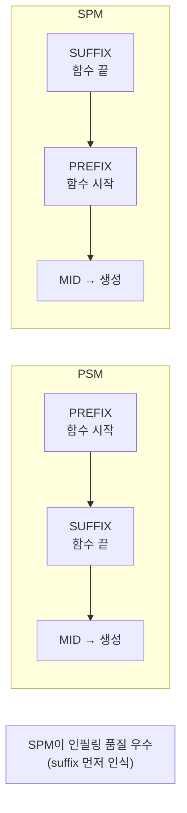
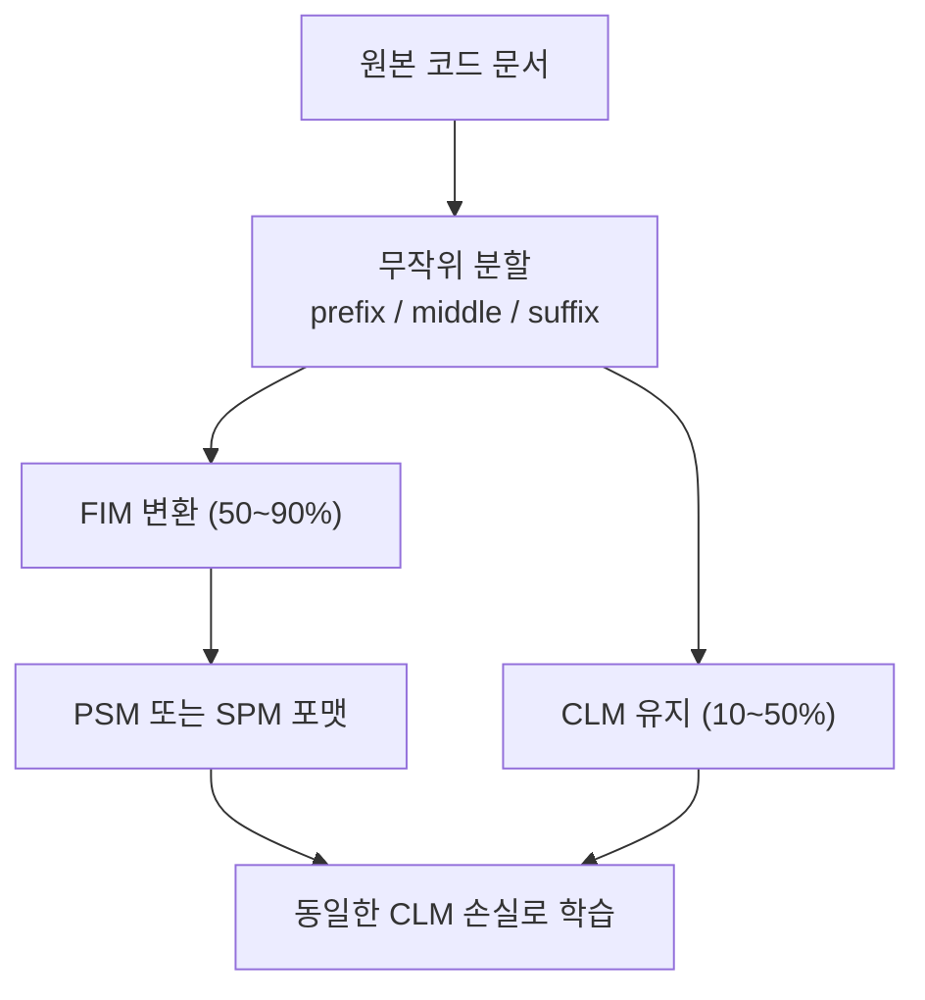

# Fill-in-the-Middle (FIM) - 중간 채우기 학습

## 개요

Fill-in-the-Middle(FIM)은 텍스트의 중간 부분을 비워두고 앞뒤 맥락(prefix와 suffix)을 모두 주었을 때 빈칸을 채우도록 학습하는 기법이다. 주로 **코드 생성** 모델에서 코드 편집, 자동완성, 인필링(infilling) 작업을 위해 사용된다.

[[causal-language-modeling]](CLM)이 왼쪽에서 오른쪽으로만 예측하는 것과 달리, FIM은 양방향 맥락을 활용한다. 하지만 [[masked-language-modeling]](MLM, BERT 방식)처럼 별도의 양방향 인코더를 요구하지 않고, **기존 자기회귀(autoregressive) 디코더 구조를 그대로 유지**하면서 양방향 맥락을 활용한다는 점이 핵심이다.

2022년 OpenAI의 Bavarian et al. "Efficient Training of Language Models to Fill in the Middle"에서 체계화되었다.

## PSM vs SPM 포맷

FIM의 핵심 설계 결정은 prefix, suffix, middle을 어떤 순서로 배치하느냐다. 두 가지 주요 포맷이 있다:

### PSM (Prefix-Suffix-Middle)

```
<PRE> {prefix} <SUF> {suffix} <MID> {middle}
```

입력으로 prefix와 suffix를 주고, 모델이 MID 토큰 이후 middle 부분을 생성한다. 직관적인 구조이며 prefix를 먼저 보기 때문에 prefix에 대한 이해가 강하다.

### SPM (Suffix-Prefix-Middle)

```
<PRE> {suffix} <SUF> {prefix} <MID> {middle}
```

suffix를 먼저 제시하고 prefix는 나중에 준다. 논문에서 SPM이 PSM보다 실제 인필링 품질이 더 높음을 실험적으로 보였다. 이유는 suffix가 먼저 제시되면 모델이 "무엇으로 끝나야 하는가"를 명확히 인식한 상태에서 middle을 생성하기 때문이다.



## 학습 데이터 변환

FIM 학습은 기존 자기회귀 훈련 데이터를 **변환**하여 사용한다. 각 학습 샘플에 대해:

1. 원본 문서를 무작위로 세 구간으로 분할: [prefix | middle | suffix]
2. FIM 포맷으로 재배열: `<PRE> prefix <SUF> suffix <MID> middle <EOT>`
3. 일반 CLM 손실로 학습 (middle 부분의 토큰에 대한 예측 손실)

학습 데이터의 일부(50-90%)만 FIM으로 변환하고, 나머지는 원래 CLM 포맷을 유지한다. 이를 통해 왼쪽-오른쪽 생성 능력을 유지하면서 인필링 능력을 추가한다.



## 코드 생성에서의 활용

### 커서 인식 자동완성

현대 AI 코딩 도구(GitHub Copilot, Cursor, Codeium 등)는 FIM을 핵심 기술로 사용한다. 사용자가 파일 중간에 커서를 놓고 코드를 작성할 때:

- **Prefix**: 커서 위쪽 코드 (함수 선언, import 등)
- **Suffix**: 커서 아래쪽 코드 (나머지 로직, 닫는 괄호 등)
- **Middle**: 모델이 생성할 커서 위치의 코드

suffix가 있으면 모델이 아래와 연결되는 코드를 생성할 수 있어, 단순 좌-우 예측보다 맥락에 맞는 자동완성이 가능하다.

### 실제 사용 예시

```python
def calculate_average(numbers):
    # [커서 위치 - FIM middle]
    return result
```

FIM 없이 left-to-right 모델은 `return result` 이후 코드를 알 수 없어 부적절한 완성을 제안할 수 있다. FIM 모델은 `return result`가 suffix임을 알고 그에 맞는 합산/나눗셈 코드를 middle에 생성한다.

## CLM, MLM과의 비교

| 항목 | CLM (GPT 방식) | MLM (BERT 방식) | FIM |
|------|--------------|----------------|-----|
| 방향성 | 단방향 (L→R) | 양방향 | 양방향 (재배열로 달성) |
| 아키텍처 | 디코더 | 인코더 | 디코더 (동일) |
| 생성 가능 | 가능 | 불가 | 가능 |
| 인필링 | 불가 | 가능하지만 생성 품질 낮음 | 가능 + 생성 품질 유지 |
| 훈련 목적함수 | 다음 토큰 예측 | 마스크 토큰 예측 | 다음 토큰 예측 (포맷만 변경) |

FIM의 핵심 장점은 **새로운 아키텍처나 목적함수 없이** 기존 CLM 인프라 위에서 인필링 능력을 추가한다는 점이다.

## FIM을 채택한 모델들

- **Code Llama** (Meta, 2023): 70% FIM 비율, SPM 포맷 사용
- **StarCoder** (BigCode, 2023): FIM 토큰으로 `<fim_prefix>`, `<fim_suffix>`, `<fim_middle>` 사용
- **DeepSeek-Coder**: 높은 FIM 비율로 인필링 특화
- **Codex** (OpenAI): FIM의 초기 공개 사례

## 한계

- 아주 긴 suffix가 있을 때 컨텍스트 창(context window) 초과 가능
- prefix와 suffix 모두 충분해야 high-quality 인필링 가능 (한쪽이 비어있으면 효과 반감)
- FIM 학습 데이터의 분할 방식이 실제 편집 패턴과 다를 수 있음 (무작위 분할 vs 의미 있는 편집 위치)

## 관련 문서

- [[causal-language-modeling]] -- 기본 자기회귀 언어 모델링 (FIM의 기반 아키텍처)
- [[masked-language-modeling]] -- BERT 방식 양방향 학습 (FIM의 비교 대상)
- [[ast-fim-code-training]] -- AST 기반 FIM 변형 (더 정교한 코드 특화 분할)
