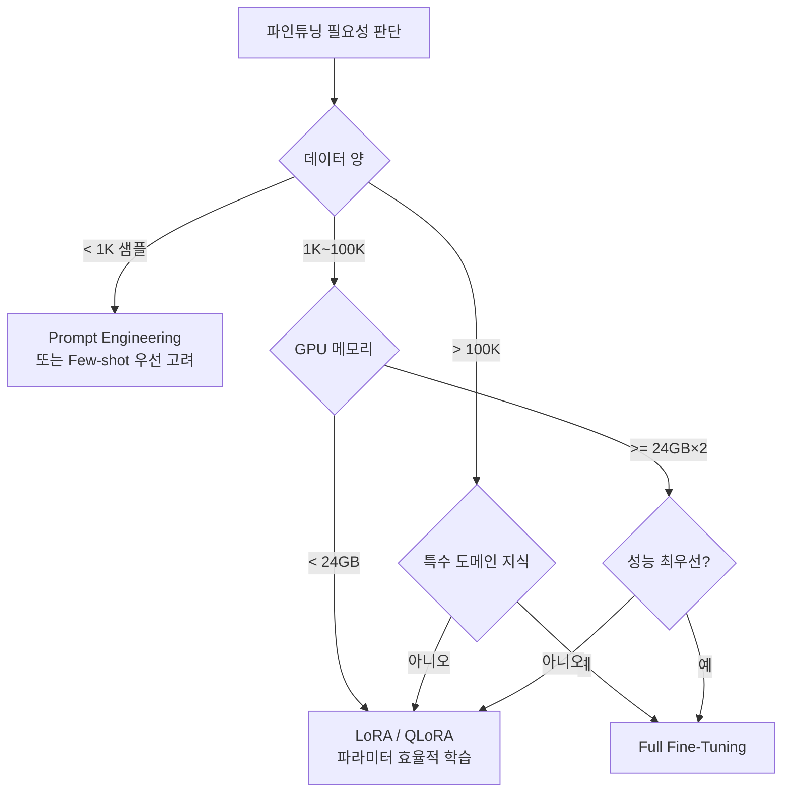

# 파인튜닝 개요 (Fine-Tuning Overview)

## 정의

파인튜닝(fine-tuning)은 대규모 코퍼스로 사전학습(pre-training)된 모델을 특정 태스크나 도메인에 맞게 추가 학습하는 과정이다. 사전학습 단계에서 습득한 일반적인 언어 능력을 유지하면서, 소량의 타겟 데이터로 특화된 행동을 유도한다.

전이학습(transfer learning)의 일종이며, LLM 파인튜닝은 크게 **전체 파라미터 갱신**과 **파라미터 효율적 기법(PEFT)** 두 방향으로 나뉜다.

## 파인튜닝 유형

### Full Fine-Tuning
- 모델 전체 파라미터를 업데이트
- 성능 상한이 가장 높음
- GPU 메모리 요구량이 원본 모델 크기의 수 배
- Catastrophic Forgetting 위험 가장 높음

### PEFT (Parameter-Efficient Fine-Tuning)
원본 가중치를 동결하고 소규모 추가 파라미터만 학습한다.

| 기법 | 핵심 아이디어 | 학습 파라미터 비율 |
|------|--------------|-------------------|
| LoRA | 가중치 변화량을 저랭크 행렬로 근사 | ~0.1-1% |
| QLoRA | LoRA + 4비트 양자화 | ~0.1% (메모리 획기적 절감) |
| Prompt Tuning | 입력 앞에 소프트 토큰 추가 | 수천 파라미터 |
| Prefix Tuning | 각 레이어에 가상 토큰 삽입 | ~0.1% |
| Adapter | 레이어 사이에 소형 MLP 삽입 | ~3-5% |

### SFT (Supervised Fine-Tuning)의 위치

SFT는 레이블이 있는 (입력, 출력) 쌍으로 학습하는 방식이다. Full Fine-Tuning과 PEFT 모두 SFT 방식을 사용할 수 있다. RLHF(Reinforcement Learning from Human Feedback) 파이프라인에서는 SFT가 첫 번째 단계로, 이후 보상 모델 학습과 PPO/DPO 최적화가 뒤따른다.

## 파인튜닝 유형 결정 트리

위 트리는 자원 제약과 데이터 규모를 기준으로 최선의 전략을 안내한다. 24GB 단일 GPU 환경에서 7B 모델 전체 파인튜닝은 사실상 불가능하므로 QLoRA가 현실적 선택이다.

## 주요 하이퍼파라미터 가이드

| 파라미터 | 전형적 범위 | 비고 |
|---------|------------|------|
| 학습률 (lr) | 1e-5 ~ 5e-4 | 사전학습보다 1-2 오더 낮게 |
| 에포크 | 1~5 | 소규모 데이터일수록 낮게 |
| 배치 크기 | 8~128 | 그래디언트 누적으로 효과적 증가 |
| 워밍업 스텝 | 전체 스텝의 5-10% | 초기 불안정성 방지 |
| LoRA rank | 8, 16, 64 | rank ↑ = 표현력 ↑, 파라미터 ↑ |
| LoRA alpha | rank의 1~2배 | 스케일링 계수 |

## Catastrophic Forgetting

파인튜닝 시 타겟 태스크에 특화되면서 사전학습에서 습득한 일반 지식이 손상되는 현상이다.

**완화 전략:**
- **낮은 학습률**: 기존 가중치 변화를 최소화
- **PEFT**: 원본 가중치를 동결하므로 구조적으로 방지
- **데이터 혼합(data mixing)**: 타겟 데이터에 일반 데이터를 소량 혼합
- **Elastic Weight Consolidation (EWC)**: 중요 파라미터에 정규화 패널티 부과
- **Replay buffer**: 이전 태스크 데이터 일부를 지속 포함

## 파인튜닝 데이터 품질 원칙

- **양보다 질**: 고품질 1K 샘플이 저품질 100K 샘플보다 유리한 경우가 많음
- **형식 일관성**: 입력-출력 형식이 추론 시와 동일해야 함
- **다양성**: 같은 태스크의 다양한 표현 방식 포함
- **오염 방지**: 평가 벤치마크 데이터와 중복 제거

## 실무 적용 관점

> "Fine-tuning teaches the model *how* to respond; pre-training teaches it *what* to know."

행동 양식(응답 형식, 톤, 거절 패턴)은 파인튜닝으로 효과적으로 변경 가능하지만, 사전학습에 없는 지식을 파인튜닝으로 주입하는 것은 비효율적이다. 지식 주입이 목적이면 RAG(검색 증강 생성) 또는 Continued Pre-training을 우선 고려한다.

## 관련 문서

- [[lora-qlora-finetuning]] - LoRA/QLoRA 상세 메커니즘
- [[instruction-tuning]] - 명령어 형식 SFT
- [[supervised-fine-tuning]] - SFT 학습 절차 상세
- [[transfer-learning]] - 전이학습 일반 개론
- [[continual-pretraining]] - 지속 사전학습으로 지식 주입
