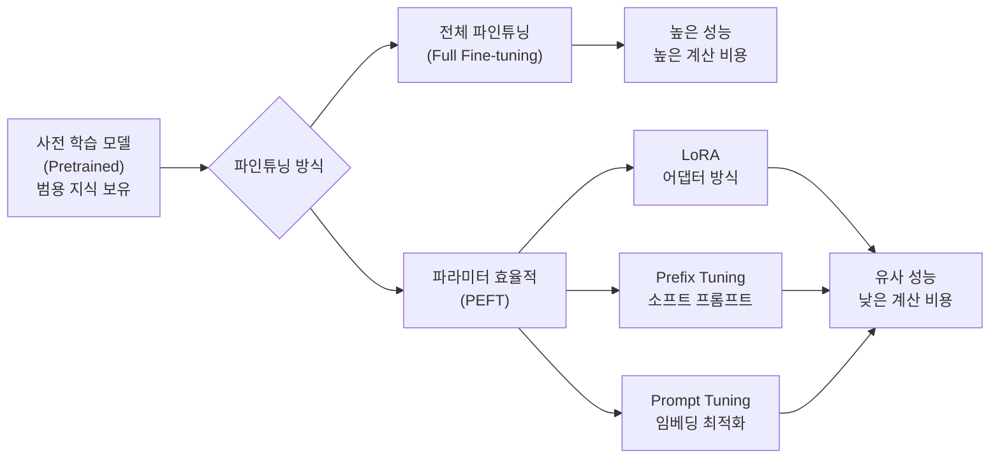
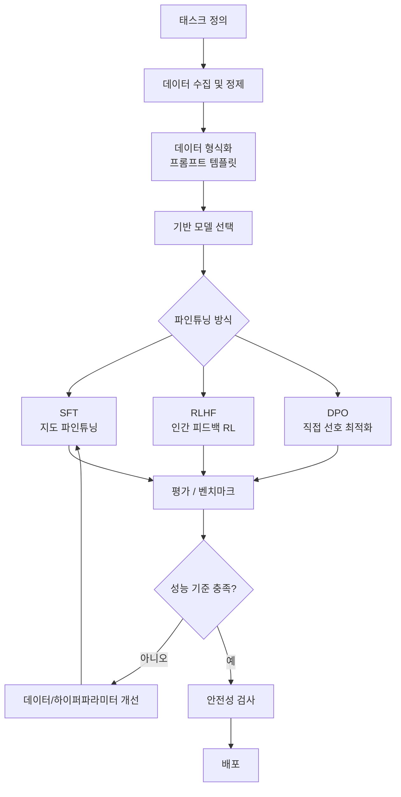
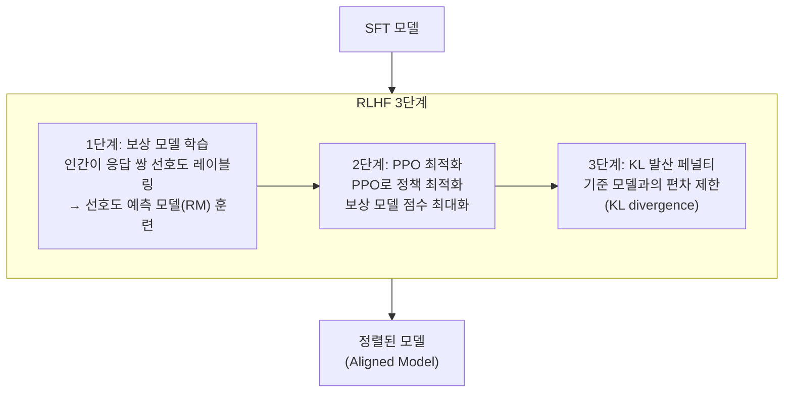
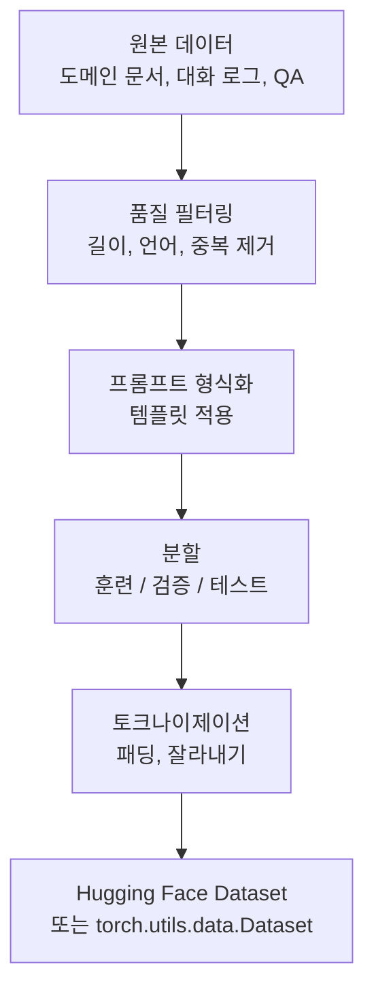
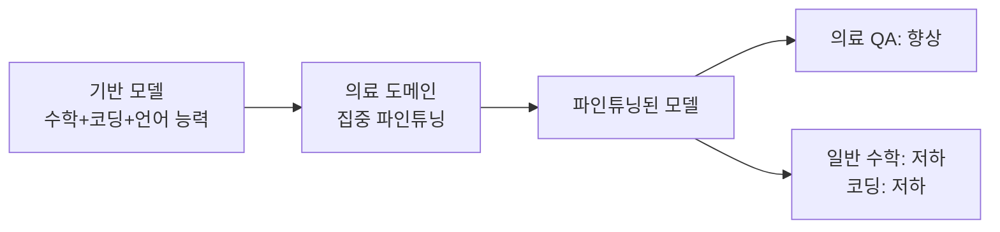

# 파인튜닝 (Fine-tuning)

## 개념 정의

파인튜닝(Fine-tuning)은 대규모 사전 학습된 모델(pretrained model)을 특정 태스크 또는 도메인에 맞게 **추가 학습하는 전이 학습(Transfer Learning)의 한 형태**다. 방대한 범용 지식을 갖춘 기반 모델(foundation model)을 출발점으로 삼아, 상대적으로 적은 도메인별 데이터와 계산 자원으로 높은 성능을 달성한다.

LLM 파인튜닝은 사전 학습 비용(수백만~수십억 달러)의 수천분의 일로 특화 모델을 얻을 수 있어, 현재 AI 응용 개발의 핵심 파이프라인이다.



---

## Full Fine-tuning vs PEFT

### 전체 파인튜닝 (Full Fine-tuning)

모델의 모든 파라미터를 업데이트한다.

```python
from transformers import AutoModelForCausalLM, Trainer, TrainingArguments

model = AutoModelForCausalLM.from_pretrained("meta-llama/Llama-2-7b-hf")
# 모든 파라미터가 학습 대상 (7B 파라미터)

training_args = TrainingArguments(
    output_dir="./full-ft-output",
    learning_rate=2e-5,
    num_train_epochs=3,
    per_device_train_batch_size=2,
    gradient_accumulation_steps=8,
    fp16=True,
)
trainer = Trainer(model=model, args=training_args, train_dataset=dataset)
trainer.train()
```

**장점**: 최고 성능 달성 가능, 모델 완전 적응
**단점**: 메모리 집약적(7B 모델 = ~80GB VRAM), 카타스트로픽 포겟(catastrophic forgetting) 위험

### 파라미터 효율적 파인튜닝 (PEFT)

대부분의 파라미터를 고정하고 소수의 파라미터만 학습한다. 자세한 내용은 [[lora]] 참조.

| 방법 | 학습 파라미터 비율 | 특징 |
|------|-----------------|------|
| Full FT | 100% | 최고 성능 가능 |
| LoRA (r=8) | ~0.1% | 저랭크 어댑터 |
| IA3 | ~0.01% | 스케일링 벡터만 |
| Prefix Tuning | ~0.1% | 컨텍스트 앞에 학습 가능 토큰 |
| Prompt Tuning | ~0.001% | 입력 임베딩만 최적화 |

---

## 파인튜닝 워크플로우 전체 개요



---

## SFT (Supervised Fine-Tuning)

지도 파인튜닝은 입력-출력 쌍의 데이터로 다음 토큰 예측 손실(next-token prediction loss)을 최소화한다.

$$\mathcal{L}_{SFT} = -\sum_{t=1}^{T} \log P_\theta(y_t | x, y_{1:t-1})$$

### 데이터 포맷

```python
# Alpaca 스타일 포맷
def format_instruction(sample: dict) -> str:
    """지시-입력-출력 형식으로 프롬프트를 구성한다."""
    if sample.get("input"):
        return (
            f"Below is an instruction...\n\n"
            f"### Instruction:\n{sample['instruction']}\n\n"
            f"### Input:\n{sample['input']}\n\n"
            f"### Response:\n{sample['output']}"
        )
    return (
        f"Below is an instruction...\n\n"
        f"### Instruction:\n{sample['instruction']}\n\n"
        f"### Response:\n{sample['output']}"
    )

# Chat 포맷 (ChatML)
def format_chat(messages: list[dict]) -> str:
    """ChatML 형식으로 대화를 직렬화한다."""
    formatted = ""
    for msg in messages:
        formatted += f"<|im_start|>{msg['role']}\n{msg['content']}<|im_end|>\n"
    formatted += "<|im_start|>assistant\n"
    return formatted
```

### SFT 데이터 품질 원칙

- **다양성(Diversity)**: 태스크, 도메인, 응답 스타일의 다양한 조합
- **정확성(Accuracy)**: 사실 오류 없는 레이블. 오염된 데이터는 학습에 악영향
- **크기보다 품질**: 고품질 1K 샘플이 저품질 100K보다 나을 수 있음 (LIMA 논문)
- **응답 길이 다양성**: 짧은 답변과 긴 설명이 균형있게 분포

---

## RLHF (강화 학습 기반 인간 피드백)

RLHF(Reinforcement Learning from Human Feedback)는 SFT 이후 단계로, 인간 선호도를 학습하여 유용하고 무해한 모델을 만든다.



보상 모델 손실:

$$\mathcal{L}_{RM} = -\mathbb{E}_{(x, y_w, y_l) \sim D} \left[\log \sigma(r_\phi(x, y_w) - r_\phi(x, y_l))\right]$$

- $y_w$: 선호 응답 (preferred/winner)
- $y_l$: 비선호 응답 (less preferred/loser)

PPO 목적 함수:

$$\mathcal{L}_{PPO} = \mathbb{E}[r_\phi(x, y)] - \beta \cdot \text{KL}[\pi_\theta(y|x) \| \pi_{ref}(y|x)]$$

**단점**: 보상 모델 학습, PPO 최적화 등 3단계 파이프라인으로 구현 복잡도와 계산 비용이 높다.

---

## DPO (Direct Preference Optimization)

DPO는 RLHF의 복잡성을 단순화하여 **보상 모델 없이 직접 선호도 데이터로** 정책을 최적화한다. 자세한 내용은 [[dpo|dpo-direct-preference-optimization]] 참조.

$$\mathcal{L}_{DPO} = -\mathbb{E}_{(x, y_w, y_l)} \left[\log \sigma \left(\beta \log \frac{\pi_\theta(y_w|x)}{\pi_{ref}(y_w|x)} - \beta \log \frac{\pi_\theta(y_l|x)}{\pi_{ref}(y_l|x)}\right)\right]$$

```python
from trl import DPOTrainer, DPOConfig

dpo_config = DPOConfig(
    beta=0.1,                    # KL 발산 제어 계수
    loss_type="sigmoid",         # DPO 손실 유형
    max_length=1024,
    max_prompt_length=512,
    learning_rate=5e-7,
    num_train_epochs=1,
    per_device_train_batch_size=4,
    gradient_accumulation_steps=4,
)

dpo_trainer = DPOTrainer(
    model=model,                  # SFT 완료된 모델
    ref_model=ref_model,          # 동결된 참조 모델
    args=dpo_config,
    train_dataset=preference_dataset,  # {"prompt", "chosen", "rejected"}
    tokenizer=tokenizer,
)

dpo_trainer.train()
```

| 비교 항목 | RLHF+PPO | DPO |
|-----------|----------|-----|
| 구현 복잡도 | 높음 (3단계) | 낮음 (1단계) |
| 계산 비용 | 높음 | 중간 |
| 안정성 | PPO 불안정성 | 안정적 |
| 성능 | 최고 수준 | RLHF 근접 |
| 필요 데이터 | 선호도 쌍 | 선호도 쌍 |

---

## 데이터 준비

### 데이터 파이프라인



```python
from datasets import Dataset
import json

def prepare_sft_dataset(raw_data: list[dict]) -> Dataset:
    """원본 데이터를 SFT 학습용 데이터셋으로 변환한다."""
    formatted = []
    for item in raw_data:
        text = format_instruction(item)
        # 최소 길이 필터
        if len(text.split()) < 10:
            continue
        formatted.append({"text": text})
    return Dataset.from_list(formatted)
```

### 데이터 오염(Contamination) 방지

- 평가 벤치마크 데이터가 훈련 세트에 포함되지 않도록 검사
- n-gram 중복 검사 또는 임베딩 유사도 기반 중복 제거
- 민감 정보(PII, 개인정보) 마스킹

---

## 카타스트로픽 포겟 (Catastrophic Forgetting)

특정 태스크에 집중 파인튜닝 시 기존 범용 능력이 저하되는 현상.



**완화 방법**:
1. **Replay**: 일부 일반 도메인 데이터를 파인튜닝 데이터에 혼합
2. **낮은 학습률**: 큰 변화를 억제
3. **EWC (Elastic Weight Consolidation)**: 중요 파라미터 업데이트에 페널티
4. **PEFT**: 기반 가중치 고정으로 범용 능력 보존

---

## 도메인 적응 (Domain Adaptation)

### 지속 사전 학습 (Continued Pretraining)

도메인 특화 텍스트로 추가 사전 학습. 다음 토큰 예측 목표 유지.

```
[의료] → PubMed 논문, 임상 노트로 추가 사전 학습
[법률] → 법령, 판례로 추가 사전 학습
[코딩] → GitHub 코드로 추가 사전 학습
```

### 도메인 적응 순서


---

## 하이퍼파라미터 가이드

| 파라미터 | 권장 범위 | 조정 방향 |
|----------|----------|----------|
| learning rate | 1e-5 ~ 5e-4 | 과적합 시 낮추기 |
| batch size | 16~128 (유효 배치) | 클수록 안정, 메모리 제약 |
| epochs | 1~5 | 작은 데이터셋은 더 많이 |
| warmup ratio | 0.03~0.1 | 학습 초반 안정화 |
| weight decay | 0.01~0.1 | 정규화 |
| gradient clip | 0.5~1.0 | 불안정 학습 방지 |
| lr scheduler | cosine | 일반적으로 cosine decay |

### 학습률 탐색

```python
from transformers import TrainingArguments

# 학습률 탐색 실험
for lr in [1e-5, 3e-5, 1e-4, 3e-4]:
    args = TrainingArguments(
        output_dir=f"./lr-{lr}",
        learning_rate=lr,
        num_train_epochs=1,
        per_device_train_batch_size=4,
        eval_strategy="steps",
        eval_steps=100,
        load_best_model_at_end=True,
    )
    # 각 실험 결과를 비교하여 최적 lr 선택
```

---

## 평가 전략

### 자동 평가

| 지표 | 태스크 | 도구 |
|------|-------|------|
| MMLU | 지식 종합 | lm-evaluation-harness |
| HellaSwag | 상식 추론 | lm-evaluation-harness |
| HumanEval | 코드 생성 | bigcode-evaluation |
| MT-Bench | 대화 능력 | FastChat |
| BLEU/ROUGE | 생성 품질 | nltk/rouge-score |

### 인간 평가 (Human Eval)

- 선호도 비교: A vs B 응답 중 선택
- 절대 평가: 1-5점 척도 (유용성, 정확성, 안전성)
- **레이터(annotator) 일치도**: Krippendorff's alpha, Cohen's kappa로 품질 측정

---

## 안전성 및 정렬

파인튜닝 후 모델이 유해하거나 편향된 응답을 생성할 위험을 평가한다.

- **ToxiGen**: 증오 발언 생성 비율
- **BBQ (Bias Benchmark for QA)**: 편향 측정
- **TruthfulQA**: 허위 정보 생성 측정
- **Safety benchmark**: 적대적 프롬프트에 대한 안전 응답률

---

## 관련 문서

- [[fine-tuning-overview]] - 파인튜닝 개요 요약
- [[supervised-fine-tuning]] - SFT 상세
- [[lora]] - LoRA PEFT 기법
- [[rlhf]] - RLHF 상세 파이프라인
- [[dpo|dpo-direct-preference-optimization]] - DPO 원리 및 구현
- [[quantization]] - 파인튜닝과 함께 사용되는 양자화
- [[transformer]] - 파인튜닝 대상 기반 아키텍처
