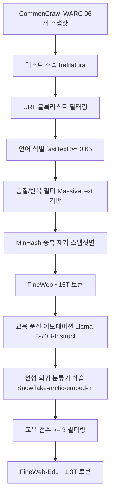

# FineWeb 데이터셋 (FineWeb Dataset)

## 개요

FineWeb은 HuggingFace가 2024년 5월에 공개한 약 15조(15T) 토큰 규모의 영어 웹 사전학습 데이터셋이다. 96개의 CommonCrawl 스냅샷(2013년 여름 ~ 2024년 4월)을 처리하여 구축했으며, 디스크 기준 약 44TB에 달하는 공개 LLM 사전학습 데이터셋 중 최대 규모다. [[pretraining-data-curation]]의 모범 사례를 체계적으로 적용하여, C4, The Pile, SlimPajama, Dolma v1.6 등 기존 공개 데이터셋보다 다양한 벤치마크에서 더 나은 성능을 보인다. 처리 과정 전체가 datatrove 라이브러리와 함께 오픈소스로 공개되어 재현 가능하다.

## 핵심 정보

| 항목 | 내용 |
|------|------|
| 개발 주체 | HuggingFace |
| 공개 시기 | 2024년 5월 31일 |
| 규모 | ~15T 토큰 (GPT-2 토크나이저 기준) |
| 디스크 크기 | ~44 TB |
| 소스 | CommonCrawl 96개 스냅샷 |
| 언어 | 영어 |
| 라이선스 | ODC-By 1.0 |
| 처리 도구 | datatrove |

## 데이터 처리 파이프라인

### 1. 텍스트 추출

기존 CommonCrawl의 WET 파일 대신 WARC 원본에서 trafilatura 라이브러리로 직접 텍스트를 추출한다. WET 파일은 불필요한 메뉴, 헤더, 광고 텍스트가 포함되는 경우가 많은데, trafilatura는 본문 추출 정확도가 더 높다.

### 2. 기본 필터링

- **URL 블록리스트**: 성인 콘텐츠 등 저품질 도메인을 사전 차단
- **언어 식별**: fastText 기반 언어 분류기로 영어 문서만 선별 (신뢰도 0.65 이상)
- **품질/반복 필터**: Google의 MassiveText(Gopher 논문)에서 제안된 휴리스틱 기반 -- 종료 구두점 비율, 중복 라인 비율, 짧은 라인 비율, 특수문자 비율 등 문서 수준 통계 적용

### 3. 중복 제거 전략

FineWeb의 핵심 발견 중 하나는 중복 제거 범위에 관한 것이다. 직관적으로는 전체 데이터를 한꺼번에 중복 제거하는 것이 최선으로 보이지만, 실험 결과 **각 CommonCrawl 스냅샷을 개별적으로 중복 제거한 뒤 샘플링**하는 방식이 더 나은 학습 성능을 보였다. 이는 스냅샷 간 일부 중복이 오히려 학습에 도움이 될 수 있음을 시사한다.

### 4. C4 휴리스틱의 선별적 적용

C4 데이터셋에서 사용된 휴리스틱 필터(문장 종료 구두점 필수, JavaScript 단어 필터 등)를 전부 적용하지 않고, ablation 실험을 통해 실제 성능 향상에 기여하는 필터만 선별적으로 채택했다. 과도한 필터링이 오히려 데이터 다양성을 해치는 문제를 방지하기 위한 설계 원칙이다.

## FineWeb-Edu: 교육 품질 서브셋

FineWeb-Edu는 FineWeb에서 교육적 가치가 높은 문서만 추출한 1.3T 토큰 규모의 서브셋이다.

### 구축 과정

1. **어노테이션**: Llama-3-70B-Instruct 모델로 50만 개 샘플에 교육적 가치 점수(0-5점) 부여
2. **분류기 학습**: Snowflake-arctic-embed-m 임베딩 위에 선형 회귀 모델을 학습하여 교육 점수 예측
3. **필터링**: 교육 점수 3점 이상 문서만 보존

### 성능 특성

FineWeb-Edu는 MMLU, ARC, OpenBookQA 등 지식 및 추론 벤치마크에서 전체 FineWeb보다 더 높은 성능을 보인다. 반면, 다양성이 필요한 일부 태스크에서는 전체 FineWeb이 더 나을 수 있어, 학습 목적에 따라 선택이 필요하다.

## 기존 데이터셋과의 비교

| 데이터셋 | 토큰 수 | 소스 | 필터링 방식 |
|---------|---------|------|-----------|
| C4 | ~750B | CommonCrawl (1 스냅샷) | 규칙 기반 휴리스틱 |
| The Pile | ~825B | 22개 큐레이션된 소스 | 소스별 큐레이션 |
| RefinedWeb | ~5T | CommonCrawl | 엄격한 중복 제거 + 필터링 |
| SlimPajama | ~627B | RedPajama 필터링 | MinHash 중복 제거 |
| **FineWeb** | **~15T** | **CommonCrawl 96 스냅샷** | **trafilatura + 선별적 휴리스틱** |
| **FineWeb-Edu** | **~1.3T** | **FineWeb 서브셋** | **LLM 기반 교육 품질 필터링** |

FineWeb 팀의 ablation 실험에 따르면, 동일한 토큰 수로 학습할 때 FineWeb이 C4, Dolma v1.6, The Pile, SlimPajama를 일관되게 능가했다. [[data-mixing-curriculum-learning]]과 결합하면 더 높은 성능을 기대할 수 있다.

## datatrove 라이브러리

FineWeb 구축 과정에서 개발된 datatrove는 대규모 텍스트 데이터 처리를 위한 HuggingFace의 오픈소스 라이브러리다. 모듈형 파이프라인 블록(Reader, Filter, Deduplicator, Writer 등)을 조합하여 데이터 처리 파이프라인을 구성하며, 로컬/S3/HuggingFace Hub 등 다양한 스토리지를 지원한다. FineWeb의 전체 재현 스크립트(`fineweb.py`)가 datatrove 리포지토리에 포함되어 있다.

## 대표 자료

- [The FineWeb Datasets: Decanting the Web for the Finest Text Data at Scale (Penedo et al., 2024)](https://arxiv.org/abs/2406.17557)
- [HuggingFace FineWeb Dataset](https://huggingface.co/datasets/HuggingFaceFW/fineweb)
- [datatrove GitHub Repository](https://github.com/huggingface/datatrove)

## 관련 문서

- [[pretraining-data-curation]] -- FineWeb이 적용한 데이터 큐레이션 기법의 전체 맥락
- [[data-decontamination]] -- 벤치마크 오염 방지를 위한 데이터 정제
- [[neural-scaling-laws]] -- 15T 토큰 규모가 스케일링 법칙에서 갖는 의미
- [[tokenizer-training]] -- FineWeb의 토큰 수 측정 기준 (GPT-2 토크나이저)
- [[data-mixing-curriculum-learning]] -- FineWeb을 활용한 도메인 배합 전략
- [[synthetic-data-training]] -- FineWeb-Edu의 LLM 기반 어노테이션과 합성 데이터의 관계
