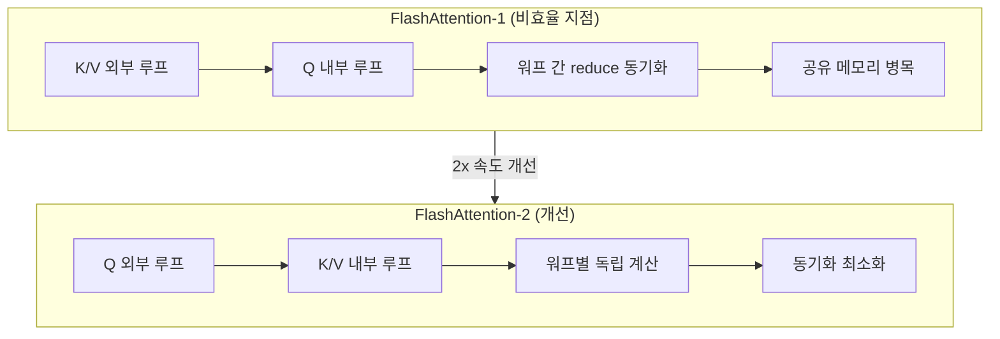

# FlashAttention-2 내부 구조

FlashAttention-2는 Dao et al. (2023)이 발표한 IO 인식(IO-aware) 어텐션 알고리즘으로, FlashAttention-1 대비 약 2배의 속도 향상을 달성한다. 핵심 혁신은 GPU 워프(warp) 수준 병렬화 재설계와 비인과적(non-causal) 마스크 처리 효율화에 있다.

## 배경: FlashAttention-1의 한계

FlashAttention-1은 HBM(High Bandwidth Memory) 읽기/쓰기를 최소화하는 타일드 어텐션을 도입했으나, 워프 간 작업 분배가 비효율적이었다. 특히:

- 순방향 패스에서 Q 행을 외부 루프로, K/V를 내부 루프로 배치 -> 불필요한 공유 메모리 읽기/쓰기 발생
- 역방향 패스에서 워프 간 결과 집계 시 동기화 오버헤드 발생
- 비인과적 어텐션에서 마스크 처리 비효율



## 핵심 메커니즘

### 1. 루프 순서 반전 - 워프 분할 최적화

FlashAttention-2에서 가장 중요한 변화는 **루프 순서 교체**다.

**FA-1 방식 (K/V 외부, Q 내부):**
- 각 워프가 Q 블록의 일부를 처리 -> 중간 결과를 공유 메모리에 집계 필요
- `softmax` 정규화 시 워프 간 통신 필요

**FA-2 방식 (Q 외부, K/V 내부):**
- 각 워프가 Q 블록 전체에 독립적으로 작업
- 로컬 `softmax` 통계를 워프 내에서 누적 -> 동기화 불필요
- 공유 메모리 쓰기 횟수 ~절반으로 감소

```
# 수식: 타일드 Online Softmax (FA-2 순방향)
for 블록_Q in range(seq_len / Br):
    m_i = -inf, l_i = 0, O_i = 0    # 로컬 통계 초기화
    for 블록_KV in range(seq_len / Bc):
        S_ij = Q_i @ K_j^T / sqrt(d)   # 점수 행렬
        m_ij = max(S_ij)               # 블록 최댓값
        P_ij = exp(S_ij - m_ij)        # unnormalized softmax
        l_ij = sum(P_ij)               # 블록 합계

        # Online 갱신
        m_i_new = max(m_i, m_ij)
        l_i_new = exp(m_i - m_i_new) * l_i + exp(m_ij - m_i_new) * l_ij
        O_i = (l_i * exp(m_i - m_i_new) * O_i + exp(m_ij - m_i_new) * P_ij @ V_j) / l_i_new

    O_i = O_i  # 정규화 완료
```

### 2. 워프 병렬 분배 재설계

FlashAttention-2는 하나의 어텐션 블록을 처리하는 스레드블록 내에서 **워프별 독립 분배** 전략을 채택한다.

| 항목 | FA-1 | FA-2 |
|------|------|------|
| 워프당 Q 할당 | Q 행의 일부 | Q 행 전체 |
| K/V 처리 | 순차 내부 루프 | 워프별 독립 열 분할 |
| 워프 간 통신 | 매 K/V 블록마다 필요 | 출력 집계 시만 |
| 공유 메모리 사용 | Q, K, V, S 전체 | Q 재사용 + K, V 스트리밍 |

```mermaid
flowchart LR
    subgraph ThreadBlock["스레드블록 (1개 Q 행)"]
        W0[워프 0\nK[:,0:Hd/4]] --> Acc0[로컬 Acc]
        W1[워프 1\nK[:,Hd/4:Hd/2]] --> Acc1[로컬 Acc]
        W2[워프 2\nK[:,Hd/2:3Hd/4]] --> Acc2[로컬 Acc]
        W3[워프 3\nK[:,3Hd/4:Hd]] --> Acc3[로컬 Acc]
        Acc0 & Acc1 & Acc2 & Acc3 --> |warp reduce| Output[최종 O 행]
    end
```

### 3. 비인과적 마스크 효율화

인과적(causal) 어텐션에서는 대각선 위 블록이 전부 마스킹되므로 약 절반의 연산만 필요하다. FA-2는 이를 **타일 수준에서 정확히 파악**하여:

- 완전히 마스킹된 K/V 블록: 계산 자체를 스킵
- 부분 마스킹 블록: 마스크를 명시 적용 후 계산

비인과적 어텐션(양방향 어텐션)에서는 모든 블록을 계산해야 하지만, FA-2의 워프 분배로 인해 FA-1 대비 처리량이 더 크게 향상된다.

## 역방향 패스 최적화

FA-2의 역방향 패스는 `dQ`, `dK`, `dV`를 재계산(recomputation) 방식으로 구한다.

```
# 역방향 재계산 패턴
for 블록_Q:
    S_ij = Q_i @ K_j^T / sqrt(d)    # 순방향 재계산
    P_ij = softmax(S_ij)
    dV_j += P_ij^T @ dO_i
    dP_ij = dO_i @ V_j^T
    dS_ij = P_ij * (dP_ij - rowsum(dP_ij * P_ij))   # softmax gradient
    dQ_i += dS_ij @ K_j / sqrt(d)
    dK_j += dS_ij^T @ Q_i / sqrt(d)
```

역방향에서 `dQ` 업데이트는 K/V 블록 루프 전체에 걸쳐 누적되므로, FA-1에서는 공유 메모리 동기화가 필수였다. FA-2는 `dQ`를 HBM에서 원자적으로 누적하여 공유 메모리 경합을 제거한다.

## 코드 예시 - 실무 사용

```python
# pip install flash-attn
import torch
from flash_attn import flash_attn_qkvpacked_func, flash_attn_func

# 기본 사용 (packed QKV)
batch, seq_len, num_heads, head_dim = 2, 2048, 16, 64
qkv = torch.randn(batch, seq_len, 3, num_heads, head_dim,
                  device='cuda', dtype=torch.float16)

# dropout_p=0.0, softmax_scale=None (자동), causal=True
out = flash_attn_qkvpacked_func(qkv, dropout_p=0.0, causal=True)

# 분리된 Q, K, V
q = torch.randn(batch, seq_len, num_heads, head_dim, device='cuda', dtype=torch.float16)
k = torch.randn(batch, seq_len, num_heads, head_dim, device='cuda', dtype=torch.float16)
v = torch.randn(batch, seq_len, num_heads, head_dim, device='cuda', dtype=torch.float16)

out = flash_attn_func(q, k, v, dropout_p=0.0, causal=True)
# out.shape: (batch, seq_len, num_heads, head_dim)
```

```python
# HuggingFace Transformers 통합 (attn_implementation 인수)
from transformers import AutoModelForCausalLM

model = AutoModelForCausalLM.from_pretrained(
    "meta-llama/Llama-2-7b-hf",
    torch_dtype=torch.float16,
    attn_implementation="flash_attention_2",   # FA-2 자동 적용
    device_map="cuda",
)
```

## 성능 비교

| 지표 | 표준 어텐션 | FlashAttention-1 | FlashAttention-2 |
|------|------------|-----------------|-----------------|
| 시퀀스 길이 2K, A100 | 기준 | 3x | 6x |
| 시퀀스 길이 8K, A100 | 기준 | 5x | 9x |
| HBM 읽기/쓰기 | O(N^2) | O(N) | O(N), 상수 개선 |
| GPU 활용률 (A100 BF16) | ~25-40% | ~35-50% | ~50-73% |
| 최대 배치 처리 길이 | 메모리 제한 | ~16K | ~32K+ |

FlashAttention-2는 A100 80GB에서 BF16 기준 최대 73% MFU(Model FLOP Utilization)를 달성하며, 이는 이론적 최대 대비 매우 높은 수치다.

## 지원 하드웨어 및 정밀도

- **A100/H100**: BF16, FP16 완전 지원. FP32는 성능 저하
- **RTX 30xx/40xx**: FP16 지원. BF16은 40xx 이상
- **AMD GPU**: ROCm 지원 (별도 패키지)
- **Apple Silicon**: 미지원 (MPS 백엔드 불가)

```python
# 정밀도 확인 후 조건부 적용
import torch
from transformers import AutoConfig

def get_attn_impl(model_name: str) -> str:
    if torch.cuda.is_available():
        device = torch.cuda.get_device_properties(0)
        # Ampere(SM 80) 이상: FA-2 지원
        if device.major >= 8:
            return "flash_attention_2"
    return "eager"
```

## FlashAttention-3와의 관계

[[flashattention-3]]은 H100 전용으로 FA-2를 더 발전시켰다:

- Warpgroup GEMM: 여러 워프를 그룹으로 묶어 WGMMA 명령 사용
- 비동기 파이프라이닝: GEMM과 softmax를 동시 실행
- FP8 지원: 2배 처리량 추가
- FA-2 대비 약 1.5-2x 추가 속도 향상 (H100 한정)

## 관련 문서

- [[flashattention-3]] - H100 특화 WGMMA/FP8 확장
- [[flash-decoding]] - 추론 시 KV 병렬 디코딩
- [[activation-recomputation]] - 역방향 패스 재계산 전략
- [[chunked-prefill]] - 긴 시퀀스 프리필 청킹
- [[transformer-architecture]] - 어텐션 구조 기초
