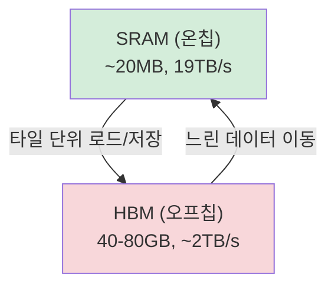

# FlashAttention (IO-Aware Exact Attention)

## 개념 요약

FlashAttention은 Tri Dao et al. (2022)이 제안한 **IO 인식(IO-aware) 어텐션** 알고리즘이다. 어텐션 계산 결과는 기존과 동일하게 정확(exact)하지만, GPU 메모리 계층을 인식해 HBM(High Bandwidth Memory) 접근을 최소화함으로써 속도와 메모리 효율을 동시에 개선한다.

## GPU 메모리 계층 이해



표준 어텐션은 `N x N` 어텐션 행렬을 HBM에 쓰고 다시 읽는다. 시퀀스 길이 N이 커질수록 HBM I/O가 `O(N^2)` 규모로 증가하는 것이 주요 병목이다.

## 타일링(Tiling)으로 SRAM 활용 극대화

FlashAttention의 핵심 아이디어는 Q, K, V 행렬을 작은 블록(tile)으로 쪼개 SRAM 안에서 완결적으로 처리하는 것이다.

```mermaid
flowchart LR
    HBM1[HBM: Q, K, V] -->|타일 로드| SRAM1[SRAM 타일 처리\nattn = softmax(QK^T/√d)·V]
    SRAM1 -->|누적 결과만 저장| HBM2[HBM: Output O]
```

- `N x N` 어텐션 행렬을 HBM에 물질화(materialize)하지 않음
- Online Softmax 기법으로 블록별 소프트맥스를 수치적으로 안정되게 누적
- HBM 접근 복잡도: `O(N^2 / M)` (M = SRAM 크기)

## 재계산(Recomputation)으로 메모리 절감

역전파 시 중간 어텐션 행렬이 필요하지만 FlashAttention은 이를 저장하지 않는다. 대신 역전파 단계에서 **재계산(recomputation)** 한다.

- 저장 메모리: `O(N^2)` -> `O(N)` (시퀀스 길이에 선형)
- 재계산 비용으로 FLOPs는 소폭 증가하지만, I/O 절감 효과가 압도적으로 큼
- 이는 [[gradient-accumulation-checkpointing]]의 selective checkpointing 원리와 유사

## FA-1 / FA-2 / FA-3 진화

| 버전 | 핵심 개선 | 발표 |
|------|-----------|------|
| FA-1 (2022) | IO-aware 타일링, 재계산 도입 | Dao et al. NeurIPS 2022 |
| FA-2 (2023) | 워프(warp) 레벨 병렬화 향상, causal mask 최적화, forward 2x 속도 | Dao, ICLR 2024 |
| FA-3 (2024) | Hopper GPU(H100) 전용 최적화, WGMMA + TMA 활용, 비동기 파이프라인 | Shah et al. 2024 |

FA-3는 H100의 새로운 하드웨어 기능을 직접 활용해 FA-2 대비 1.5-2x 추가 속도 향상을 달성한다.

## 학습에서의 효과

- **긴 시퀀스 가능화**: 표준 어텐션은 32K 이상 시퀀스에서 메모리 OOM 발생. FA는 선형 메모리로 128K+ 가능
- **학습 속도**: GPU A100 기준 표준 어텐션 대비 2-4x 학습 처리량 향상
- **정확도 동일**: 근사(approximate)가 아닌 exact attention - 결과가 수치적으로 동일

## 적용 방법

```python
# HuggingFace Transformers 통합
model = AutoModelForCausalLM.from_pretrained(
    "meta-llama/Llama-2-7b",
    attn_implementation="flash_attention_2",  # FA-2 활성화
    torch_dtype=torch.bfloat16,
)
```

## 관련 문서
- [[selective-activation-recomputation]] -- 선택적 활성값 재계산 (Selective Activation Recomputation)
- [[flashattention-3]] -- FlashAttention-3
- [[document-packing-masking]] -- Document Attention Masking (문서 패킹 마스크)

- [[long-context-training]] - FA가 가능하게 한 긴 시퀀스 학습
- [[mixed-precision-training]] - BF16과의 결합
- [[gradient-accumulation-checkpointing]] - 재계산 원리의 일반화
- [[mfu-model-flops-utilization]] - 연산 효율 측정
