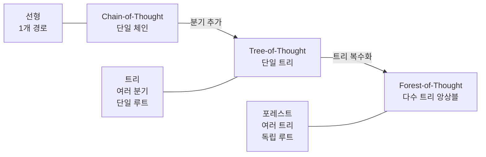
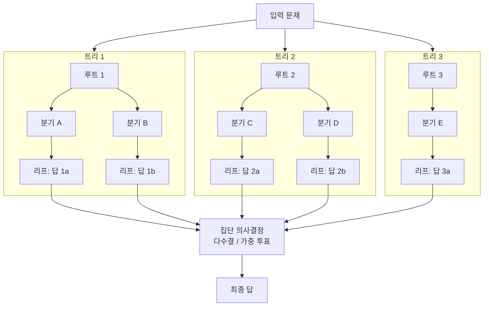

# Forest-of-Thought (멀티트리 추론)

## 개요

Forest-of-Thought(FoT)는 여러 추론 트리를 병렬로 실행하고 집단적 의사결정(collective decision-making)으로 최종 답을 도출하는 추론 전략이다. Tree-of-Thought(ToT)의 앙상블(ensemble) 확장 버전으로, 단일 추론 트리의 탐색 오류를 여러 트리의 다양성으로 보완한다.

## 추론 전략 계층

## 구조

각 트리는 **독립적인 랜덤 시드**와 **다른 탐색 경로**로 시작해 다양성을 확보한다. 루트가 다르므로 단순 Best-of-N보다 탐색 공간 커버리지가 높다.

## Tree-of-Thought와의 차이

| 항목 | Tree-of-Thought | Forest-of-Thought |
|------|----------------|------------------|
| 트리 수 | 1개 | N개 (보통 3-10개) |
| 독립성 | 없음 | 트리 간 완전 독립 |
| 최종 결정 | 최고 점수 리프 | 앙상블 투표 |
| 탐색 오류 | 트리 전체에 전파 | 개별 트리에 국한 |
| 병렬화 | 제한적 | 자연스러운 병렬 실행 |

## 30B 토큰 대규모 실험 결과

논문에서는 30B 토큰 규모의 대규모 실험으로 다음을 검증했다:

1. **도메인 의존성**: 최적 TTC 전략(Best-of-N vs ToT vs FoT)이 태스크 도메인에 따라 다름
   - 수학 증명: FoT > ToT > Best-of-N
   - 창작 태스크: Best-of-N과 FoT 차이 미미
2. **컴퓨트 예산 의존성**: 컴퓨트가 충분할 때 FoT 효과 극대화, 제한적일 때는 ToT가 더 효율적
3. **복잡 논리 문제**: 단일 트리 대비 평균 8-15% 성능 향상

**핵심 결론**: "하나의 TTC 전략이 모든 상황에 최적"이라는 주장은 성립하지 않는다. 도메인과 컴퓨트 예산에 맞는 전략 선택이 중요하다.

## 집단 의사결정 방식

### 다수결 투표 (Majority Voting)

각 트리의 최종 답 중 가장 많이 나온 답 선택. 단순하고 효과적이나 모든 답에 동일 가중치 부여.

### 가중 투표 (Weighted Voting)

트리별 신뢰도(PRM 점수 등)에 비례해 투표 가중치 조절. 품질 낮은 트리의 영향 감소.

### 검증기 선택 (Verifier Selection)

외부 검증기(verifier)가 각 트리의 최종 답을 평가해 가장 높은 점수의 답 선택.

## 실무 시사점

- 병렬 추론 인프라(여러 GPU/인스턴스)가 있을 때 효과적으로 활용 가능
- 수학·코드·과학적 추론처럼 정답이 검증 가능한 태스크에 적합
- 컴퓨트 예산이 충분하지 않은 환경에서는 단일 ToT가 더 비용 효율적

## 관련 문서

- [[test-time-compute]] - FoT가 속하는 TTC 전략 전반
- [[chain-of-thought]] - 선형 추론의 기반
- [[inference-compute-economics]] - FoT의 비용 효율성 맥락
