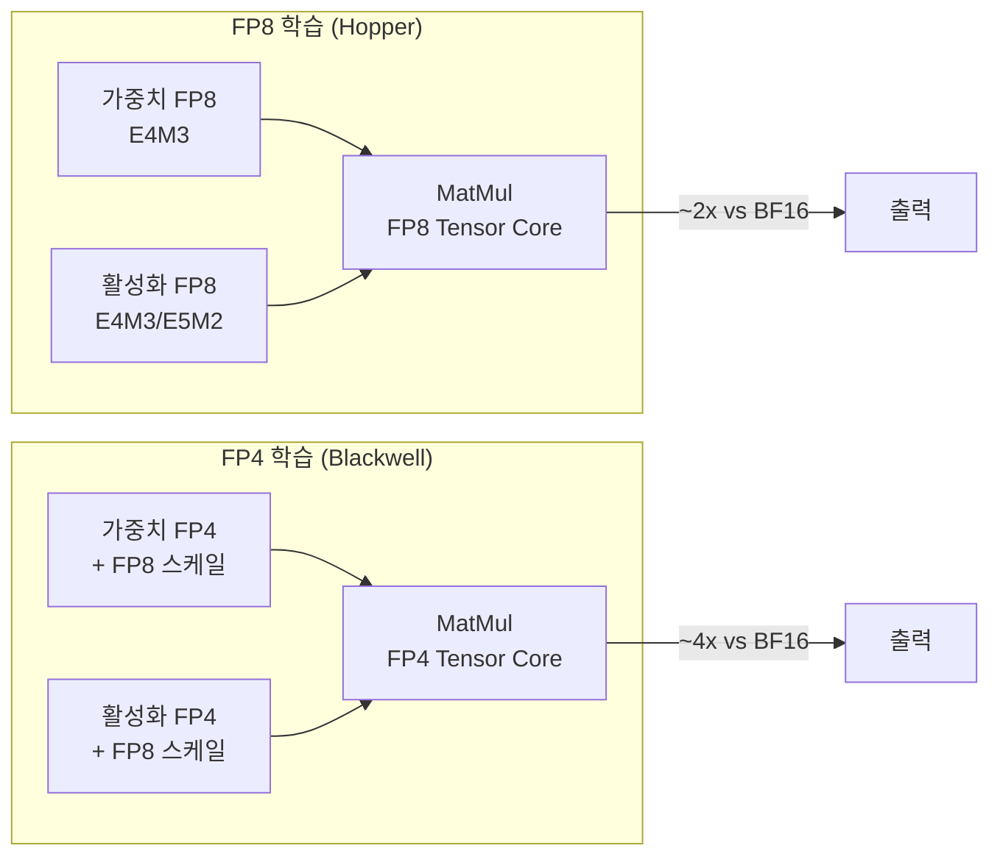

# FP4 학습

## 개요

FP4 학습은 4비트 부동소수점 형식으로 LLM 사전학습을 수행하는 기법이다. [[mixed-precision-training]]에서 BF16/FP8까지 낮춘 정밀도를 한 단계 더 내려, 행렬 곱셈의 가중치와 활성화를 모두 4비트로 표현한다. NVIDIA의 NVFP4 형식과 이를 활용하는 Quartet/Quartet II 알고리즘이 대표적이며, Blackwell GPU 아키텍처의 네이티브 FP4 Tensor Core 지원과 맞물려 실용적 의미를 갖는다. 12B 파라미터 모델을 10조(10T) 토큰으로 학습한 결과, FP8 기준선과 거의 동일한 손실 곡선과 다운스트림 정확도를 달성했다.

## NVFP4 형식

### 형식 구조

NVFP4는 NVIDIA Blackwell 아키텍처와 함께 도입된 4비트 부동소수점 형식이다. 핵심 특징은 마이크로블록 스케일링(micro-block scaling)이다:

| 속성 | 값 |
|------|------|
| 비트 수 | 4 (1 부호 + 2 지수 + 1 가수, 또는 변형) |
| 스케일링 단위 | 16개 요소당 1개 공유 스케일 팩터 |
| 스케일 형식 | FP8 (E4M3) |
| 동적 범위 | 스케일 팩터로 보상 |

16개의 4비트 요소가 하나의 FP8 스케일 팩터를 공유하는 구조로, 개별 요소의 좁은 동적 범위를 그룹 단위 스케일링으로 보상한다. 이는 MXFP4(Microscaling FP4) 표준과도 호환되는 접근법이다.

### FP8과의 비교

FP4는 FP8 대비 데이터 이동량을 절반으로 줄이고, Tensor Core 처리량을 이론적으로 2배 높인다. 그러나 4비트의 극도로 제한된 표현력으로 인해, 단순 양자화만으로는 학습 품질이 크게 저하된다. 이를 해결하기 위한 알고리즘이 Quartet이다.

## Quartet: 최적 FP4 학습 알고리즘

### 설계 철학

Quartet의 핵심 통찰은 forward pass와 backward pass의 양자화 목표가 다르다는 점이다:

- **Forward pass**: 양자화 오차의 MSE(평균 제곱 오차)를 최소화하여 정확한 출력을 보장해야 한다
- **Backward pass**: 그래디언트의 편향(bias)을 제거하여 수렴 방향을 유지해야 한다

Quartet은 이 두 목표를 분리(decouple)하여 각각에 최적화된 양자화 전략을 적용한다.

### 핵심 구성요소

**아다마르 변환 (Hadamard Transform)**: 양자화 전에 입력 텐서에 아다마르 행렬을 곱하여 요소 간 에너지를 균등하게 분산시킨다. 이는 이상치(outlier) 값의 영향을 완화하여 양자화 오차를 줄인다. Forward에서는 고정 32x32 아다마르 행렬을, backward에서는 블록 단위 랜덤 아다마르 변환(RHT)을 사용한다.

**QuEST 프로젝션**: Forward pass에서 MSE를 최소화하는 최적의 FP4 매핑을 수행한다. 단순 반올림 대신 양자화 그리드 포인트에 대한 최적 할당을 계산한다.

**확률적 반올림 (Stochastic Rounding)**: Backward pass에서 그래디언트를 FP4로 변환할 때, 결정적(deterministic) 반올림 대신 확률적 반올림을 사용한다. 값이 두 양자화 레벨 사이에 있으면, 거리에 비례하는 확률로 인접 레벨 중 하나를 선택한다. 이 방식은 기대값(expectation)이 원래 값과 같으므로 양자화가 비편향(unbiased)이 된다.

## Quartet II: NVFP4 완전 활용

Quartet II(2026)는 Quartet을 NVFP4 하드웨어에 완전히 맞춘 후속 연구이다.

### 주요 개선점

| 요소 | Quartet | Quartet II |
|------|---------|-----------|
| 형식 | MXFP4 | NVFP4 |
| Forward | QuEST + 고정 Hadamard | NVFP4 스케일링 + Four-over-Six |
| Backward | SR + RHT | MS-EDEN + 내부 차원 RHT |
| BF16 대비 속도 | 이론적 ~2x | 실측 4x+ |
| 실제 처리량 | -- | 1B 학습에서 BF16 대비 2.4x+ |

**Four-over-Six**: NVFP4의 스케일 팩터 선택을 최적화하는 휴리스틱으로, 마이크로블록 내에서 더 정확한 표현을 달성한다.

**MS-EDEN**: Backward pass의 비편향 그래디언트 추정을 개선하여 수렴 안정성을 높인다.

## 실험 결과

### 손실 곡선 비교

12B 모델, 10T 토큰 학습에서:
- NVFP4 학습의 손실 곡선이 FP8 기준선과 거의 동일하게 수렴
- 다운스트림 작업(언어 이해, 코드, 수학) 정확도도 FP8과 통계적으로 유의미한 차이 없음
- 학습 불안정(loss spike) 빈도도 FP8과 유사

### 계산 효율성

이론적으로 FP4 Tensor Core는 BF16 대비 약 4배의 FLOPS를 제공한다. Quartet II는 1B 모델 학습에서 BF16 대비 2.4배 이상의 실제 처리량을 달성했다. 이론치와의 차이는 아다마르 변환 오버헤드, 메모리 대역폭 병목, 스케일 팩터 관리 비용 등에 기인한다.

## [[mixed-precision-training]]과의 관계

FP4 학습은 혼합 정밀도의 극단적 확장이다. 전체 연산이 FP4로 수행되는 것이 아니라:

- 행렬 곱셈(GEMM): FP4
- 축적(accumulation): FP32
- 소프트맥스, LayerNorm: BF16/FP32
- [[optimizer-selection]] 상태: FP32
- 마스터 가중치: BF16

정밀도에 민감한 연산은 여전히 높은 정밀도를 유지하되, 연산량의 대부분을 차지하는 행렬 곱셈만 FP4로 수행하는 전략이다.

## 실전 적용 조건

### 하드웨어 요구사항

- NVIDIA Blackwell(B100/B200) 이상: 네이티브 FP4 Tensor Core 필수
- Hopper(H100)에서는 소프트웨어 에뮬레이션 가능하나 속도 이점 없음

### 도입 고려사항

- 모델 규모: 수십억 파라미터 이상에서 의미 있는 속도 향상
- 학습 토큰 수: 수조 토큰 이상의 장기 학습에서 비용 절감 효과 극대화
- [[learning-rate-scheduling]]: FP4 수치 특성에 맞는 학습률 조정 필요
- 아다마르 변환 구현: CUTLASS 템플릿 활용한 효율적 커널 필요

## 관련 문서

- [[mixed-precision-training]] -- FP32/FP16/BF16/FP8 정밀도 전략의 전체 계보
- [[neural-scaling-laws]] -- 정밀도 저하가 스케일링 법칙에 미치는 영향
- [[optimizer-selection]] -- FP4 학습에서의 옵티마이저 상태 관리
- [[learning-rate-scheduling]] -- 저정밀도 학습의 학습률 전략
- [[evaluation-during-training]] -- 양자화 학습의 품질 모니터링
- [[pretraining-data-curation]] -- 대규모 사전학습 데이터 요구사항
