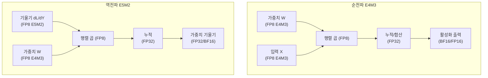

# FP8 학습 - 8비트 부동소수점 훈련

## 개요

FP8(8-bit Floating Point) 학습은 신경망 훈련에서 행렬 연산을 8비트 부동소수점 형식으로 수행하여 메모리를 절반으로 줄이고 연산 처리량을 높이는 혼합 정밀도(mixed-precision) 기법이다. NVIDIA H100 GPU에 FP8 텐서코어가 네이티브 지원으로 탑재되면서 실용적 선택지가 되었다.

기존 [[mixed-precision-training]]의 FP16/BF16 혼합 정밀도에서 한 단계 더 나아가, 훈련의 핵심 연산(주로 행렬 곱)을 FP8로 낮추되 정확도에 민감한 누적(accumulation)과 파라미터는 FP16/BF16 또는 FP32를 유지한다.

## FP8 데이터 포맷

FP8은 단일 포맷이 아니라 두 가지 변형이 있다:

| 포맷 | 지수 비트 | 가수 비트 | 표현 범위 | 주요 용도 |
|------|---------|---------|---------|---------|
| E4M3 | 4 | 3 | 좁음, 정밀도 높음 | 순전파 (forward), 가중치 |
| E5M2 | 5 | 2 | 넓음, 정밀도 낮음 | 역전파 (backward), 기울기 |

**E4M3**: 지수 범위가 좁지만 가수(mantissa) 비트가 많아 표현 정밀도가 높다. 순전파의 activation과 가중치에 적합하다.

**E5M2**: 지수 범위가 넓어 기울기처럼 값이 극단적으로 작거나 클 수 있는 텐서에 적합하다.

## NVIDIA Transformer Engine

H100의 FP8 지원을 실제 훈련에서 활용하려면 **Transformer Engine** 라이브러리가 핵심이다. Transformer Engine은 다음 기능을 제공한다:

### 자동 스케일링 (Automatic Scaling)

FP8의 표현 범위가 좁기 때문에, 값의 분포에 맞춰 스케일 인자(scale factor)를 동적으로 조정해야 한다. Transformer Engine은 세 가지 스케일링 모드를 지원한다:

- **per-tensor scaling**: 텐서 전체에 단일 스케일 인자 (가장 단순)
- **per-channel scaling**: 채널별 스케일 인자 (정확도 우수)
- **delayed scaling**: 이전 스텝 통계를 활용한 스케일 추정 (오버헤드 최소)

### FP8 활성화 캐싱

Transformer Engine은 훈련 중 FP8 형식으로 activation을 캐시한다. BF16으로 activation을 저장하는 것보다 메모리가 절반이므로, 같은 GPU 메모리에 더 긴 시퀀스나 더 큰 배치를 넣을 수 있다.

## 성능 이득

[[distributed-training-overview]]의 분산 학습 환경에서 FP8의 이점:

- **연산 처리량**: H100 FP8 텐서코어는 BF16 대비 이론상 2배의 FLOPS
- **메모리 대역폭**: FP8 텐서는 BF16의 절반 크기 → 메모리 이동 시간 단축
- **배치 크기**: 같은 메모리에 2배 큰 배치 적재 가능 → 학습 효율 향상
- **MFU 향상**: [[mfu-model-flops-utilization]]에서 BF16 대비 30-50% 향상 보고됨

실제 DeepSeek-V3는 FP8 훈련을 대규모로 적용하여 훈련 비용을 크게 절감했다.

## 정확도 유지 전략

FP8의 좁은 표현 범위는 오버플로우/언더플로우를 유발할 수 있다. 정확도를 유지하기 위한 핵심 전략:

### Loss Scaling

BF16 혼합 정밀도와 마찬가지로, 기울기에 스케일 팩터를 곱해 언더플로우를 방지하고 파라미터 업데이트 전 다시 나눈다.

### 마스터 가중치 (Master Weights)

파라미터 업데이트는 반드시 FP32 "마스터 가중치"에 적용된다. FP8 가중치는 연산용이며, 실제 상태는 FP32로 유지된다. 이는 BF16 혼합 정밀도의 관행과 동일하다.

### 정밀도 민감 레이어 격리

LayerNorm, Softmax, 임베딩 레이어 등 정밀도에 민감한 연산은 BF16/FP32를 유지하고 행렬 곱 부분만 FP8로 한다.

## 현재 지원 현황

- **H100**: FP8 네이티브 (E4M3, E5M2 모두)
- **A100**: FP8 미지원 (BF16이 최저)
- **H200**: H100과 동일한 FP8 지원
- **AMD MI300X**: FP8 지원 (ROCm 환경)

Transformer Engine 외에 PyTorch 2.1+의 `torch.float8_e4m3fn`, `torch.float8_e5m2` 타입이 직접 지원된다.

## FP4와의 비교

[[fp4-training]]은 4비트로 더 극단적인 압축을 추구하지만, 아직 연구 단계에 가깝다. FP8은 현재 (2024-2026) 기준 프로덕션 훈련에 실용적으로 사용 가능한 최저 정밀도다.

## 관련 문서

- [[mixed-precision-training]] -- BF16/FP16 혼합 정밀도 훈련 개요 (FP8의 상위 개념)
- [[distributed-training-overview]] -- 분산 훈련 환경에서 FP8 활용
- [[mfu-model-flops-utilization]] -- FP8 도입 후 MFU 측정 방법
- [[fp4-training]] -- 더 극단적인 4비트 부동소수점 훈련 연구
