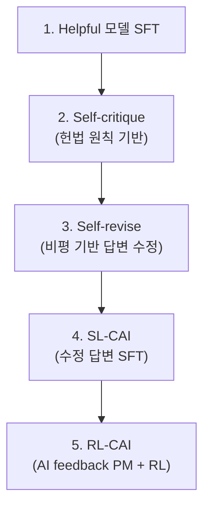
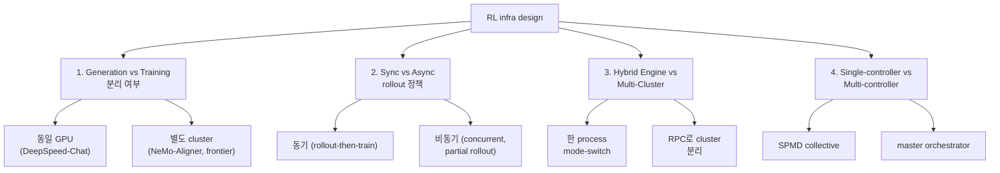

# Frontier Lab RL Infrastructure - 운영 패턴

## 개요

Anthropic, OpenAI 같은 frontier lab의 RL 학습 인프라는 공개 정보가 제한적이지만, 블로그·산업 분석·오픈소스 프레임워크 비교를 통해 **공통 패턴**이 드러난다. 핵심은 (1) generation cluster와 training cluster의 물리적 분리, (2) 비동기 weight broadcast, (3) GPU 자원의 90% 가까이가 trainer가 아닌 generator에 할당되는 비대칭 토폴로지다. 비공개 부분은 (추정)으로 명시한다.

## 1. Anthropic - Claude RLHF / Constitutional AI 인프라

### 알려진 학습 인프라

- **Project Rainier** (AWS): Anthropic 전용 클러스터, **500,000 Trainium2 칩 → 1M까지 확장 예정**
- "EC2 UltraCluster of Trainium2 UltraServers" — UltraServer 1대 = 4 physical server × 16 Trainium2 칩 = 64 Trainium2/UltraServer
- 칩 간 **NeuronLinks** 고속 인터커넥트
- 이전 Claude 모델 학습 대비 **5배 이상 compute**
- Multi-cloud: **NVIDIA + AWS Trainium + Google TPU** 동시 사용
- Anthropic 엔지니어가 Trainium silicon에 직접 low-level kernel 작성

### 알려진 알고리즘

- **RLHF** (Bai et al. 2022, Anthropic) — early HH-RLHF 시리즈
- **Constitutional AI** — RLHF + self-critique + RLAIF (RL from AI Feedback)
- 학습 단계: pretraining → SFT → RLHF/CAI → red-teaming + safety RL

### Constitutional AI 파이프라인 패턴 (공개 정보 기준)

자세한 내용은 [[constitutional-ai-original]] 참조.

### Inference + RL 결합 (추정)

- 사내 inference 인프라(Anthropic Inference Stack)와 RL 학습이 weight 공유 (추정)
- "long-running Claude for scientific computing" 블로그 — long-horizon agent 학습 인프라 일부 시사

### 핵심 인용

> "Project Rainier ... currently powered by 500,000 Trainium2 chips and scaling to 1 million, representing a 70% increase in AWS's AI infrastructure and providing over five times the compute power used for earlier Claude models." — Constellation Research

## 2. OpenAI - GPT 시리즈 RLHF 인프라

### 알려진 학습 인프라

- **Microsoft Azure 슈퍼컴퓨터**: 10,000+ GPU 초기 설계, 이후 25,000+ A100으로 확장
- **GPT-MoE 1.8T** 학습: 25,000 A100 × 3~5개월 (산업 추정)
- **GPT-4 학습 비용**: $78M~$100M+ (compute 단독, 산업 추정)
- Stargate 구상: Intel / TSMC / AMD / NVIDIA 다중 공급
- $500M 단위 단일 클러스터 운영 (산업 추정)

### RLHF 학습 패턴 (InstructGPT 공개 + 산업 분석)

- **Actor + Reward + Reference + Critic** 4-모델 동시 운영
- 70B 모델 기준 weights만 약 560 GB (4모델 합산), 활성화/optimizer/KV는 별도
- **"RLHF training spends 80% of the time on sample generation"** — 산업 통계
- 일부 lab은 GPU 90%를 generation에 할당, trainer cluster는 idle 대기

### Generation / Training 분리 운영 (산업 패턴)

- **generation cluster** (vLLM/SGLang/TensorRT) + **training cluster** (FSDP/Megatron) 분리
- 비동기 weight broadcast (NCCL p2p, S3 checkpoint sync 등)
- OpenAI 사내는 자체 inference stack + RL framework 운영 — 오픈소스 [[verl-bytedance]] / [[openrlhf]]와 유사한 hybrid engine 패턴 (추정)

### 핵심 인용

> "RLHF training spends 80% of the time on sample generation." — OpenRLHF README

> "Microsoft constructed an Azure supercomputer with over 10,000 GPUs and ultra-fast networking specifically for OpenAI's model training." — Cudo Compute analysis

> "for many top labs, as much as 90% of the GPU fleet dedicated to an RL run isn't actually training the model — it's generating the data the model will train on." — Amplify Partners blog

## 3. 산업 운영 공통 패턴

### 분산 토폴로지 - 4가지 axis

| 시스템 | gen/train 분리 | sync/async | engine | controller |
|--------|---------------|-----------|--------|-----------|
| [[deepspeed-chat]] | 한 process | sync | Hybrid | single |
| [[openrlhf]] | Ray actor | async 옵션 | Hybrid | hybrid |
| [[verl-bytedance]] | Ray | async + partial | 3D-HybridEngine | hybrid |
| [[nemo-aligner]] | PyTriton | async | TRT-LLM | multi |
| Anthropic (추정) | 별도 cluster | async + RLAIF | sealed stack | proprietary |
| OpenAI (추정) | 별도 cluster | async | proprietary | proprietary |

### Bottleneck 운영

- **Generation throughput**이 RL 학습의 wall-clock 결정 — vLLM/SGLang/TRT-LLM 가속이 가장 큰 ROI
- **Weight sync latency**: training → rollout broadcast가 매 N step 또는 비동기 백그라운드
- **Reward model**: 종종 별도 cluster에 deploy, batched scoring으로 간섭 최소화

### 알려진 운영 best practice

- **Reference model CPU offload** — KL term 계산 빈도가 낮아 swap 가능
- **Speculative decoding for rollout** — frontier lab 내부 자료에서 시사 (추정)
- **Replay buffer for stability** — pure on-policy 대신 partial replay
- **Reward hacking 방지**: KL penalty + reward model ensemble + length normalization

## 핵심 통찰

frontier lab의 RL 인프라는 단일 framework가 아니라 **여러 sub-system이 RPC로 결합된 미니 데이터센터**다. 오픈소스 진영의 [[openrlhf]] / [[verl-bytedance]] / [[nemo-aligner]]는 이 구조의 일부 컴포넌트를 packaging한 것으로 볼 수 있다. 90% GPU가 generator라는 통계는 **inference stack과 RL training의 경계가 흐려지고 있음**을 시사한다.

## 관련 문서

- [[constitutional-ai-original]] - Anthropic CAI 알고리즘
- [[rlhf]], [[rlhf-pipeline]] - RLHF 일반
- [[openrlhf]], [[verl-bytedance]], [[nemo-aligner]], [[deepspeed-chat]] - 오픈소스 RL framework
- [[rl-harness-frameworks-comparison]] - RL harness 통합 비교
- [[ai-accelerators]] - 하드웨어 (Trainium, H100, TPU)
