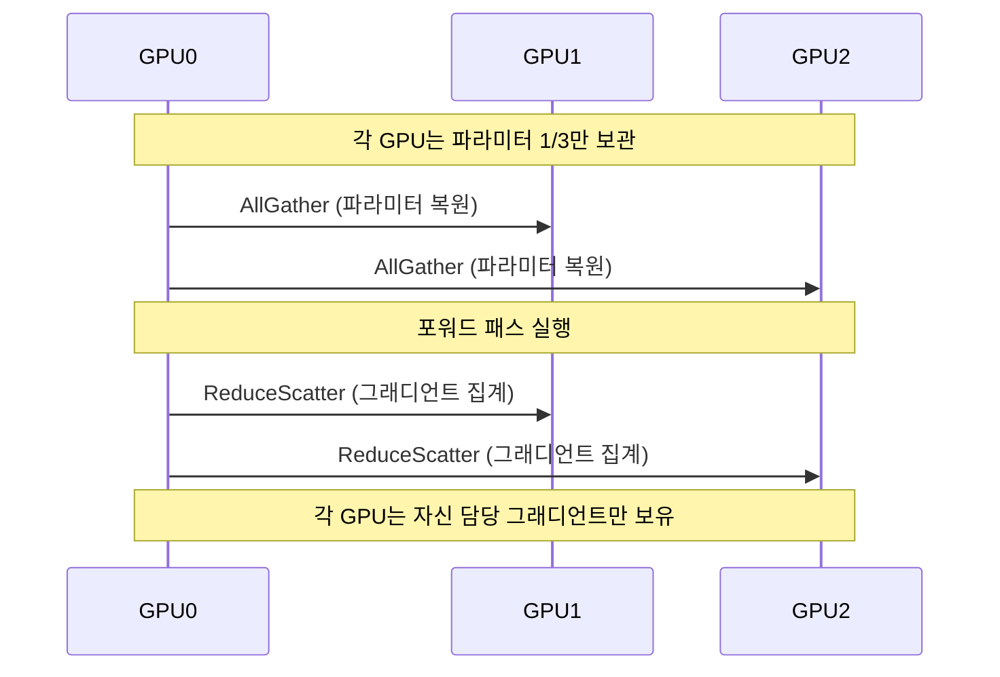

# FSDP vs DeepSpeed 비교 가이드

## 개념 요약

FSDP(Fully Sharded Data Parallel)와 DeepSpeed ZeRO(Zero Redundancy Optimizer)는 모두 **옵티마이저 상태, 그래디언트, 파라미터**를 GPU에 분산 저장해 단일 GPU 메모리 한계를 극복하는 대규모 모델 학습 프레임워크다. 같은 문제를 다른 구현 철학으로 접근한다.

## ZeRO Stage 1/2/3 vs FSDP 샤딩 모드

### ZeRO 단계별 분산 범위

| Stage | 분산 대상 | 메모리 절감 (데이터 병렬 N개) |
|-------|-----------|--------------------------|
| ZeRO-1 | 옵티마이저 상태 | ~4x |
| ZeRO-2 | + 그래디언트 | ~8x |
| ZeRO-3 | + 파라미터 | ~N x |

### FSDP 샤딩 모드

| 모드 | 분산 대상 | ZeRO 동등 |
|------|-----------|-----------|
| `NO_SHARD` | 없음 (DDP와 동일) | - |
| `SHARD_GRAD_OP` | 옵티마이저 상태 + 그래디언트 | ZeRO-2 |
| `FULL_SHARD` | 파라미터 + 옵티마이저 + 그래디언트 | ZeRO-3 |
| `HYBRID_SHARD` | 노드 내 FULL_SHARD, 노드 간 DDP | ZeRO-3 + 계층 |

## 통신 패턴

FSDP(ZeRO-3)의 포워드/역전파 통신:



- **AllGather**: 각 GPU의 파라미터 샤드를 모아 전체 파라미터 복원 (계산 전)
- **ReduceScatter**: 그래디언트를 집계하며 동시에 각 GPU로 분산 (계산 후)
- AllGather + ReduceScatter = AllReduce와 동일한 통신량, 메모리 효율이 다름

## HuggingFace Accelerate 통합

```python
from accelerate import Accelerator
from accelerate.utils import FullyShardedDataParallelPlugin, DeepSpeedPlugin

# FSDP 사용
fsdp_plugin = FullyShardedDataParallelPlugin(
    sharding_strategy="FULL_SHARD",
    auto_wrap_policy="TRANSFORMER_BASED_WRAP",
)
accelerator = Accelerator(fsdp_plugin=fsdp_plugin)

# DeepSpeed 사용
deepspeed_plugin = DeepSpeedPlugin(hf_ds_config="ds_config.json")
accelerator = Accelerator(deepspeed_plugin=deepspeed_plugin)
```

Accelerate는 두 백엔드를 동일한 API로 추상화해 코드 변경 최소화.

## Megatron-DeepSpeed 조합

대형 모델(100B+) 학습에서는 단순 데이터 병렬 샤딩으로는 부족하다.

- **Megatron-LM**: Tensor Parallelism(TP) + Pipeline Parallelism(PP) 최적화
- **DeepSpeed ZeRO**: 데이터 병렬 메모리 효율
- **조합**: TP(모델 수평 분할) + PP(모델 수직 분할) + ZeRO(데이터 병렬 효율) = 3D/4D 병렬

## 선택 기준

| 상황 | 권장 |
|------|------|
| PyTorch 네이티브, HuggingFace 생태계 | FSDP |
| 기존 DeepSpeed config 보유 | DeepSpeed |
| ZeRO Offload(CPU/NVMe로 오프로드) 필요 | DeepSpeed |
| Tensor/Pipeline 병렬화 결합 필요 | Megatron-DeepSpeed |
| 모델 크기 7B~70B, GPU 8~64개 | FSDP FULL_SHARD |
| 모델 크기 100B+, 수백 GPU | Megatron-DeepSpeed |

## 주요 차이점 요약

| 항목 | FSDP | DeepSpeed ZeRO |
|------|------|----------------|
| 개발사 | Meta (PyTorch 내장) | Microsoft |
| PyTorch 통합 | 네이티브 | 별도 라이브러리 |
| 설정 방식 | Python API | JSON config |
| CPU Offload | 제한적 | ZeRO-Offload 강력 |
| NVMe Offload | 미지원 | ZeRO-Infinity 지원 |
| 디버깅 용이성 | 상대적으로 쉬움 | config 복잡성 있음 |

## 관련 문서

- [[deepspeed-zero]] - ZeRO 원리 상세
- [[data-parallelism-fsdp]] - FSDP 원리 상세
- [[tensor-pipeline-parallelism]] - TP/PP와의 결합
- [[expert-parallelism]] - EP 추가 결합 (MoE)
- [[distributed-communication]] - AllGather/ReduceScatter 통신 원리
