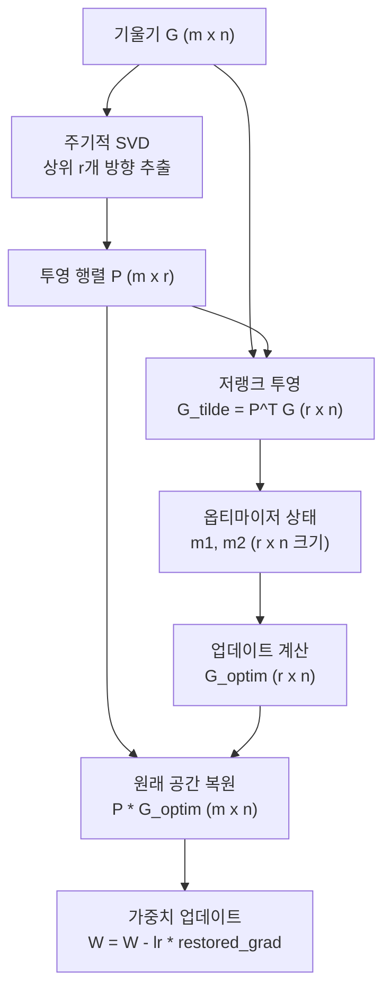

# GaLore - Gradient Low-Rank Projection

## 개요

GaLore(Gradient Low-Rank Projection)는 2024년 Zhao et al.이 제안한 메모리 효율적 LLM 사전학습 및 파인튜닝 기법이다. 핵심 아이디어는 **파라미터 자체**가 아닌 **기울기(gradient)**를 저랭크 공간에 투영하여 옵티마이저 상태의 메모리를 대폭 절약하면서도, 전체 파라미터(full-parameter)를 업데이트하는 훈련 품질을 유지하는 것이다.

기존 LoRA([[lora-paper]])가 파라미터 행렬 자체를 저랭크 분해하는 것과 달리, GaLore는 훈련 중 기울기 행렬의 저랭크 구조를 활용한다. 이 접근은 파라미터 공간에 대한 가정 없이 옵티마이저 상태 메모리만 줄이기 때문에, 이론적으로 전체 모델 품질에 더 가깝다.

## 핵심 메커니즘

### 기울기의 저랭크 현상

LLM 훈련 과정에서 가중치 행렬의 기울기 $G \in \mathbb{R}^{m \times n}$은 실질적으로 낮은 고유 랭크를 갖는다. 즉, 정보를 담은 방향이 소수 차원에 집중된다. GaLore는 이 현상을 명시적으로 활용한다:

1. **SVD 투영 행렬 계산**: 기울기 $G$에 대해 주기적으로 SVD를 수행하여 상위 $r$개의 주방향 $P \in \mathbb{R}^{m \times r}$을 추출
2. **저랭크 공간으로 투영**: $\tilde{G} = P^\top G \in \mathbb{R}^{r \times n}$으로 기울기를 압축
3. **압축된 공간에서 옵티마이저 상태 유지**: Adam의 1차·2차 모멘트를 $r \times n$ 크기로 저장
4. **원래 공간으로 복원 후 파라미터 업데이트**: $P \tilde{G}_{\text{optim}}$으로 복원해 실제 가중치에 적용

위 흐름에서 핵심은 옵티마이저 상태가 원래 $m \times n$이 아닌 $r \times n$ 크기로 유지된다는 점이다.

### SVD 재계산 주기

투영 행렬 $P$는 매 스텝마다 갱신하지 않고 일정 스텝(T) 간격으로 재계산한다. T가 너무 짧으면 SVD 계산 비용이 커지고, 너무 길면 기울기 공간의 변화를 반영하지 못한다. 논문에서는 T=200 정도가 실용적으로 효과적임을 보였다.

## LoRA와의 비교

| 항목 | LoRA | GaLore |
|------|------|--------|
| 압축 대상 | 파라미터 행렬 | 기울기/옵티마이저 상태 |
| 파라미터 업데이트 | 저랭크 어댑터만 | 전체 파라미터 |
| 추론 시 오버헤드 | 어댑터 병합 필요 | 없음 (일반 모델과 동일) |
| 표현력 제약 | 저랭크 구조에 제한 | 이론상 full-parameter 동등 |
| 메모리 절약 | 옵티마이저 + 파라미터 | 옵티마이저 상태 중심 |
| SVD 계산 비용 | 1회 (초기화) | 주기적 (T마다) |

GaLore의 핵심 장점은 "full-parameter 훈련과 동등한 품질을 저메모리로 달성"이라는 주장이다. LLaMA-7B급 모델을 단일 24GB GPU에서 사전학습할 수 있음을 실험으로 보였다.

## 메모리 절약 분석

Adam 옵티마이저는 파라미터당 1차 모멘트(m1)와 2차 모멘트(m2)를 각각 fp32로 저장한다. 파라미터 행렬이 $m \times n$이면 옵티마이저 상태만 $2 \times m \times n \times 4$ 바이트다.

GaLore 적용 시 이를 $2 \times r \times n \times 4$로 줄인다. 랭크 $r$을 $m$의 10-20% 수준으로 설정하면 옵티마이저 상태 메모리를 80-90% 절감한다. 전체 훈련 메모리에서 옵티마이저 상태가 차지하는 비중이 크기 때문에, 실질적 훈련 가능 모델 크기가 크게 증가한다.

## 분산 학습과의 결합

GaLore는 [[distributed-training-overview]]의 ZeRO나 FSDP와 독립적으로 결합 가능하다. 기울기 투영은 각 GPU에서 독립적으로 수행되며, 분산 훈련의 기울기 통신 전 또는 후에 적용할 수 있다. 단, SVD 재계산 시 동기화가 필요하다는 구현 복잡성이 있다.

## 한계와 후속 연구

- **SVD 계산 오버헤드**: 주기적 SVD는 훈련 속도를 약 10-20% 저하시킴
- **투영 공간 전환**: 투영 행렬이 갱신될 때 옵티마이저 상태의 연속성이 끊기는 문제 ("warm restart" 필요)
- **랭크 선택 민감도**: 랭크 r이 너무 작으면 수렴이 느려지거나 품질 저하 발생

이후 연구들은 GaLore의 SVD 계산을 줄이는 방향(RandomGaLore, GaLore 변형들)과, 투영 행렬 갱신을 더 부드럽게 처리하는 방향으로 발전하고 있다.

## 실용적 적용 지침

- LLM 사전학습보다는 **파인튜닝 단계**에서 더 안정적인 결과를 보임
- 모든 선형 레이어(attention, FFN)에 동시 적용 권장
- 랭크는 히든 차원의 10-20%를 시작점으로 설정
- 투영 갱신 주기 T: 길수록 SVD 비용이 작지만 품질 손실 위험

## 관련 문서

- [[lora-paper]] -- 파라미터 저랭크 분해 기반 파인튜닝 (GaLore의 비교 기준)
- [[distributed-training-overview]] -- ZeRO/FSDP와의 결합 맥락
- [[mixed-precision-training]] -- 메모리 절약 기법 전반
