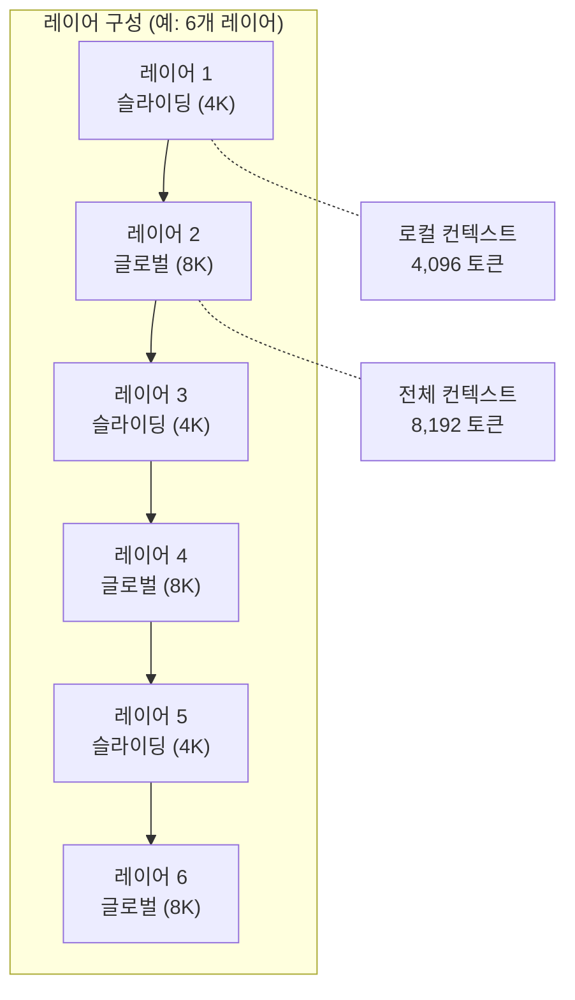
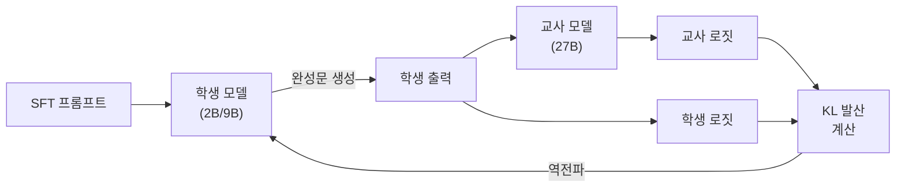

# Gemma 2 학습

## 개요

Gemma 2는 Google DeepMind가 2024년 6월 공개한 오픈 가중치 언어 모델 패밀리다. 2B, 9B, 27B 세 가지 크기로 제공되며, 27B 모델은 처음부터(from scratch) 13조 토큰으로 학습하고, 2B와 9B 모델은 이 27B 교사 모델로부터 [[knowledge-distillation|지식 증류]]로 학습한다. 핵심 혁신은 세 가지다: (1) 슬라이딩 윈도우와 글로벌 어텐션의 교차 배치, (2) 학습-추론 분포 불일치를 해소하는 [[on-policy-distillation|on-policy 증류]], (3) 로짓 소프트 캡핑(logit soft-capping)을 통한 학습 안정화.

## 모델 패밀리

| 모델 | 파라미터 | 학습 토큰 | 학습 방식 | 인프라 |
|------|---------|----------|----------|-------|
| Gemma 2 2B | 2B | 2T | 증류 (27B 교사) | TPU |
| Gemma 2 9B | 9B | 8T | 증류 (27B 교사) | TPU v4 |
| Gemma 2 27B | 27B | 13T | From scratch | TPU v5p |

전체 학습은 Google Cloud TPU에서 JAX와 ML Pathways를 사용하여 수행되었다. 특이한 점은 2B와 9B 모델이 이론적 compute-optimal 토큰 수의 50배 이상으로 학습되었다는 것이다. 이는 증류 학습에서 더 많은 토큰이 성능 개선에 효과적이라는 판단에 기반한다.

## 슬라이딩 윈도우 + 글로벌 어텐션 (Interleaved Attention)

Gemma 2의 아키텍처적 혁신은 슬라이딩 윈도우 어텐션과 글로벌 어텐션을 레이어 단위로 교차 배치하는 것이다.

| 레이어 위치 | 어텐션 유형 | 윈도우 크기 |
|-----------|-----------|-----------|
| 홀수 레이어 (1, 3, 5...) | 슬라이딩 윈도우 (로컬) | 4,096 토큰 |
| 짝수 레이어 (2, 4, 6...) | 글로벌 (전체) | 8,192 토큰 |

이 설계의 장점:

- **장문맥 품질 유지**: 전체 레이어의 절반이 여전히 모든 토큰에 접근하므로, 긴 의존성(long-range dependency) 포착 능력을 보존
- **연산 효율**: 나머지 절반이 슬라이딩 윈도우를 사용하여, 전체 글로벌 어텐션 대비 연산량을 절감
- **메모리 절감**: 로컬 어텐션 레이어의 KV 캐시 크기가 제한됨

## On-Policy Knowledge Distillation

Gemma 2의 가장 중요한 학습 기법이다. 2B와 9B 모델은 기존 오프라인 증류 대신 [[on-policy-distillation|on-policy 증류]]로 학습된다.

### 기존 증류 vs On-Policy 증류

| 항목 | 기존 (Off-Policy) 증류 | On-Policy 증류 (Gemma 2) |
|------|---------------------|------------------------|
| 학습 데이터 생성 | 교사 모델이 생성 | **학생 모델이 직접 생성** |
| 피드백 | 고정 소프트 라벨 | 학생 출력에 대한 교사 로짓 |
| 분포 불일치 | 학습 vs 추론 간 괴리 존재 | **최소화됨** |
| 손실 함수 | 교차 엔트로피 + KL 발산 | **학생 출력 기반 KL 발산** |

### 작동 방식

1. **학생이 롤아웃 생성**: SFT 프롬프트에 대해 학생 모델이 직접 완성문(completion)을 생성
2. **교사 피드백 계산**: 학생이 생성한 시퀀스에 대해 교사와 학생의 로짓 간 KL 발산을 계산
3. **KL 발산 최소화**: 학습 전반에 걸쳐 KL 발산을 최소화하여, 학생이 교사의 행동을 정확히 모델링

핵심 이점은 학습-추론 간 분포 불일치(train-inference mismatch)의 해소다. 학생이 실제로 생성할 법한 출력에 대해 학습하므로, 추론 시 접하게 될 분포와 학습 분포가 일치한다.

## 로짓 소프트 캡핑 (Logit Soft-Capping)

로짓이 과도하게 커지는 것을 방지하는 안정화 기법이다. 로짓을 최대값 임계치로 나누고 tanh를 통과시킨 뒤 다시 임계치를 곱하는 방식으로, 값의 범위를 제한하면서도 경사(gradient)가 완전히 차단되지 않도록 한다.

| 적용 위치 | 캡핑 임계치 |
|----------|-----------|
| 어텐션 로짓 | 50.0 |
| 최종 출력 로짓 | 30.0 |

단순 클리핑(clipping)과 달리 소프트 캡핑은 임계치 근처에서도 경사 신호가 유지되어 학습이 계속 진행된다.

## 사전학습 상세

27B 모델의 사전학습 데이터는 웹 문서, 코드, 과학 논문 등 다양한 소스에서 수집한 13조 토큰이다. 영어 중심이며, Google의 내부 데이터 파이프라인을 통해 품질 필터링과 중복 제거가 수행되었다. 구체적인 데이터 구성 비율은 공개되지 않았다.

| 학습 요소 | 상세 |
|----------|------|
| 데이터 소스 | 웹 문서, 코드, 과학 논문 |
| 프레임워크 | JAX + ML Pathways |
| 하드웨어 | TPU v5p (27B), TPU v4 (9B) |
| 증류 대상 | 2B, 9B (교사: 27B) |
| 오버트레이닝 | compute-optimal 대비 50x+ |

## 의의

Gemma 2는 [[knowledge-distillation|지식 증류]]를 LLM 사전학습에 체계적으로 적용한 대표 사례다. On-policy 증류를 통해 학습-추론 분포 불일치라는 기존 증류의 근본적 한계를 해결했으며, 슬라이딩+글로벌 어텐션 교차 배치는 효율과 품질의 균형에 대한 실용적 답을 제시했다. 이론적 compute-optimal 토큰 수의 50배 이상을 사용한 "오버트레이닝" 전략은, 소형 모델에서 더 많은 학습 데이터가 여전히 효과적이라는 [[neural-scaling-laws|스케일링 법칙]]의 확장적 해석을 뒷받침한다.

## 관련 문서

- [[knowledge-distillation]] -- 지식 증류의 이론과 기법 분류
- [[on-policy-distillation]] -- on-policy 증류의 상세 원리와 최신 동향
- [[mixed-precision-training]] -- 로짓 소프트 캡핑과 수치 안정성
- [[neural-scaling-laws]] -- 오버트레이닝 전략의 스케일링 법칙 근거
- [[supervised-fine-tuning]] -- SFT 프롬프트 기반 on-policy 증류
- [[data-parallelism-fsdp]] -- TPU 기반 분산 학습 전략
