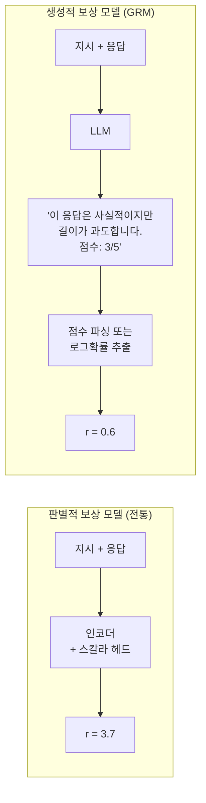
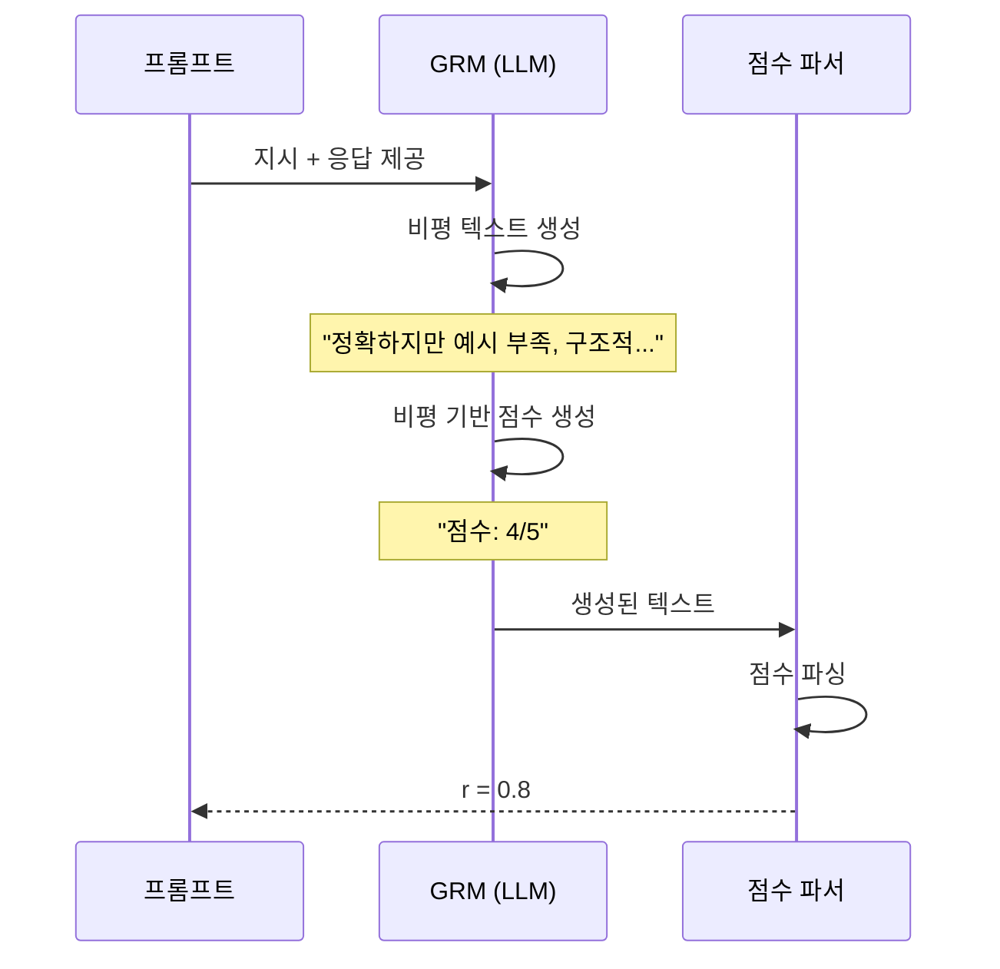

# Generative Reward Model (GRM)

## 개요

Generative Reward Model(GRM)은 보상 신호를 숫자 스칼라로 직접 출력하는 대신 **자연어 평가(critique) 또는 선호 판단을 텍스트로 생성**한 뒤 그로부터 보상을 추출하는 방식의 보상 모델이다. 기존 판별적(discriminative) 보상 모델의 한계인 분포 외(out-of-distribution) 일반화 부족과 낮은 해석 가능성을 해결하기 위해 제안되었으며, [[rlaif]] 파이프라인의 핵심 구성 요소로 자리 잡고 있다.

## 기존 보상 모델과의 비교



| 특성 | 판별적 RM | GRM |
|------|-----------|-----|
| 출력 형태 | 스칼라 실수 | 텍스트 (+ 파싱) |
| 해석 가능성 | 낮음 | 높음 (이유 포함) |
| OOD 일반화 | 약함 | 강함 |
| 추론 비용 | 낮음 | 높음 |
| 보상 해킹 저항성 | 낮음 | 중간 |

## GRM의 주요 구현 방식

### 1. LLM-as-Judge 기반

LLM에게 평가 프롬프트를 제공하고 텍스트 평가와 점수를 생성하도록 한다. Prometheus, JudgeLM 등이 이 방식이다.

**프롬프트 구조**:
```
[지시]: {instruction}
[응답 A]: {response_a}
[응답 B]: {response_b}

두 응답을 비교하고 더 좋은 응답을 선택한 이유를 설명하라.
최종 판단: A 또는 B
```

판단 토큰("A" 또는 "B")의 로그확률(log-probability)로 선호 강도를 수치화할 수 있다.

### 2. Critique-then-Score (비평 후 점수)

먼저 자연어 비평(critique)을 생성하고 그 비평을 조건으로 최종 점수를 생성한다. Chain-of-Thought 효과로 더 일관된 점수가 나오는 경향이 있다.



### 3. 로그확률 기반 암묵적 보상

생성 모델은 주어진 컨텍스트에서 다음 토큰의 로그확률을 자연스럽게 산출한다. 응답 $y$에 대한 교사 LLM의 로그확률을 암묵적 보상으로 사용한다.

$$r(x, y) = \log P_{\text{GRM}}(y | x) - \log P_{\text{ref}}(y | x)$$

이는 [[rlaif]] 파이프라인에서 별도 보상 모델 훈련 없이 강력한 LLM을 바로 보상 신호로 활용하는 방식이다.

## GRM 학습

### Direct Reward Tuning

GRM을 직접 보상 신호로 파인튜닝한다. 인간 선호 데이터 또는 [[rlaif]] 생성 데이터를 이용해 "좋은 응답에 높은 점수, 나쁜 응답에 낮은 점수"를 생성하도록 학습한다.

### Self-Taught Evaluator

강력한 기반 모델이 스스로 평가 능력을 향상시키는 방식이다:
1. 초기 판별적 RM으로 대규모 선호 데이터 수집
2. GRM이 각 응답에 대한 비평을 생성
3. 비평이 정확한 판단으로 이어지면 보상, 틀리면 벌점
4. 반복으로 평가 능력 향상

## 보상 해킹(Reward Hacking) 저항성

GRM은 자연어 설명을 생성하므로, 정책 모델이 GRM을 속이려면 단순히 스코어를 높이는 것이 아니라 **설득력 있는 텍스트**를 생성해야 한다. 이로 인해 판별적 RM 대비 보상 해킹이 더 어렵다.

그러나 완전히 면역이지는 않다. "설명 가능하게 보이는 보상 해킹"이 발생할 수 있으며, [[reward-model-training]]에서 논의되는 OOD 문제는 여전히 존재한다.

## 실용적 고려사항

- **추론 비용**: GRM은 각 평가마다 수백 토큰을 생성하므로 대규모 RL 훈련에서 병목이 된다. 배치 추론 최적화 또는 캐싱이 필수적이다.
- **일관성 확보**: 동일 입력에 대해 다른 판단이 나오는 **확률적 불일치** 문제. 온도를 낮추거나 여러 번 샘플링해 다수결을 취하는 방식으로 완화한다.
- **포맷 강제**: 점수 파싱을 위해 구조화된 출력(JSON, 번호 목록)을 강제하거나 정규식으로 추출한다.

## 관련 문서

- [[reward-model-training]] - 보상 모델 학습 일반 개요
- [[rlaif]] - AI 피드백 기반 강화학습에서의 GRM 활용
- [[rlhf-pipeline]] - GRM이 속하는 전체 RLHF 파이프라인
- [[rejection-sampling-finetuning]] - GRM을 검증기로 활용하는 ReST
- [[reward-hacking-overoptimization]] - GRM으로 완화하려는 핵심 문제
