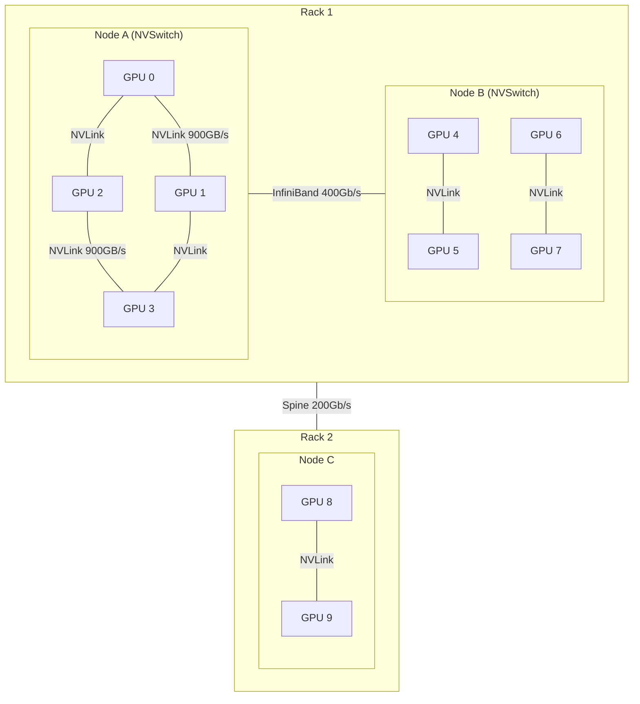

# GPU 클러스터 스케줄링

## 개요

GPU 클러스터 스케줄링은 수백~수천 개의 GPU로 구성된 학습 클러스터에서 작업(job)을 효율적으로 할당, 실행, 관리하는 인프라 계층이다. HPC(High Performance Computing) 전통의 Slurm과 클라우드 네이티브 Kubernetes가 두 축을 이루며, 2026년 현재 NVIDIA Slinky를 중심으로 양 진영의 통합(Slurm on Kubernetes)이 가속화되고 있다. 대규모 LLM 학습에서 스케줄링은 GPU 활용률, 장애 복구, 토폴로지 인식 배치를 통해 학습 비용과 시간에 직접적 영향을 미친다.

## 핵심 개념

### Slurm: HPC 워크로드 매니저

SchedMD(2025년 NVIDIA에 인수)가 개발한 HPC 워크로드 매니저다. 20년 이상의 대규모 클러스터 운영 경험이 축적되어 있으며, 학술 기관과 국가 슈퍼컴퓨터의 사실상 표준이다.

**핵심 구성요소**:
- **slurmctld**: 중앙 컨트롤러, 작업 큐 관리 및 리소스 할당
- **slurmd**: 각 노드의 에이전트, 작업 실행 및 모니터링
- **slurmrestd**: REST API 인터페이스

**AI 학습에 유리한 특성**:
- 네이티브 다중 노드 작업 지원: `--nodes`, `--ntasks-per-node`, `--gpus-per-node`
- GRES(Generic Resource Scheduling)로 GPU를 1등 자원으로 관리
- 장시간 실행 작업(수일~수주)에 최적화된 스케줄링
- Backfill 스케줄링: 대형 작업 대기 중 빈 슬롯에 소형 작업 삽입

### Kubernetes: 클라우드 네이티브 오케스트레이션

컨테이너 기반 마이크로서비스 오케스트레이션에서 출발한 Kubernetes는 GPU 학습 영역으로 확장되고 있다. 자동 스케일링, 서비스 디스커버리, 선언적 구성 등 클라우드 네이티브 패턴이 강점이다.

**GPU 학습 관련 확장**:
- **NVIDIA GPU Operator**: GPU 드라이버, CUDA 런타임 자동 관리
- **Training Operator (Kubeflow)**: PyTorchJob, TFJob 등 분산 학습 CRD
- **Volcano**: HPC 스타일 배치 스케줄링, Gang Scheduling 지원
- **DRA (Dynamic Resource Allocation)**: GPU 토폴로지 인식 할당

### Slurm vs Kubernetes 비교

| 특성 | Slurm | Kubernetes |
|------|-------|------------|
| 주력 영역 | HPC, 장시간 배치 학습 | 클라우드, 서비스/추론 |
| 다중 노드 학습 | 네이티브 지원 | CRD 확장 필요 |
| GPU 스케줄링 | GRES 네이티브 | Device Plugin + DRA |
| 토폴로지 인식 | topology/block (25.11+) | Topograph 통합 |
| 장애 복구 | 수동/스크립트 기반 | Pod 자동 재시작 |
| 탄력적 학습 | 제한적 | 자동 스케일링 유연 |
| 모니터링 | Prometheus 통합 | 네이티브 통합 |
| 학습 곡선 | HPC 전문가 필요 | DevOps 인력 활용 가능 |

### 하이브리드: Slinky (Slurm on Kubernetes)

NVIDIA Slinky는 Slurm과 Kubernetes를 통합하는 오픈소스 프로젝트로, 두 가지 접근을 제공한다:

- **slurm-bridge**: Kubernetes 네이티브 워크로드에 Slurm 스케줄링 적용
- **slurm-operator**: Kubernetes 인프라 위에 전체 Slurm 클러스터 운영

NVIDIA 내부에서 8,000+ GPU 클러스터에서 운영 중이며, 컨테이너화되지 않은 Slurm과 동일한 GPU 통신 성능을 달성했다.

### SUNK (Slurm on Kubernetes -- CoreWeave)

CoreWeave의 SUNK는 수천 GPU의 장시간 학습 작업에 특화된 프로덕션 시스템이다. 토폴로지 인식 스케줄링과 지속적 헬스 관리(continuous health management)로 예측 가능하고 안정적인 학습 환경을 제공한다.

## 토폴로지 인식 스케줄링

### GPU 토폴로지의 중요성

대규모 분산 학습에서 GPU 간 통신 대역폭은 물리적 배치에 따라 크게 다르다:

[[tensor-pipeline-parallelism]]에서 TP 그룹은 NVLink 범위 내(노드 내) GPU에, PP 그룹은 노드 간에 배치해야 통신 병목을 최소화한다. 토폴로지 인식 스케줄링은 이러한 물리적 배치를 자동으로 고려하여 GPU를 할당한다.

- **Slurm 25.11+**: `TopologyPlugin=topology/block`으로 GPU 블록 토폴로지 기반 할당
- **Kubernetes + Topograph**: DRA와 통합하여 GPU 블록 토폴로지 자동 탐색 및 할당

## 장애 복구와 탄력적 학습

### 장애 유형과 빈도

수천 GPU 클러스터에서는 하드웨어 장애가 일상적이다:

| 장애 유형 | 빈도 (1000 GPU 기준) | 영향 |
|----------|-------------------|------|
| GPU 메모리 에러 | 주 1-2회 | 해당 노드 작업 실패 |
| InfiniBand 링크 다운 | 주 1회 | 통신 장애 |
| 노드 다운 | 월 2-3회 | 전체 작업 중단 |
| PSU/냉각 장애 | 월 1회 미만 | 다중 노드 영향 |

### 장애 대응 전략

| 전략 | Slurm | Kubernetes | 적합 환경 |
|------|-------|------------|----------|
| 체크포인트 재시작 | scontrol requeue + 새 노드 | Pod 재생성 | 일반적 |
| 탄력적 학습 (Elastic) | 제한적 지원 | torchelastic 통합 | 자원 가변 환경 |
| 핫 스페어 | 대기 노드 확보 | 자동 스케일링 | 대규모 프로덕션 |
| 헬스 체크 | Prolog/Epilog 스크립트 | Liveness/Readiness Probe | 사전 예방 |

[[model-checkpointing-sharding]]의 비동기 체크포인팅과 결합하면 장애 발생 시 학습 손실을 최소화하면서 빠르게 재개할 수 있다.

## 실전 도입 가이드

### 환경별 권장

| 환경 | 권장 스택 | 이유 |
|------|----------|------|
| 학술/연구 (고정 클러스터) | Slurm | HPC 전통, 다중 노드 학습 네이티브 |
| 클라우드 (가변 자원) | Kubernetes + Volcano | 탄력적 스케일링, 자동 복구 |
| 대규모 프로덕션 | Slinky (Slurm on K8s) | 양쪽 장점 통합 |
| 하이브리드 (학습 + 서빙) | Slurm(학습) + K8s(서빙) | 각 영역 최적화 |

### 모니터링

Prometheus + Grafana 조합이 양쪽 환경 모두에서 표준이다. Slurm 메트릭과 Kubernetes 메트릭을 단일 대시보드에서 통합 모니터링할 수 있다. GPU 활용률, 메모리 사용량, 네트워크 대역폭, 작업 대기 시간이 핵심 지표이다.

## 관련 문서
- [[llm-training-cost-guide]] -- LLM 학습 비용 가이드 (Training Cost Guide)

- [[tensor-pipeline-parallelism]] -- 토폴로지 인식 병렬화 배치
- [[data-parallelism-fsdp]] -- 분산 학습 전략
- [[model-checkpointing-sharding]] -- 장애 복구 체크포인팅
- [[distributed-communication]] -- GPU 간 통신 백엔드
- [[nvidia-vera-rubin]] -- 차세대 GPU 아키텍처
- [[dgx-spark]] -- 소규모 학습 환경
