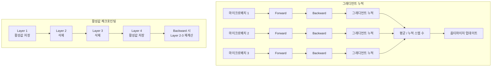

# 그래디언트 누적과 활성값 체크포인팅

## 개요

그래디언트 누적(Gradient Accumulation)과 활성값 체크포인팅(Activation Checkpointing, 일명 Gradient Checkpointing)은 GPU 메모리가 제한된 환경에서 대규모 배치 크기와 대형 모델 학습을 가능하게 하는 두 가지 직교적 메모리 최적화 기법이다. 그래디언트 누적은 작은 마이크로배치를 여러 번 실행하여 큰 유효 배치 크기를 시뮬레이션하고, 활성값 체크포인팅은 forward pass에서 중간 활성값을 저장하는 대신 backward 시 재계산하여 메모리를 절감한다. 두 기법은 [[data-parallelism-fsdp]], [[deepspeed-zero]], [[mixed-precision-training]]과 함께 LLM 학습 메모리 최적화의 기본 구성요소이다.

## 핵심 개념

### 그래디언트 누적 (Gradient Accumulation)

GPU 메모리에 적재할 수 있는 배치 크기가 유효 배치 크기보다 작을 때, 여러 미니배치의 그래디언트를 누적한 후 한 번에 옵티마이저 업데이트를 수행한다.

**작동 방식**:
- 유효 배치 크기 = 마이크로배치 크기 x 누적 스텝 수 x GPU 수
- 예: 마이크로배치 4, 누적 8스텝, GPU 8개 = 유효 배치 256

| 설정 | 마이크로배치 | 누적 스텝 | GPU | 유효 배치 |
|------|-----------|----------|-----|----------|
| 메모리 풍부 | 32 | 1 | 8 | 256 |
| 메모리 제한 | 4 | 8 | 8 | 256 |
| 단일 GPU | 4 | 64 | 1 | 256 |

**주의 사항**: 그래디언트를 누적할 때는 누적 스텝 수로 나누어 평균을 취해야 한다. 그렇지 않으면 유효 학습률이 누적 스텝 수에 비례하여 증가하는 효과가 발생한다.

### 활성값 체크포인팅 (Activation Checkpointing)

Backward pass에서 그래디언트 계산에는 forward pass의 중간 활성값(activation)이 필요하다. 표준 학습에서는 모든 레이어의 활성값을 메모리에 저장하지만, 활성값 체크포인팅은 일부 전략적 지점의 활성값만 저장하고 나머지는 backward 시 재계산한다.

**메모리-연산 트레이드오프**:

| 전략 | 메모리 사용 | 재계산 비용 | 적용 대상 |
|------|-----------|-----------|----------|
| 저장 없음 (전부 재계산) | 최소 (입력만) | 최대 (~100% forward 반복) | 극한 메모리 제약 |
| 선택적 저장 | 중간 (sqrt(N) 레이어) | 약 20-33% 추가 | 일반적 권장 |
| 전부 저장 (기본) | 최대 | 없음 | 메모리 여유 시 |

Transformer 모델에서 일반적으로 어텐션 블록 단위(Transformer block boundary)로 체크포인트를 설정한다. N개 레이어에서 sqrt(N)개 지점에 체크포인트를 설정하면 메모리가 O(N)에서 O(sqrt(N))으로 감소하며, 재계산 오버헤드는 약 20-33% 수준이다.

### 두 기법의 직교적 결합

그래디언트 누적과 활성값 체크포인팅은 서로 다른 메모리 축을 최적화한다:

- **그래디언트 누적**: 배치 차원의 메모리 문제 해결 (큰 배치를 작은 마이크로배치로 분할)
- **활성값 체크포인팅**: 모델 깊이 차원의 메모리 문제 해결 (중간 활성값 저장 최소화)

두 기법을 동시에 적용하면 상승 효과를 얻는다. 예를 들어, 활성값 체크포인팅으로 마이크로배치당 메모리를 줄이면 더 큰 마이크로배치를 사용할 수 있어 그래디언트 누적 스텝 수를 줄이고 학습 속도를 개선할 수 있다.

## 작동 원리

### 그래디언트 누적 흐름

1. 마이크로배치로 forward + backward 수행 (옵티마이저 업데이트 보류)
2. 그래디언트를 `.grad` 속성에 누적
3. 설정된 누적 스텝 수 만큼 1-2 반복
4. 누적된 그래디언트를 스텝 수로 나누어 평균화
5. 옵티마이저 업데이트 수행 후 그래디언트 초기화

### 활성값 체크포인팅 흐름

1. Forward pass 중 체크포인트 지점의 활성값만 메모리에 유지
2. 비체크포인트 레이어의 활성값은 저장하지 않음
3. Backward pass 시 체크포인트 간 구간의 활성값을 재계산
4. 재계산된 활성값으로 그래디언트 계산

## 성능 영향

### 그래디언트 누적의 학습 동역학

이론적으로 그래디언트 누적과 큰 배치의 단일 forward/backward는 수학적으로 동일하다. 실전에서는 다음 차이가 있다:

- **BatchNorm**: 마이크로배치 단위로 통계가 계산되므로 전체 배치와 다른 통계. LLM에서는 대부분 LayerNorm을 사용하므로 영향 없음
- **Dropout**: 마이크로배치마다 독립적으로 적용되므로 통계적 차이 미미
- **[[learning-rate-scheduling]]**: warmup 스텝 수가 유효 배치 기준이므로 누적 스텝 수를 반영하여 조정

### 활성값 체크포인팅의 속도 저하

| 모델 크기 | 체크포인트 없음 | 블록 단위 체크포인트 | 속도 저하 |
|----------|-------------|-----------------|----------|
| 1.3B | 기준 | 활성값 메모리 60% 절감 | ~20% |
| 7B | 기준 | 활성값 메모리 60% 절감 | ~25% |
| 70B | 기준 | 활성값 메모리 60% 절감 | ~30% |

모델이 클수록 재계산 비용이 상대적으로 증가하지만, 체크포인팅 없이는 메모리 부족으로 학습 자체가 불가능한 경우가 대부분이다.

## 실전 도입 가이드

### 적용 순서

1. **[[mixed-precision-training]] 먼저 적용**: BF16만으로 메모리 50% 절감
2. **활성값 체크포인팅 적용**: 추가 40-60% 활성값 메모리 절감
3. **그래디언트 누적 적용**: 원하는 유효 배치 크기 달성
4. **[[deepspeed-zero]] 또는 [[data-parallelism-fsdp]]**: 모델 상태 분산

### [[tensor-pipeline-parallelism]]과의 관계

파이프라인 병렬화에서 마이크로배치는 파이프라인 버블을 줄이는 핵심 요소이다. 그래디언트 누적 스텝 수를 파이프라인 스테이지 수의 4배 이상으로 설정하면 버블 비율을 효과적으로 낮출 수 있다.

### 흔한 실수

- **그래디언트 평균화 누락**: 누적 후 스텝 수로 나누지 않으면 유효 학습률이 왜곡
- **학습률 미조정**: 유효 배치 크기 변경 시 [[learning-rate-scheduling]]의 warmup 기간 조정 필요
- **과도한 체크포인팅**: 모든 레이어에 체크포인트를 설정하면 재계산 비용이 forward pass 전체를 반복하는 것과 같음

## 관련 문서

- [[data-parallelism-fsdp]] -- FSDP와 결합하여 메모리 극대화
- [[deepspeed-zero]] -- ZeRO 활성값 체크포인팅 통합 지원
- [[mixed-precision-training]] -- 직교적 메모리 절감
- [[tensor-pipeline-parallelism]] -- 파이프라인 마이크로배치와의 관계
- [[learning-rate-scheduling]] -- 배치 크기 변경 시 학습률 조정
- [[mit-training-efficiency]] -- 학습 효율화 연구
