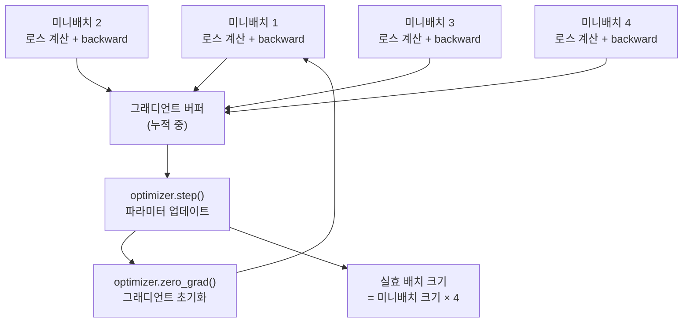

# 그래디언트 누적 (Gradient Accumulation)

## 개요

**그래디언트 누적(gradient accumulation)** 은 GPU 메모리 제약으로 인해 큰 배치(batch)를 한 번에 처리할 수 없을 때, 여러 개의 작은 미니배치(mini-batch)에서 계산한 그래디언트를 누적한 뒤 한 번에 파라미터를 업데이트하는 기법이다.

결과적으로 실제 GPU에 올라가는 데이터는 적지만, 학습 동태(training dynamics)는 큰 배치를 사용한 것과 동일하게 만든다.

## 동작 원리

일반적인 학습 루프:

```
for batch in dataloader:
    loss = model(batch)
    loss.backward()      # 그래디언트 계산
    optimizer.step()     # 파라미터 업데이트
    optimizer.zero_grad()
```

그래디언트 누적 적용:

```python
accumulation_steps = 4  # N 스텝마다 업데이트

for i, batch in enumerate(dataloader):
    loss = model(batch) / accumulation_steps  # 스케일 조정
    loss.backward()  # 그래디언트 누적 (zero_grad 하지 않음)

    if (i + 1) % accumulation_steps == 0:
        optimizer.step()     # N번 누적 후 업데이트
        optimizer.zero_grad()
```



## 실효 배치 크기 계산

$$\text{실효 배치 크기} = \text{미니배치 크기} \times \text{누적 스텝} \times \text{GPU 수}$$

예시:
- GPU당 미니배치 크기: 4
- 누적 스텝: 8
- GPU 수: 8
- **실효 배치 크기: 4 × 8 × 8 = 256**

LLM 사전학습에서는 실효 배치 크기로 수백만 토큰을 사용하는 것이 일반적이다 (예: GPT-3는 3.2M 토큰/배치).

## 메모리 절약 메커니즘

그래디언트 누적이 메모리를 절약하는 이유:

1. **순방향 패스(forward pass)**: 활성화(activation) 메모리는 미니배치 크기에 비례
2. **역방향 패스(backward pass)**: 그래디언트는 파라미터 수에만 비례 (배치 무관)
3. 그래디언트 버퍼는 배치 크기와 무관하게 일정

따라서 배치 크기 4로 8번 누적하면, 배치 크기 32를 한 번에 처리하는 것 대비 메모리가 약 8배 절약된다 (활성화 부분).

## 학습률과의 상호작용

그래디언트 누적 시 학습률(learning rate) 조정이 필요할 수 있다.

**선형 스케일링 규칙 (Linear Scaling Rule)**:
Goyal et al. (2017)이 제안한 경험적 규칙. 배치 크기를 k배 늘리면 학습률도 k배 늘린다.

$$\text{new lr} = \text{base lr} \times \frac{\text{실효 배치 크기}}{\text{기준 배치 크기}}$$

단, 이 규칙은 완벽하지 않으며 특히 배치가 매우 크거나 작을 때 불안정할 수 있다. **웜업(warmup)** 스케줄을 함께 사용하는 것이 일반적이다.

## DeepSpeed와 FSDP 통합

### DeepSpeed ZeRO

Microsoft DeepSpeed의 ZeRO(Zero Redundancy Optimizer) 최적화는 그래디언트 누적과 자연스럽게 결합된다.

ZeRO Stage 1-3는 각각 옵티마이저 상태, 그래디언트, 파라미터를 GPU 간에 분산 저장한다. 그래디언트 누적과 함께 사용 시:
- `gradient_accumulation_steps` 파라미터로 DeepSpeed 설정에서 직접 제어
- AllReduce 통신을 누적 마지막 스텝에만 수행해 통신 비용 절약

### PyTorch FSDP (Fully Sharded Data Parallel)

PyTorch의 완전 분산 데이터 병렬 처리. `no_sync()` 컨텍스트 매니저를 사용해 중간 스텝에서 그래디언트 동기화를 건너뛴다:

```python
for i, batch in enumerate(dataloader):
    if (i + 1) % accumulation_steps != 0:
        with model.no_sync():  # 통신 없이 그래디언트 누적
            loss = model(batch)
            loss.backward()
    else:
        loss = model(batch)
        loss.backward()
        optimizer.step()
        optimizer.zero_grad()
```

## 주의사항

### 배치 정규화 (Batch Normalization)

배치 정규화 레이어는 배치 통계를 사용하므로, 그래디언트 누적 시 각 미니배치의 통계가 달라져 불안정할 수 있다. LLM은 보통 레이어 정규화(Layer Normalization)를 사용하므로 이 문제는 없다.

### 드롭아웃 (Dropout)

각 미니배치에서 드롭아웃 마스크가 독립적으로 적용된다. 이는 의도된 동작이며, 큰 배치에서 한 번 적용하는 것과 다를 수 있다.

### 로스 스케일링

누적 스텝 수로 로스를 나누지 않으면 그래디언트가 accumulation_steps배 커진다. 위 코드 예시처럼 `loss / accumulation_steps`로 스케일링이 필요하다.

## 언제 사용하는가

| 상황 | 그래디언트 누적 사용 여부 |
|------|--------------------------|
| GPU 메모리 충분, 원하는 배치 크기 가능 | 불필요 |
| GPU 메모리 부족으로 큰 배치 불가 | 필수 |
| 분산 학습 GPU 수 제한 | 유용 |
| 단일 GPU로 대규모 모델 파인튜닝 | 필수 |
| 통신 비용 절감 필요 | no_sync()와 함께 유용 |

## 관련 문서

- [[분산 학습]] - 멀티 GPU 학습의 전체 패러다임
- [[DeepSpeed ZeRO]] - 그래디언트 누적과 결합되는 메모리 최적화
- [[활성화 재계산]] - 메모리 절약의 또 다른 기법 (activation checkpointing)
- [[혼합 정밀도 학습]] - FP16/BF16으로 메모리를 절약하는 보완 기법
- [[배치 크기와 학습 안정성]] - 배치 크기가 학습에 미치는 영향
