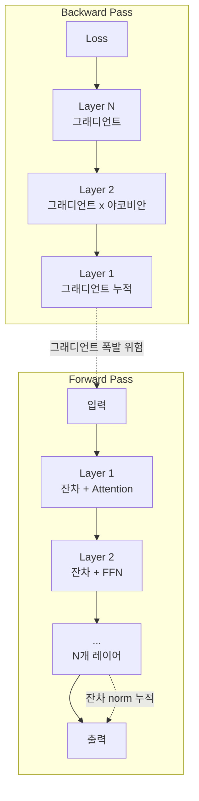
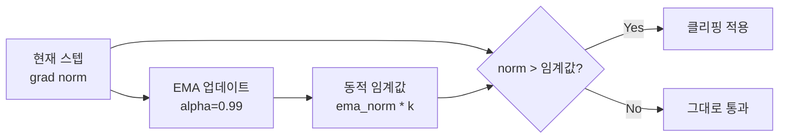

# 그래디언트 Norm 모니터링

## 개요

그래디언트 norm 모니터링은 LLM 학습 과정에서 각 스텝의 그래디언트 크기(L2 norm)를 추적하여 학습 안정성을 실시간으로 진단하는 기법이다. 그래디언트 폭발(exploding gradients)은 깊은 Transformer 모델에서 빈번하게 발생하며, 이를 방치하면 [[loss-spike-debugging|loss spike]], NaN 발산, 학습 실패로 이어진다. 그래디언트 norm 모니터링은 단순한 관측을 넘어 그래디언트 클리핑(gradient clipping), 적응적 학습률 조정, 조기 경고 시스템의 기반이 되며, [[mixed-precision-training]]과 [[learning-rate-scheduling]]의 안정적 운영에 필수적이다.

## 그래디언트 폭발의 메커니즘

### Transformer에서의 폭발 경로

Transformer 모델의 그래디언트 폭발은 주로 두 가지 경로로 발생한다:



1. **잔차 연결 경로**: forward pass에서 잔차 경로의 norm이 레이어를 거치며 누적. N개 레이어를 통과하면 norm이 O(sqrt(N)) 이상으로 증가할 수 있다
2. **야코비안 곱 폭발**: backward pass에서 각 레이어의 야코비안 행렬이 곱해지며, 하나의 야코비안이라도 spectral norm > 1이면 그래디언트가 기하급수적으로 증가

### 폭발의 징후

| 징후 | 의미 | 심각도 |
|------|------|--------|
| 글로벌 grad norm이 점진적 증가 | 학습 역학의 불안정 축적 | 경고 |
| 특정 레이어 grad norm만 급등 | 해당 레이어의 국소적 불안정 | 주의 |
| grad norm이 클리핑 임계값 빈번 도달 | 임계값 재조정 또는 LR 감소 필요 | 경고 |
| NaN/Inf grad norm | 즉각적 학습 중단 필요 | 치명적 |

## 모니터링 방법

### 글로벌 그래디언트 Norm

전체 모델 파라미터의 그래디언트를 하나의 벡터로 펼친 후 L2 norm을 계산한다:

```
global_norm = sqrt(sum_i(||g_i||^2))
```

여기서 g_i는 i번째 파라미터 텐서의 그래디언트이다. PyTorch에서는 `torch.nn.utils.clip_grad_norm_()` 호출 시 반환값으로 글로벌 norm을 얻을 수 있다.

### Per-Layer 그래디언트 Norm

글로벌 norm만으로는 어느 레이어가 문제인지 알 수 없다. per-layer 추적은 각 레이어(또는 파라미터 그룹)별로 개별 norm을 기록한다.

**추적 대상 우선순위:**
1. **Attention QKV 가중치**: attention logit 폭발의 직접적 원인
2. **FFN 가중치**: 특히 첫 번째/마지막 레이어
3. **Embedding 레이어**: 입력 분포 변화에 민감
4. **LayerNorm 파라미터**: norm 전후 그래디언트 집중 감지

### 통계 기반 추적

단순 norm 값 외에 통계적 접근을 병행한다:

| 지표 | 계산 | 용도 |
|------|------|------|
| EMA (지수이동평균) | ema = alpha * norm + (1-alpha) * ema_prev | 추세 파악 |
| 표준편차 | 최근 K 스텝의 std | 변동성 탐지 |
| 최대/최소 비율 | max(norm_layers) / min(norm_layers) | 레이어 간 불균형 |
| 클리핑 빈도 | clipped_steps / total_steps | 임계값 적정성 |

## 그래디언트 클리핑 전략

### 글로벌 Norm 클리핑

가장 널리 사용되는 방법으로, 전체 그래디언트 벡터의 L2 norm이 임계값(max_norm)을 초과하면 비례 축소한다:

```
if global_norm > max_norm:
    g_i = g_i * (max_norm / global_norm)  # 모든 파라미터에 동일 비율 적용
```

**일반적 임계값:**
- LLM 사전학습: max_norm = 1.0 (가장 보편적)
- 파인튜닝: max_norm = 0.5 - 1.0
- RLHF: max_norm = 0.5 (더 보수적)

### 값 클리핑 (Value Clipping)

개별 그래디언트 원소를 [-c, c] 범위로 클리핑한다. norm 클리핑 대비 방향 정보를 왜곡할 수 있어 LLM 학습에서는 덜 선호된다.

### 적응적 그래디언트 클리핑 (AGC)

NFNet(Brock et al., 2021)에서 제안한 방법으로, 파라미터 norm 대비 그래디언트 norm의 비율을 기준으로 클리핑한다:

```
clip_factor = min(1, c * ||w|| / ||g||)
g = g * clip_factor
```

각 파라미터 텐서별로 독립적으로 적용되므로 per-layer 폭발에 효과적이다. Transformer의 서로 다른 레이어가 매우 다른 scale을 가질 때 고정 임계값보다 유연하다.

### ZClip: 동적 적응 클리핑

ZClip(2025)은 최근 그래디언트 norm의 EMA를 기반으로 동적 임계값을 설정한다:



1B LLaMA 실험에서 고정 클리핑 대비 학습 가능한 학습률 범위를 확장하고, 안정적 학습률 영역에서는 spike를 완전히 제거했다.

## 실전 모니터링 구성

### 로깅 구성 예시

| 지표 | 로깅 빈도 | 대시보드 |
|------|----------|---------|
| 글로벌 grad norm | 매 스텝 | W&B / TensorBoard |
| Per-layer grad norm | 매 100 스텝 | W&B |
| 클리핑 이벤트 | 매 스텝 (발생 시) | 알림 연동 |
| Param norm | 매 100 스텝 | W&B |
| 활성값 통계 | 매 500 스텝 | 디버깅용 |

### 알림 임계값 설정

| 조건 | 대응 |
|------|------|
| grad_norm > 5 * EMA | Slack/이메일 경고 |
| grad_norm > 10 * EMA | 자동 체크포인트 저장 |
| NaN 발생 | 즉시 학습 일시 중단 |
| 클리핑 빈도 > 50% (최근 1000 스텝) | LR 또는 임계값 재검토 알림 |

## 그래디언트 분석과 학습 안정성의 관계

그래디언트 norm 모니터링은 다른 안정성 기법들과 밀접하게 연결된다:

- **[[learning-rate-scheduling]]**: 그래디언트 norm이 지속적으로 높으면 학습률이 과도한 신호. warmup 연장이나 최대 LR 감소를 고려
- **[[mixed-precision-training]]**: BF16은 FP16 대비 동적 범위가 넓어 그래디언트 오버플로우에 강건. FP8 학습에서는 더욱 세밀한 모니터링 필요
- **[[optimizer-selection]]**: Adam 계열은 2차 모멘트로 자연스러운 적응적 스케일링을 제공하지만, 모멘텀에 spike 이력이 누적될 수 있음
- **[[loss-spike-debugging]]**: 그래디언트 norm 급등은 loss spike의 선행 지표가 될 수 있으며, 조기 탐지에 핵심적 역할

## 대표 자료

- [Understanding Gradient Clipping (Neptune AI)](https://neptune.ai/blog/understanding-gradient-clipping-and-how-it-can-fix-exploding-gradients-problem)
- [ZClip: Adaptive Spike Mitigation for LLM Pre-Training (2025)](https://arxiv.org/abs/2504.02507)
- [High-Performance Large-Scale Image Recognition Without Normalization -- AGC (Brock et al., 2021)](https://arxiv.org/abs/2102.06171)
- [Stabilizing LLM Training: Techniques and Insights (Rohan Paul)](https://www.rohan-paul.com/p/stabilizing-llm-training-techniques)

## 관련 문서

- [[loss-spike-debugging]] -- loss spike 진단과 롤백/데이터 스킵 전략
- [[mixed-precision-training]] -- 수치 정밀도와 그래디언트 안정성
- [[learning-rate-scheduling]] -- 학습률과 그래디언트 규모의 관계
- [[optimizer-selection]] -- 옵티마이저별 그래디언트 처리 특성
- [[model-checkpointing-sharding]] -- 불안정 탐지 시 체크포인트 활용
- [[evaluation-during-training]] -- 학습 중 모니터링 지표 전반
- [[gradient-accumulation-checkpointing]] -- 그래디언트 누적과 메모리 관리
