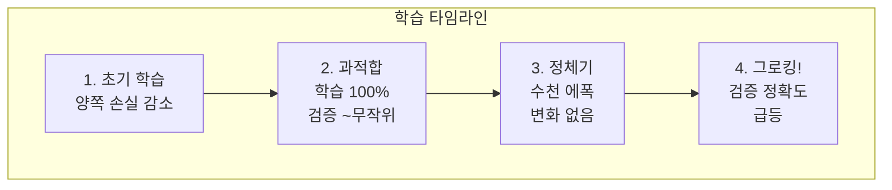
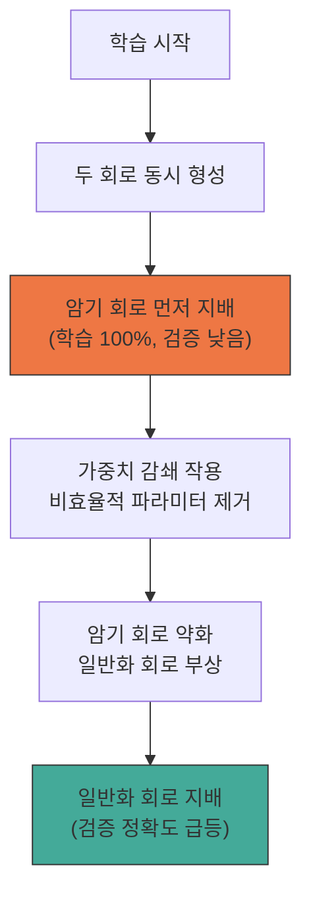

# 그로킹과 학습 동역학

## 개요

그로킹(Grokking)은 2022년 OpenAI의 Alethea Power 등이 "Grokking: Generalization Beyond Overfitting on Small Algorithmic Datasets" 논문에서 보고한 학습 현상이다. 모델이 학습 데이터에 완전히 과적합한 이후, 추가 학습을 계속하면 갑자기(abruptly) 일반화 성능이 급등하는 지연된 일반화(delayed generalization) 현상을 가리킨다. 이 현상은 학습 동역학의 위상 전이(phase transition), 대규모 언어 모델의 창발적 능력(emergent abilities)과 깊이 연결되어 있으며, 신경망의 학습 과정을 이해하는 핵심 단서를 제공한다.

## 그로킹 현상

### 관찰 패턴

전형적인 그로킹은 다음 순서로 진행된다:

1. **초기 학습**: 학습 손실과 검증 손실이 함께 감소
2. **과적합 단계**: 학습 정확도가 100%에 도달하지만, 검증 정확도는 무작위 수준에 머무름
3. **정체기(plateau)**: 검증 성능이 오랜 기간 개선 없이 유지 (수천~수만 에폭)
4. **급격한 일반화**: 검증 정확도가 갑자기 100% 근처로 도약



이 현상이 직관에 반하는 이유는 일반적으로 과적합 이후 추가 학습은 일반화를 악화시킨다고 알려져 있기 때문이다. 그로킹은 이 통념을 정면으로 도전한다.

### 발생 조건

그로킹은 모든 학습 상황에서 발생하지 않는다. 주요 조건:

- **작은 데이터셋**: 알고리즘적 데이터셋(모듈러 산술, 순열 등) 또는 소규모 학습 데이터
- **충분한 모델 용량**: 데이터를 암기할 수 있을 만큼의 파라미터
- **적절한 정규화**: 특히 가중치 감쇄(weight decay)가 결정적 역할
- **충분한 학습 시간**: 과적합 이후에도 학습을 계속해야 함

## 위상 전이 관점

### 네 가지 학습 위상

경험적 연구에서 가중치 감쇄와 데이터 크기를 축으로 하는 위상 다이어그램이 발견되었다:

```mermaid
quadrantChart
    title 학습 위상 다이어그램
    x-axis "데이터 양 적음" --> "데이터 양 많음"
    y-axis "정규화 약함" --> "정규화 강함"
    quadrant-1 이해(Comprehension)
    quadrant-2 그로킹(Grokking)
    quadrant-3 암기(Memorization)
    quadrant-4 혼란(Confusion)
```

- **이해(Comprehension)**: 충분한 데이터 + 적절한 정규화. 학습과 검증이 함께 개선
- **그로킹(Grokking)**: 적은 데이터 + 적절한 정규화. 지연된 일반화 발생
- **암기(Memorization)**: 정규화 부족. 학습 데이터만 암기하고 일반화 실패
- **혼란(Confusion)**: 과도한 정규화 또는 극단적으로 적은 데이터. 학습 자체 실패

그로킹은 이해와 암기 사이의 "골디락스 영역(Goldilocks zone)"에서 발생한다.

### 가중치 감쇄의 결정적 역할

가중치 감쇄(weight decay)는 그로킹의 가장 중요한 제어 변수이다:

- **너무 약하면**: 암기 회로가 유지되어 일반화로 전이하지 못함
- **적절하면**: 파라미터 비효율적인 암기 회로를 점진적으로 약화시켜, 더 효율적인 일반화 회로가 지배하도록 유도
- **너무 강하면**: 어떤 구조도 학습하지 못하고 혼란 상태에 빠짐

이는 [[optimizer-selection]]에서 가중치 감쇄 설정이 학습 결과에 미치는 영향을 극적으로 보여주는 사례이다.

## 회로 경쟁 프레임워크

### 암기 회로 vs. 일반화 회로

그로킹의 기계적 해석(mechanistic interpretation)은 신경망 내부에서 두 종류의 회로가 경쟁한다는 관점이다:

**암기 회로(Memorization Circuit)**:
- 학습 데이터의 입출력 쌍을 직접 저장하는 룩업 테이블 방식
- 빠르게 형성되어 학습 정확도를 먼저 높임
- 파라미터를 많이 소모하며, 구조적으로 비효율적

**일반화 회로(Generalization Circuit)**:
- 데이터의 구조적 규칙(예: 모듈러 산술의 푸리에 표현)을 학습
- 형성이 느리지만, 적은 파라미터로 정확한 예측 가능
- 파라미터 효율적이며, 구조적으로 우아함



가중치 감쇄는 파라미터 비효율적인 암기 회로를 점진적으로 "가지치기"하여, 이미 조용히 형성되고 있던 일반화 회로가 출력을 지배하도록 만든다. 이 전환이 급격하게 일어나기 때문에 검증 정확도의 갑작스러운 도약으로 관측된다.

## 창발적 능력과의 연결

### LLM의 창발적 능력

대규모 언어 모델에서 관찰되는 창발적 능력(emergent abilities) -- 특정 규모 이상에서 갑자기 나타나는 과제 수행 능력 -- 은 그로킹과 구조적으로 유사하다:

- 양쪽 모두 점진적 개선이 아닌 급격한 전이를 보인다
- 양쪽 모두 임계점(critical threshold) 이전에는 거의 무작위 성능을 보인다
- 양쪽 모두 내부 회로의 위상 전이로 설명될 수 있다

### 통합 프레임워크

최근 연구는 그로킹, 이중 하강(double descent), 창발적 능력을 암기-일반화 회로 경쟁이라는 하나의 프레임워크로 통합한다:

| 현상 | 변수 | 전이 |
|------|------|------|
| 그로킹 | 학습 시간 | 시간에 따른 암기 → 일반화 |
| 이중 하강 | 모델 크기 | 규모에 따른 편향-분산 재균형 |
| 창발적 능력 | 모델 규모 | 규모에 따른 회로 완성 |

세 현상 모두 모델의 유효 차원(effective dimensionality)이 임계점을 넘는 순간 급격한 성능 변화가 발생한다.

## 실전적 함의

### 학습 전략에 대한 교훈

1. **조기 종료(early stopping)의 재고**: 과적합 후에도 학습을 계속하면 일반화가 개선될 수 있다는 가능성. 단, 적절한 정규화가 전제
2. **가중치 감쇄 튜닝**: [[learning-rate-scheduling]]만큼이나 가중치 감쇄가 학습 동역학에 결정적 영향
3. **학습 시간 예산 확장**: 특히 소규모 데이터셋에서는 통상적 수렴 기준을 넘어 추가 학습을 시도할 가치
4. **[[evaluation-during-training]] 강화**: 검증 성능의 갑작스러운 변화를 포착하기 위한 빈번한 평가

### 한계

- 대규모 자연어 학습에서 그로킹이 동일하게 관찰되는지는 완전히 확립되지 않았다
- 정체기의 길이를 사전에 예측하는 이론이 아직 부재하다
- 실전 LLM 학습에서는 데이터 규모가 충분하여 이해(comprehension) 위상에 해당하는 경우가 많다

## 관련 문서

- [[neural-scaling-laws]] -- 규모에 따른 성능 변화와 창발적 능력
- [[optimizer-selection]] -- 가중치 감쇄와 학습 동역학
- [[learning-rate-scheduling]] -- 학습률이 위상 전이에 미치는 영향
- [[evaluation-during-training]] -- 학습 중 일반화 성능 추적
- [[pretraining-data-curation]] -- 데이터 규모와 그로킹 발생 조건의 관계
