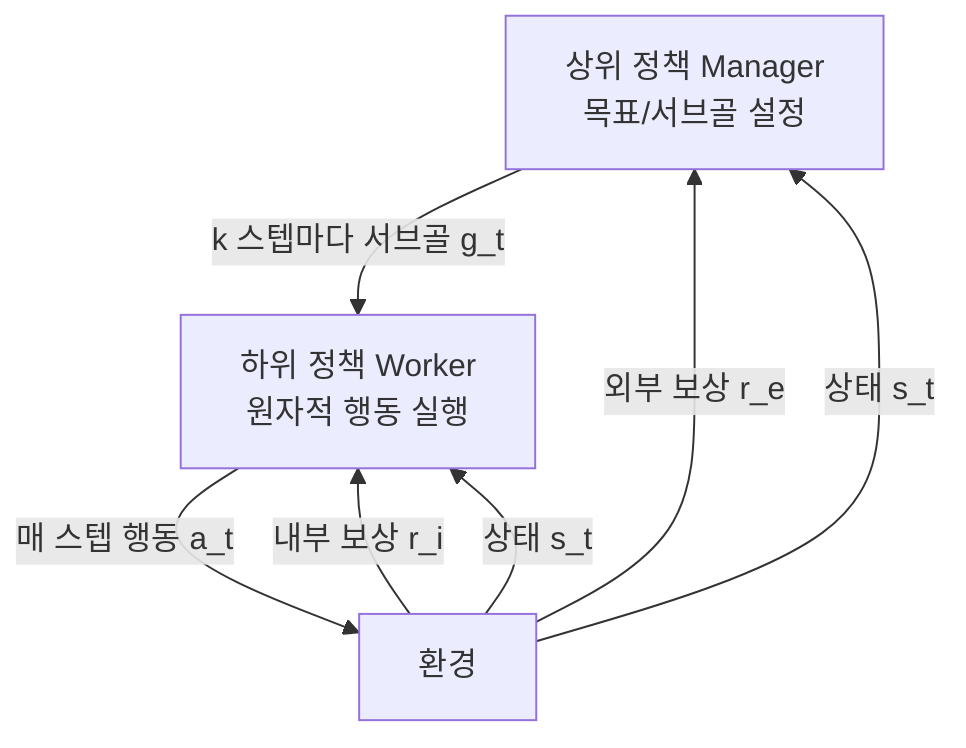
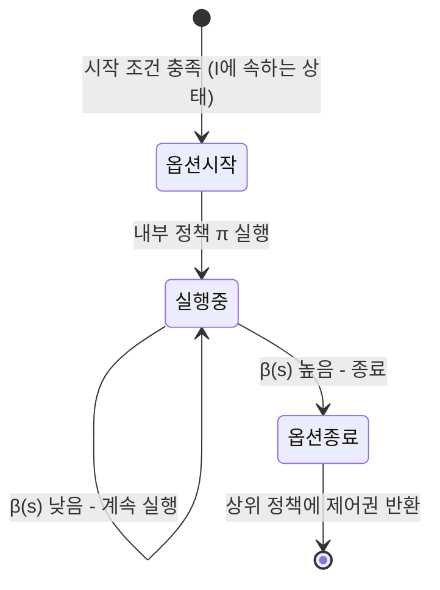
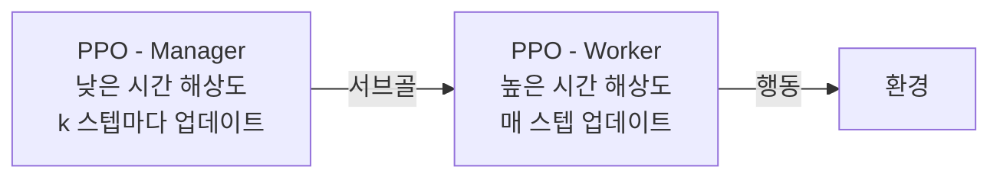

# 계층적 강화학습 (Hierarchical RL)

계층적 강화학습(Hierarchical Reinforcement Learning, HRL)은 복잡한 장기 의사결정 문제를 **여러 계층의 정책(policy)**으로 분해하여 해결하는 프레임워크다. 높은 수준의 정책이 하위 목표(서브골)를 설정하고, 낮은 수준의 정책이 그 목표를 달성하는 구체적 행동을 실행한다. 이 접근은 **시간 추상화(temporal abstraction)**를 통해 희소 보상(sparse reward) 환경에서의 탐색 효율을 크게 향상시킨다.

## 핵심 동기: 시간 추상화

평평한(flat) 강화학습이 직면하는 문제:

1. **희소 보상**: 목표 달성에 수백 스텝이 필요하며, 중간 피드백 없음
2. **긴 의존성**: 초반 행동이 후반 결과에 미치는 영향을 학습하기 어려움
3. **탐색 비효율**: 광대한 상태 공간에서 무작위 탐색으로는 의미 있는 보상을 발견하기 힘듦

HRL은 이를 해결하기 위해 **임시 추상화(temporal abstraction)**를 도입한다. 즉, 단순 행동 대신 여러 스텝에 걸쳐 실행되는 **매크로 행동(macro-action)**을 학습한다.

위 다이어그램은 2계층 HRL의 기본 구조를 나타낸다. Manager는 k 스텝마다 서브골을 설정하고, Worker는 매 스텝 행동을 선택한다.

## 옵션 프레임워크 (Options Framework)

HRL의 가장 영향력 있는 이론적 기반은 Sutton, Precup, Singh(1999)의 **옵션 프레임워크**다.

**옵션(option)** $o = \langle \mathcal{I}, \pi, \beta \rangle$의 정의:

- $\mathcal{I} \subseteq S$: 시작 가능한 상태 집합 (initiation set)
- $\pi: S \times A \to [0,1]$: 옵션 내부 정책 (intra-option policy)
- $\beta: S \to [0,1]$: 종료 조건 (termination condition)

옵션은 "방을 나간다", "계단을 오른다" 같은 **원시 행동보다 상위의 시간적 추상화 단위**다.

## 주요 알고리즘

### Feudal Networks (FuN, 2017)

- 구글 DeepMind 발표
- Manager가 Worker에게 **잠재 공간 목표(latent goal)**를 전달
- Manager는 목표 도달 여부로, Worker는 목표 방향 이동으로 각각 독립 보상
- 코사인 유사도로 Worker의 내부 보상 계산: $r_i = \frac{s_{t+c} - s_t}{|s_{t+c} - s_t|} \cdot g_t$

### HIRO (Hierarchical RL with Off-policy Correction, 2018)

- 높은 샘플 효율을 위해 오프-정책(off-policy) 학습 도입
- 하위 정책 변화로 인한 비정상성(non-stationarity) 문제 해결을 위한 오프-정책 보정
- 연속 제어 로코모션 태스크에서 강력한 성능 입증

### Option-Critic (2017)

- 옵션 프레임워크를 **종단간(end-to-end) 학습** 가능하도록 확장
- 내부 정책 $\pi$와 종료 조건 $\beta$ 모두 그래디언트로 동시 학습
- 별도의 서브골 설계 없이 옵션 구조 자동 발견

## [[policy-gradient-ppo]]와의 관계

HRL은 [[policy-gradient-ppo]] 같은 표준 정책 그래디언트 방법을 서브컴포넌트로 활용한다. Manager와 Worker 모두 독립적인 [[policy-gradient-ppo]] 에이전트로 구현되며, Manager의 시간 해상도가 Worker보다 낮다.

## [[markov-decision-process]]와 시간 추상화

HRL은 기본 [[markov-decision-process]](MDP) 프레임워크를 **반(semi) MDP**로 확장한다. 반 MDP에서는 각 "행동"(=옵션)의 지속 시간이 고정되지 않고 가변적이다:

$$\text{반 MDP} = \langle S, O, P, R, \gamma \rangle$$

여기서 $O$가 가변 지속 시간을 갖는 옵션 집합이다. 할인 인자 $\gamma$는 옵션의 실제 실행 스텝 수에 따라 누적 적용된다.

## 실용적 장점과 응용

| 장점 | 설명 |
|------|------|
| 탐색 효율 향상 | 서브골을 통해 의미 있는 탐색 방향 제시 |
| 전이 학습 | 하위 정책(primitive skills)을 새 태스크에 재사용 |
| 해석 가능성 | 계층 구조로 에이전트 행동 추적 가능 |
| 희소 보상 처리 | 내부 보상(intrinsic reward)으로 중간 학습 신호 제공 |

실제 응용 사례:
- 로봇 로코모션 (걷기 → 목적지 이동)
- 비디오게임 (전술 행동 → 전략 계획)
- 자율주행 (차선 변경 → 경로 계획)

## 한계와 도전

1. **서브골 설계**: 어떤 서브골이 유용한지 사전 정의하거나 자동 발견해야 함
2. **비정상성(non-stationarity)**: 하위 정책이 학습되면 상위 정책의 환경이 변화
3. **신용 할당(credit assignment)**: 장기 보상을 어느 계층에 얼마나 귀속시킬지
4. **계층 수 결정**: 2계층이 대부분이며, 3계층 이상은 학습이 불안정

## 관련 문서

- [[policy-gradient-ppo]] - HRL의 서브컴포넌트로 활용되는 정책 그래디언트 방법
- [[markov-decision-process]] - HRL이 확장하는 기본 의사결정 프레임워크
- [[dreamer-world-model]] - 잠재 공간에서의 장기 계획 (HRL과 결합 연구 존재)
- [[reward-shaping-exploration]] - 내부 보상과 탐색 전략 (HRL의 서브골과 연계)
- [[conservative-q-learning-cql]] - 오프라인 데이터로 하위 정책을 학습하는 맥락
