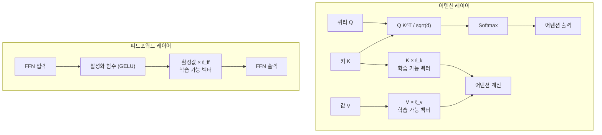
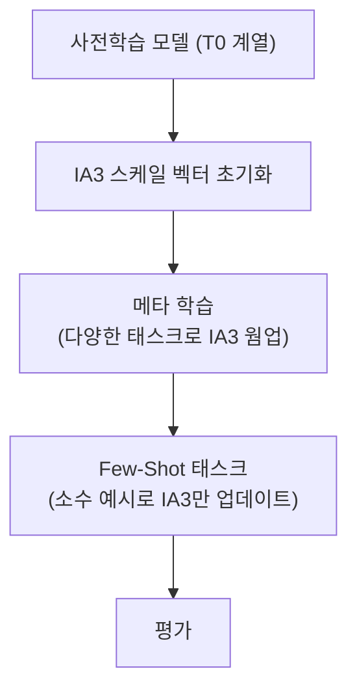

# IA3 - 활성값 스케일링 어댑터 (Infused Adapter by Inhibiting and Amplifying Inner Activations)

## 배경

LoRA, Adapter Layers 등 기존 PEFT 방법들은 파라미터를 추가하거나 가중치를 저랭크로 분해하는 방식으로 파인튜닝한다. **IA3(Liu et al., T-Few, 2022)**는 완전히 다른 접근을 택한다.

> "가중치 행렬을 바꾸는 대신, 내부 활성값에 학습 가능한 스케일 벡터를 곱하면 어떨까?"

이 아이디어의 결과는 놀랍다: LoRA 대비 **약 1/100의 추가 파라미터**로 경쟁력 있는 성능을 달성하며, 특히 few-shot 학습 시나리오에서 두드러진다.

IA3는 T-Few(Liu et al., 2022) 논문에서 "몇 가지 예시로 새로운 태스크를 인간 수준으로 학습하는 레시피"의 일부로 제안되었다.

## 핵심 메커니즘: 활성값 스케일링

### 스케일링 위치

IA3는 트랜스포머의 세 가지 위치에 학습 가능한 스케일 벡터를 주입한다:



구체적으로 세 개의 스케일 벡터를 학습한다:
- $\ell_k \in \mathbb{R}^{d_k}$: 어텐션 키(K)에 적용
- $\ell_v \in \mathbb{R}^{d_v}$: 어텐션 값(V)에 적용
- $\ell_{ff} \in \mathbb{R}^{d_{ff}}$: FFN 첫 번째 레이어 출력에 적용

### 수식

어텐션 출력 계산에서:

$$\text{Attention}(Q, K, V) = \text{softmax}\left(\frac{Q (l_k \odot K)^T}{\sqrt{d_k}}\right)(l_v \odot V)$$

FFN 계산에서:

$$\text{FFN}(x) = W_2 \cdot (l_{ff} \odot \sigma(W_1 x))$$

$\odot$는 원소별 곱(element-wise product)이다. 각 스케일 벡터는 해당 활성값 텐서의 마지막 차원에 브로드캐스트된다.

### 초기화

모든 스케일 벡터는 $\mathbf{1}$로 초기화한다. 이렇게 하면 학습 초기에 원본 모델과 동일하게 동작하며(항등 변환), 학습하면서 점차 활성값을 증폭하거나 억제하는 방향으로 조정된다.

## 파라미터 효율성

### IA3 vs 다른 PEFT 방법 파라미터 비교

모델: T0-3B (3B 파라미터), 기준 레이어 구성

| 방법 | 추가 파라미터 수 | 모델 대비 비율 |
|------|--------------|-------------|
| Full Fine-Tuning | ~3B | 100% |
| Adapter Layers | ~4M | 0.13% |
| LoRA (r=4) | ~2.4M | 0.08% |
| **IA3** | **~16K** | **~0.0005%** |

LoRA 대비 약 150배, 전체 파인튜닝 대비 200,000배 적은 파라미터다.

### 왜 이렇게 적은가

스케일 벡터는 각 레이어당 3개 벡터이며, 각 벡터의 크기가 은닉 차원 수에 불과하다. T0-3B (24레이어, $d_{model}=2048$, $d_{ff}=8192$)를 예로 들면:

- 레이어당: $2048 + 2048 + 8192 = 12,288$개 파라미터
- 전체 24레이어: $24 \times 12,288 \approx 295K$개 파라미터

LoRA (r=4)의 경우 각 가중치 행렬에 $d \times r + r \times d$ 크기의 두 행렬이 추가되어 수 MB 규모가 된다.

## T-Few: IA3 기반 few-shot 학습 레시피

IA3는 단독으로 사용되기보다 **T-Few 레시피**의 핵심 구성요소로 알려져 있다:



T-Few의 전략:
1. T0 모델(멀티태스크 사전학습)을 기반으로 시작
2. IA3 스케일 벡터를 다양한 공개 태스크로 사전 적응
3. 새 태스크의 소수 예시(few-shot)만으로 IA3를 빠르게 미세 조정
4. 모델 가중치는 일체 변경하지 않음

이 접근법으로 **GPT-3의 in-context learning을 능가**하는 성능을 훨씬 적은 자원으로 달성했다.

## 성능 결과

### RAFT 벤치마크 (실세계 few-shot 태스크)

| 방법 | 평균 정확도 | 파라미터 업데이트 |
|------|-----------|--------------|
| GPT-3 (175B) in-context | 62.7% | 없음 |
| T-Few (IA3, T0-11B) | 75.8% | ~50K |
| Full FT (T0-3B) | 68.5% | ~3B |

IA3 기반 T-Few가 GPT-3 in-context learning을 13포인트 이상 초과했다.

## 학습 후 가중치 병합

IA3의 큰 장점 중 하나는 **추론 시 추가 오버헤드 없이 원본 가중치에 병합**할 수 있다는 점이다:

```python
# 병합 예시 (개념적 코드)
# K 가중치 행렬: W_k ∈ R^{d_model × d_k}
# IA3 스케일 벡터: l_k ∈ R^{d_k}

# 각 키 벡터에 스케일이 적용되는 것은
# W_k의 각 열에 l_k를 곱하는 것과 동일
W_k_merged = W_k * l_k.unsqueeze(0)  # 브로드캐스트 곱

# 병합 후 추론: 기존 어텐션 코드 그대로 사용 가능
# 스케일 벡터를 별도로 저장/적용할 필요 없음
```

병합 후에는 스케일 벡터 저장이 불필요하고, 추론 코드 변경도 필요 없다. 이는 LoRA 병합과 동일한 장점이다.

## 한계 및 주의사항

1. **표현력 제한**: 스케일 벡터만으로는 복잡한 태스크 적응에 한계. LoRA가 더 표현력 있음
2. **방향 변화 불가**: 스케일만 조정 (원소별 곱)하므로 표현의 방향을 바꿀 수 없음
3. **대형 모델 의존**: 소형 모델에서 효과 미미. T5-base 급에서는 LoRA에 밀림
4. **최신 채택 감소**: LoRA의 범용성과 peft 라이브러리 지원으로 실무에서 LoRA가 더 일반적

## 언제 사용하는가

- **극도로 제한된 저장 공간**: 수십 KB의 어댑터가 필요한 엣지 배포
- **다수 태스크 동시 서빙**: 태스크당 스케일 벡터만 교체하면 되므로 수천 개 태스크도 메모리 부담 없음
- **빠른 few-shot 적응**: 파라미터가 적어 수십 예시로도 수 분 안에 학습 완료
- **연구/실험**: PEFT 방법론 이해 및 비교 실험

## 관련 문서

- [[lora-qlora-finetuning]] - LoRA 기본 개념 - IA3보다 많은 파라미터, 높은 표현력
- [[adalora-adaptive-rank]] - 적응적 랭크로 LoRA 효율화
- [[dora-weight-decomposed-lora]] - 가중치 분해로 LoRA 개선
- [[peft-adapter-survey]] - PEFT 방법론 전체 비교
- [[prefix-tuning-deep-prompts]] - 유사하게 적은 파라미터의 다른 접근
- [[fine-tuning-overview]] - 파인튜닝 전략 개요
