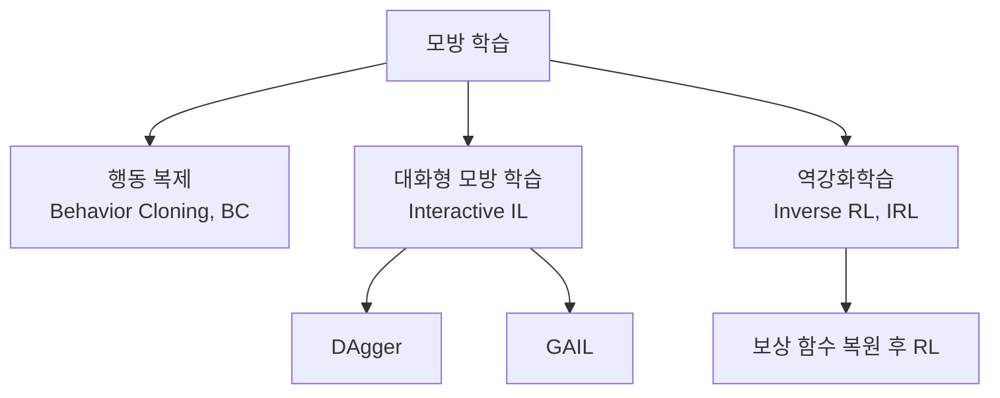
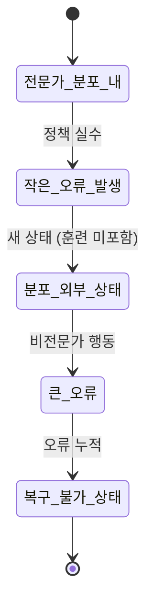
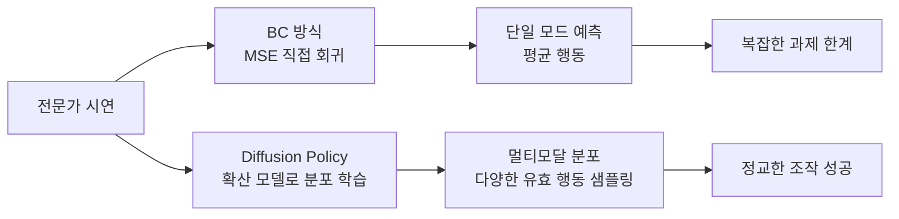

# 모방 학습 (Imitation Learning)

모방 학습(Imitation Learning, IL)은 **전문가 시연(expert demonstration)에서 정책(policy)을 학습하는 방법론**의 총칭이다. 보상 함수(reward function)를 명시적으로 설계하지 않고, 전문가가 실연한 행동 데이터만으로 유사한 행동을 재현하는 에이전트를 만든다. 로보틱스, 자율주행, 게임 플레이에서 인간 전문 지식을 AI로 증류하는 핵심 기법이다.

## 왜 모방 학습인가

보상 함수 설계(reward engineering)는 강화학습의 가장 어려운 부분 중 하나다. 특히:
- 로봇 팔 조작: "자연스러운 동작"의 보상 정량화 어려움
- 자율주행: "좋은 운전"의 모든 요소를 수식화 불가
- LLM 정렬: 인간 선호를 보상으로 완전히 포착 불가

모방 학습은 이 어려움을 "전문가처럼 행동하면 됨"으로 우회한다.

## 주요 기법 분류



## 1. 행동 복제 (Behavior Cloning, BC)

전문가 데이터 $\mathcal{D} = \{(s_i, a_i)\}$로 지도학습(supervised learning)을 수행해 정책 $\pi_\theta$를 학습한다:

$$\min_\theta \mathbb{E}_{(s,a)\sim\mathcal{D}}[\mathcal{L}(\pi_\theta(s), a)]$$

- 연속 행동: MSE 손실
- 이산 행동: 교차 엔트로피 손실

**장점**: 구현 단순, 추가 환경 상호작용 불필요.

**한계 - 공변량 이동(covariate shift)**: 학습 시 보지 못한 상태에서 오류 행동 → 더 이상한 상태로 진입 → 오류 누적. 전문가 데이터 분포를 벗어난 순간 급격히 성능 저하.



## 2. DAgger (Dataset Aggregation)

Ross et al. 2011이 제안한 기법으로 **공변량 이동 문제를 반복적 데이터 수집으로 해결**한다:

1. BC로 초기 정책 $\pi_1$ 학습
2. $\pi_1$을 환경에 실행 → 방문하는 상태에서 전문가에게 레이블 요청
3. 새 데이터를 전체 데이터셋에 추가해 $\pi_2$ 재학습
4. 반복

정책이 방문하는 실제 상태 분포에서 전문가 행동을 수집하므로, 훈련 분포와 테스트 분포가 일치한다.

**한계**: 온라인으로 인간 전문가(또는 오라클)에게 반복 질의가 필요 - 비용 높음.

## 3. GAIL (Generative Adversarial Imitation Learning)

Ho & Ermon 2016. GAN 구조를 모방 학습에 적용:

- Generator = 학습 정책 (전문가와 구별 불가한 상태-행동 분포 생성)
- Discriminator = 전문가 vs. 학습 정책 구분

$$\min_\pi \max_D \mathbb{E}_{\pi}[\log D(s,a)] + \mathbb{E}_{\pi_E}[\log(1-D(s,a))]$$

보상 함수 없이 암묵적으로 전문가 분포를 모방. 복잡한 연속 제어 과제에서 BC보다 월등히 좋은 성능.

## [[offline-reinforcement-learning]] 과의 관계

모방 학습과 [[offline-reinforcement-learning]]은 모두 사전 수집된 데이터에서 정책을 추출하지만 목표가 다르다:

| 구분 | 모방 학습 | 오프라인 RL |
|------|----------|------------|
| 데이터 가정 | 전문가 시연 | 임의 품질 데이터 |
| 보상 | 불필요 | 필요 |
| 목표 | 전문가 행동 재현 | 보상 최대화 |
| 한계 극복 | 대화형 수집 | 분포 외 행동 억제 |

## [[diffusion-policy]] 와의 연결

최근 로보틱스 분야에서 [[diffusion-policy]]는 BC의 강력한 변형으로 자리잡았다. 확산 모델(diffusion model)로 전문가 행동 분포를 표현하면:

- 멀티모달 행동 분포(동일 상태에서 여러 유효 행동) 표현 가능
- BC의 평균 회귀(mean regression) 문제 해결
- 고차원 로봇 조작에서 SOTA 달성



## Inverse Reinforcement Learning (IRL)

IRL은 전문가 행동에서 **보상 함수 자체를 역추적**한다. 복원된 보상 함수로 RL을 실행해 전문가를 넘어서는 정책을 만들 수 있다.

- MaxEnt IRL: 최대 엔트로피 원칙으로 보상 함수 추론
- 장점: 전문가를 초월하는 일반화 가능
- 단점: RL 내부 루프 필요 - 계산 비용 매우 높음

## LLM에서의 모방 학습

LLM 정렬에서도 모방 학습이 핵심적 역할을 한다:

- **SFT(Supervised Fine-Tuning)**: 인간 작성 응답으로 BC 수행
- **RLHF**: IRL과 유사하게 인간 선호에서 보상 모델 복원 후 RL
- **Constitutional AI**: AI 피드백으로 DAgger 유사 반복 개선

## 구현 예시 (행동 복제)

```python
import torch
import torch.nn as nn

class BehaviorCloning(nn.Module):
    def __init__(self, state_dim, action_dim, hidden_dim=256):
        super().__init__()
        self.policy = nn.Sequential(
            nn.Linear(state_dim, hidden_dim),
            nn.ReLU(),
            nn.Linear(hidden_dim, hidden_dim),
            nn.ReLU(),
            nn.Linear(hidden_dim, action_dim),
        )

    def forward(self, state):
        return self.policy(state)

def train_bc(model, optimizer, expert_states, expert_actions, epochs=100):
    criterion = nn.MSELoss()
    for epoch in range(epochs):
        pred_actions = model(expert_states)
        loss = criterion(pred_actions, expert_actions)
        optimizer.zero_grad()
        loss.backward()
        optimizer.step()
    return model
```

## 실무 관점

- 데이터 품질이 BC 성능의 결정적 요소 - 일관된 전문가 시연 필수
- DAgger: 환경이 안전하고 전문가 쿼리가 자동화 가능할 때 유리 (자율주행 시뮬레이터 등)
- GAIL/IRL: 보상 설계가 어렵고 복잡한 분포를 모방해야 할 때
- [[diffusion-policy]]: 정교한 로봇 조작 과제에서 현재 최선
- 데이터 수집 비용과 모방 정확도의 트레이드오프를 태스크 특성에 맞게 설계

## 관련 문서
- [[inverse-rl-imitation]] -- 역강화학습 (Inverse Reinforcement Learning)

- [[diffusion-policy]] - 확산 모델 기반의 최신 BC 변형
- [[offline-reinforcement-learning]] - 오프라인 데이터 활용의 병행 패러다임
- [[decision-transformer]] - 시퀀스 모델링으로 모방 학습을 구현한 기법
- [[policy-gradient-ppo]] - 온라인 RL과의 비교 기반 개념
