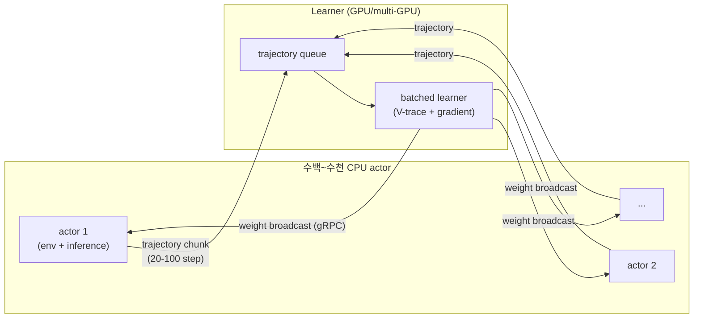

# IMPALA - Importance Weighted Actor-Learner Architecture

## 개요

IMPALA는 DeepMind(Espeholt et al. 2018)가 발표한 분산 actor-learner RL 아키텍처로, 수백~수천 머신으로 확장하면서도 데이터 효율과 자원 활용도를 동시에 달성한 역사적 baseline이다. **Decoupled actor-learner**, **V-trace off-policy correction**, **single-learner / multi-actor 토폴로지** 세 가지가 핵심 기여이며, 이후 R2D2, Ape-X, Sebulba, OpenAI Five의 "rapid" 등 거의 모든 대규모 분산 RL 시스템의 변형 출발점이 되었다.

- 논문: ["IMPALA: Scalable Distributed Deep-RL with Importance Weighted Actor-Learner Architectures"](https://arxiv.org/abs/1802.01561)
- 저자: Lasse Espeholt 외 11명 (DeepMind)
- arXiv: 1802.01561 (2018-02-05)
- 발표: ICML 2018
- 공식 구현: google-deepmind/scalable_agent (TensorFlow)

## 핵심 기여

1. **Decoupled actor-learner** — actor는 rollout만, learner는 gradient update만 담당. 비동기 통신
2. **V-trace off-policy correction** — actor가 stale policy로 수집한 trajectory를 learner의 fresh policy로 보정
3. **Single-learner, multi-actor 토폴로지** — 한 learner가 수백~수천 actor의 데이터 처리
4. **DMLab-30, Atari-57**에서 multi-task 단일 모델 학습 데모 — positive transfer 증거

## V-trace 보정

행동 정책 $\mu$로 수집한 trajectory를 타깃 정책 $\pi$ 기준으로 보정하는 truncated importance sampling 알고리즘이다.

- Truncated importance sampling weight: $\rho_t = \min(\bar{\rho}, \pi(a_t|s_t) / \mu(a_t|s_t))$
- 보조 truncation (분산 감소): $c_t = \min(\bar{c}, \pi(a_t|s_t) / \mu(a_t|s_t))$
- V-trace target:
$$v_s = V(x_s) + \sum_t \gamma^{t-s} \left( \prod_{i=s}^{t-1} c_i \right) \rho_t \delta_t V$$
- $\bar{\rho}$, $\bar{c}$ 두 hyperparameter — 일반적으로 $\bar{\rho} = \bar{c} = 1$
- $\rho_t = c_t = 1$일 때 on-policy advantage actor-critic으로 환원

## 분산 토폴로지

- **Single-learner**: GPU 1대(또는 multi-GPU) 위 거대 batched learner
- **Multi-actor**: 수백~수천 CPU 머신, 각자 환경 stepping + 정책 inference
- Actor는 trajectory chunk (보통 20-100 step)를 learner 큐에 push
- Learner는 batch로 gradient step → updated weights를 actor에 broadcast (gRPC)
- **Multi-learner** 변종도 가능 — 여러 learner를 동기/비동기로 운영해 더 큰 batch

## 처리량

- 단일 머신 batched learner: **~250,000 frames/second** (A3C 대비 30배)
- 다수 actor + GPU learner: thousands of machines로 scale

## 통신 패턴

- gRPC TCP: actor → learner trajectory push, learner → actor weight broadcast
- 이후 계열 ([[sebulba-podracer]], R2D2, Ape-X) 모두 이 패턴의 변형

## A3C / A2C / Ape-X와의 차이

| 측면 | A3C | A2C | Ape-X | IMPALA |
|------|-----|-----|-------|--------|
| 분산 actor | yes | sync | yes | yes |
| 분산 learner | shared params | yes | central | yes (single) |
| Replay buffer | no | no | prioritized | no (queue) |
| Off-policy 보정 | none | none | importance | **V-trace** |
| GPU 효율 | 낮음 | 중간 | 높음 | **매우 높음** (batched) |

## 핵심 인용

> "IMPALA, a distributed agent that scales to thousands of machines without sacrificing data efficiency or resource utilization." — abstract

> "achieving stable learning at high throughput by combining decoupled acting and learning with a novel off-policy correction method called V-trace." — abstract

> "data throughput rates of 250,000 frames per second, making it over 30 times faster than single-machine A3C." — paper §5

## 후속 영향

- DeepMind R2D2 (recurrent IMPALA), MuZero, AlphaStar 모두 IMPALA 계열
- OpenAI Five의 "rapid" 분산 학습도 유사 패턴
- [[sebulba-podracer]] (Hessel et al. 2021)가 IMPALA를 단일 TPU 호스트에 압축
- V-trace 후속: ABC (Asynchronous Batch Critic) 등

## 관련 문서

- [[sebulba-podracer]] - TPU 압축 변종
- [[anakin-podracer]] - on-device 변종
- [[ppo]] - 동시대 다른 정책 최적화 baseline
- [[rl-harness-frameworks-comparison]] - RL harness 통합 비교
